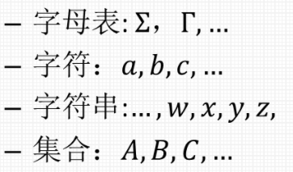
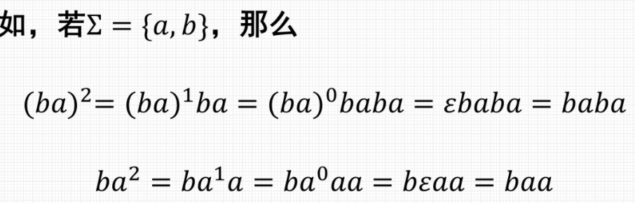
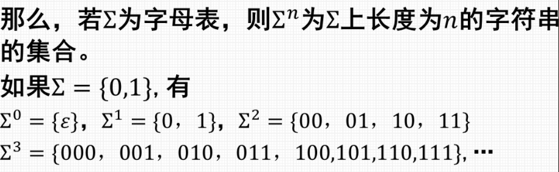
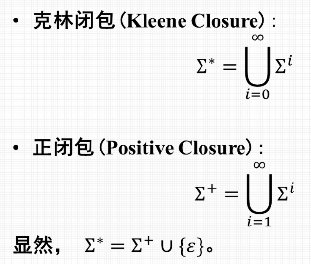
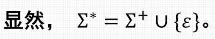

# 形式语言与自动机

### 基础知识

* #### 形式化描述
    > 所有素数是奇数 $\to $ 如果 x 是素数, 那么 x 是奇数

    * ##### 计算机科学
        $$
        \begin{cases}
            构成计算机系统基础的一些基本概念和模型 \\
            设计计算机系统(软件和硬件)的工程技术 \\
        \end{cases}
        $$
        > 形式语言与自动机针对计算机科学的第一部分

* #### 形式化证明 : 演绎法
  * 演绎证明
       > " 三段论 " : 
        $$
        \begin{cases}
            大前提 \\
            小前提 \\
            结论 \\
        \end{cases}
        $$

* #### 形式化证明 : 归纳法
  * 归纳证明(推理)

* #### 其他形式化证明 : 反证法

* #### 逆否命题

---

### 形式语言与自动机的基本概念

* #### 自动机理论
  * 研究抽象机器及其所能解决的问题的理论

* #### 形式语言
  * 经数学定义的语言

---

### 基本概念

* ##### 字母表
  * 符号 (字符) 的非空有穷集
    * $\sum_{1} = \{0,1\}$

* ##### 字符串
  * 由某字母表中符号组成的有穷序列
    * 若 $\sum_{2} = \{0,1\}$
    * 那么 0, 1, 00, 111001 为 $\sum_{2}$ 上的字符串

* ##### 空串
  * 记为 $\epsilon$ (epsilon), 有 0 个字符的串

* ##### 符号使用的一般约定
  >
  > 

* ##### 字符串的长度
  * 字符串中符号所长位置的个数
  * 记为 | $ \cdot $ |
  * 若字母表为 $\sum_{}$  , 可递归定义为:
    $$
    |w| = 
    \begin{cases}
        0 , w = \epsilon \\
        |x| + 1 , w = xa
    \end{cases}
    $$
    $
    其中 a \in \sum, w 和 x 是\sum 中字符组成的字符串
    $

* ##### 字符串 $x$ 和 $y$ 的连接
  * 将首尾相接得到新字符串的运算
  * 记为 $x \cdot y 或 xy$
  * 可递归定义为: 
    $$
    xy = 
    \begin{cases}
        x , y = \epsilon \\
        (xz)a, y = za \\
    \end{cases}
    $$
    $其中 a \in \sum, 且x, y, z 都是字符串$

* ##### 字符串 $x$ 的 $n$ 次幂$(n \geqslant 0)$
  * 递归定义为
    $$
    x^n = 
    \begin{cases}
        \epsilon, n = 0 \\
        x^{n-1}x, n > 0 \\
    \end{cases}
    $$
    >  

* ##### 集合 $A$ 和 $B$ 的连接
  * 记为 $AB$
  * 定义为 $AB = \{w|w = xy, x \in A 且 y \in B\}$

* ##### 集合 $A$ 的 $n$ 次幂 $(n \geqslant 0)$
  * 递归定义为 :
    $$
    A^n = 
    \begin{cases}
        \{\epsilon\}, n = 0 \\
        A^{n-1}A, n \geqslant 1\\
    \end{cases}
    $$
    > 

* ##### 克林闭包和正闭包
    > 
    > 

---

### 语言

有讲义, 不做了

