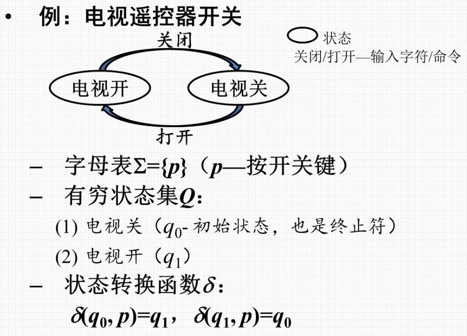
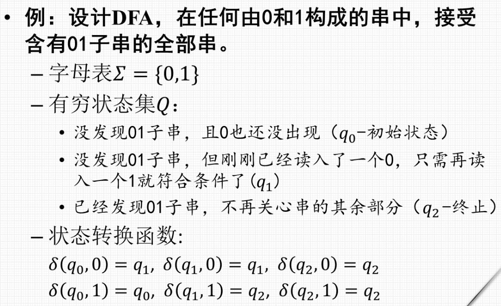
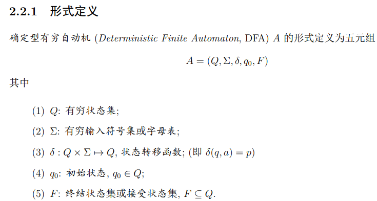
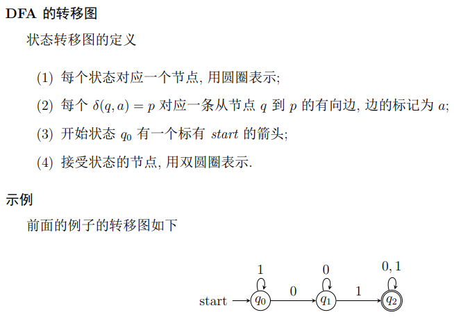
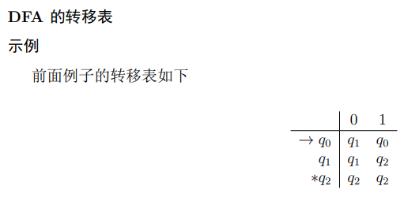
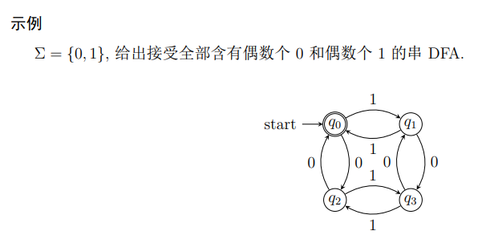
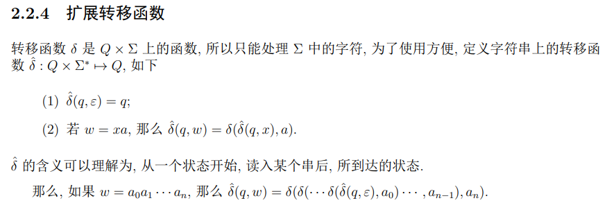
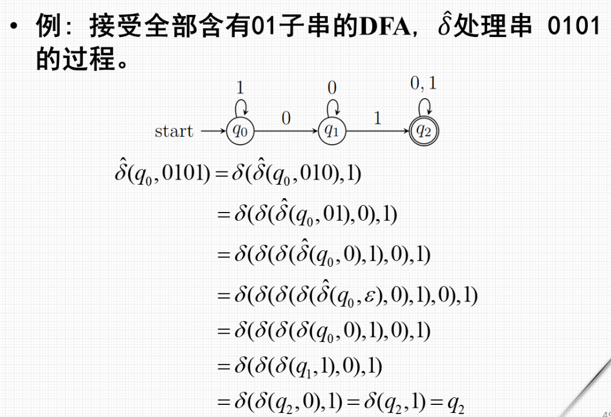
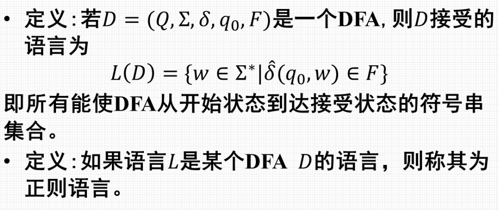
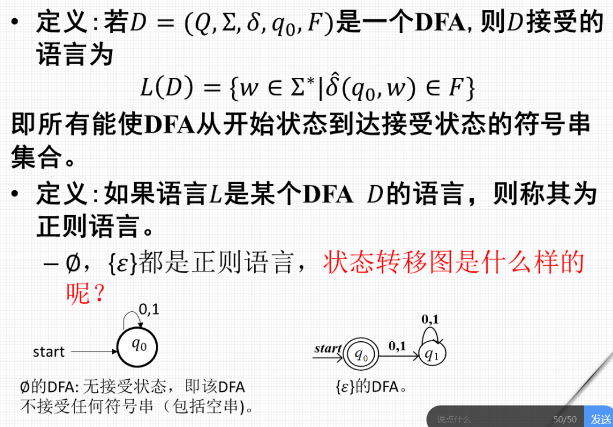

- [有穷自动机](#有穷自动机)
  - [确定有穷自动机](#确定有穷自动机)
    - [例题](#例题)
      - [电视遥控器开关](#电视遥控器开关)
      - [DFA 接收含有01子串的所有串](#dfa-接收含有01子串的所有串)
      - [==五元组==](#五元组)
    - [DFA 的表示](#dfa-的表示)
      - [状态转移图](#状态转移图)
      - [状态转移表](#状态转移表)
      - [例题 偶数个0, 偶数个1](#例题-偶数个0-偶数个1)
    - [扩展状态转移函数](#扩展状态转移函数)
      - [例](#例)
    - [正则语言](#正则语言)
      - [空集 , 状态转换图](#空集--状态转换图)
  - [非确定有穷自动机](#非确定有穷自动机)

# 有穷自动机

## 确定有穷自动机

### 例题 

 #### 电视遥控器开关
> 

 #### DFA 接收含有01子串的所有串
> 

#### ==五元组==

> 

---

### DFA 的表示

#### 状态转移图

> 

#### 状态转移表

> 

 #### 例题 偶数个0, 偶数个1
> 

---

### 扩展状态转移函数

> 

 #### 例
>

---

### 正则语言

> 

> * **有限字符串集对应的语言是正则语言**

 #### 空集 , 状态转换图

> 

---

## 非确定有穷自动机

    

