- [有穷自动机](#有穷自动机)
  - [非确定有穷状态自动机](#非确定有穷状态自动机)
    - [状态的非确定转移](#状态的非确定转移)
    - [形式定义](#形式定义)
    - [对比](#对比)
      - [例题](#例题)
  - [带空转移的非确定有穷状态机](#带空转移的非确定有穷状态机)
    - [奇妙的例题](#奇妙的例题)

# 有穷自动机

## 非确定有穷状态自动机

### 状态的非确定转移
> 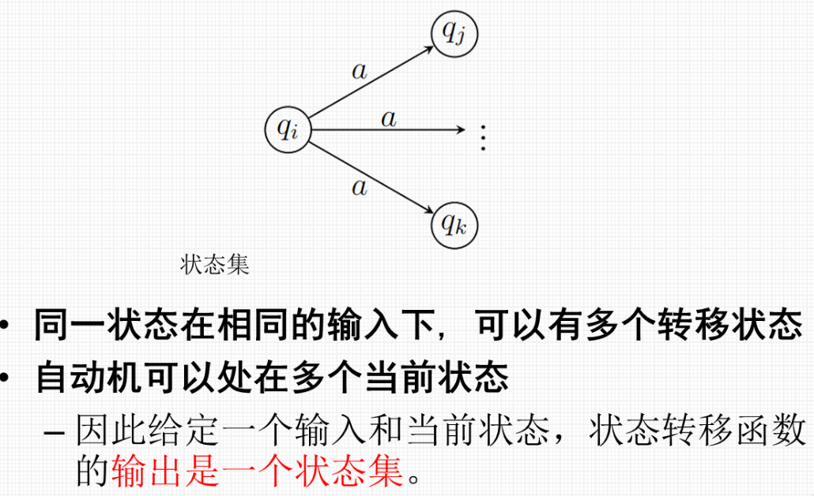
> 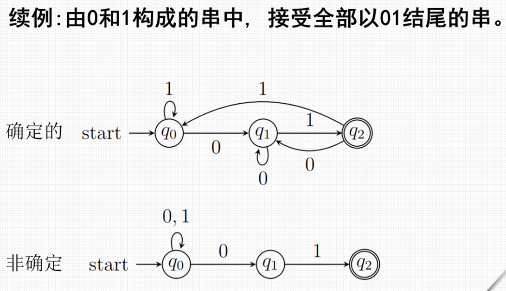

### 形式定义
> 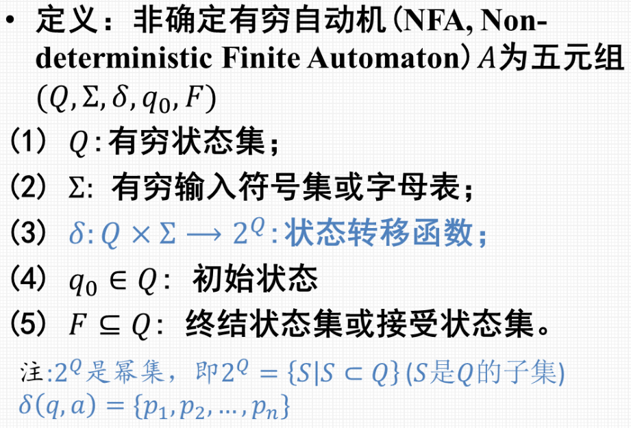
> 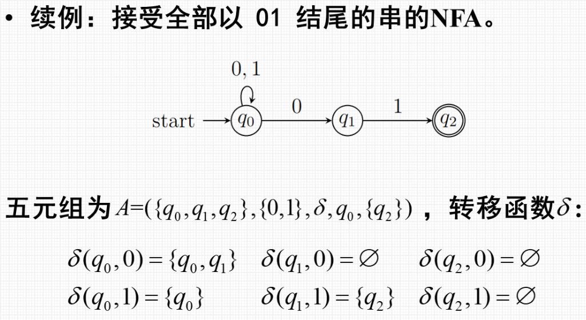
> 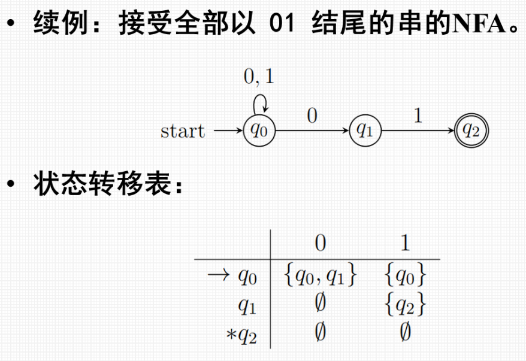

### 对比
> 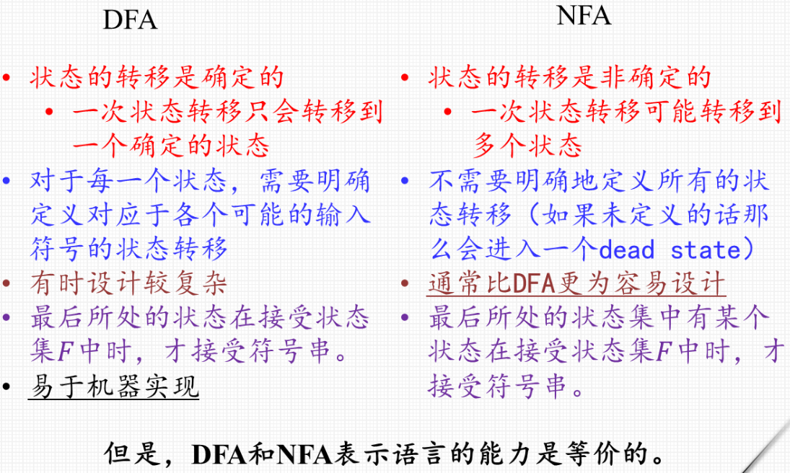

#### 例题
> 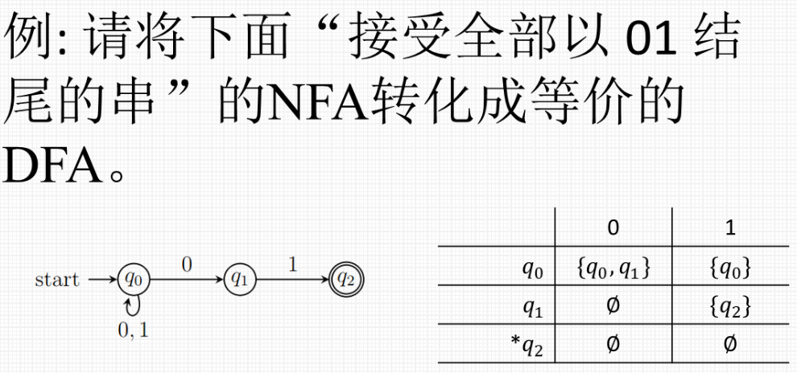
> 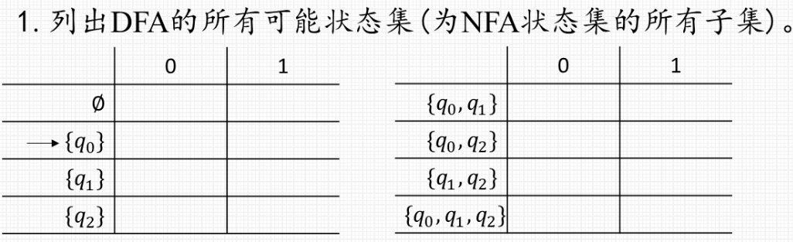
> 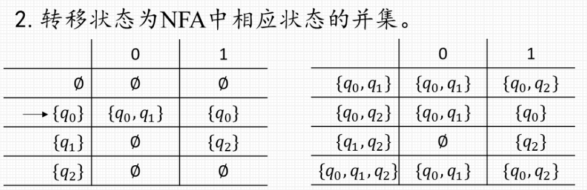
> 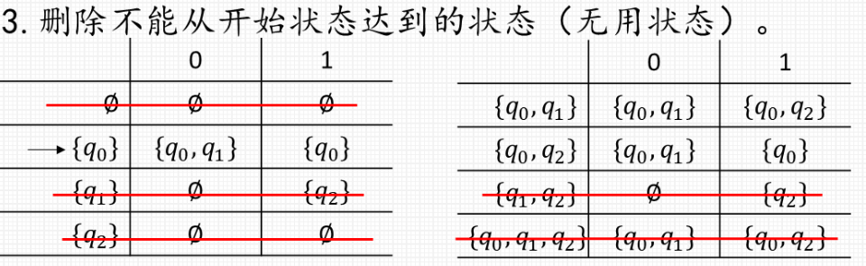
> 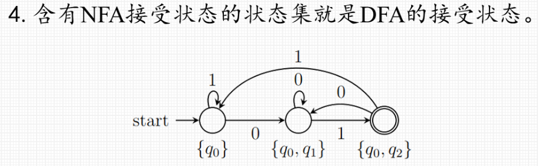

>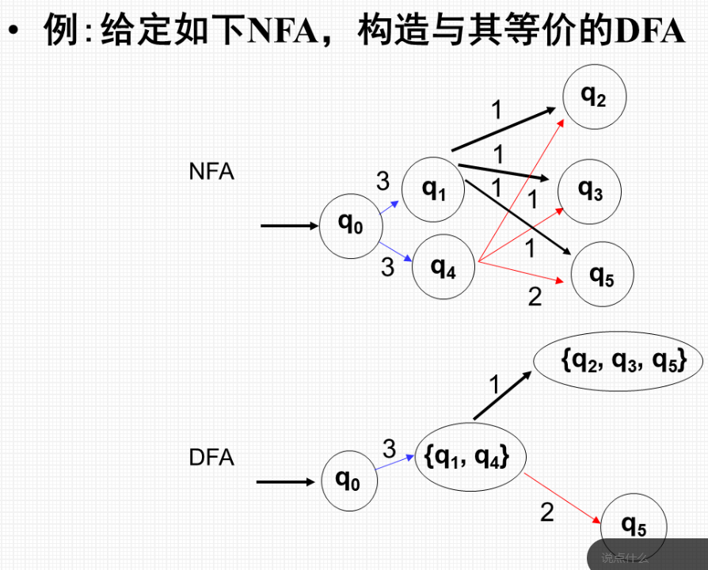

---

## 带空转移的非确定有穷状态机

* 自发的
* 明确地定义了至少一个空转移的NFA

### 奇妙的例题
* 看ppt

> 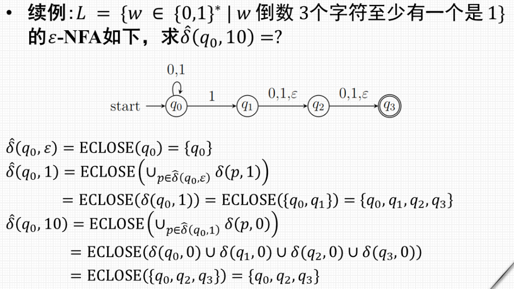
> 对于$\epsilon$闭包的求解

> * **先求$\epsilon$闭包, 再合并**
> 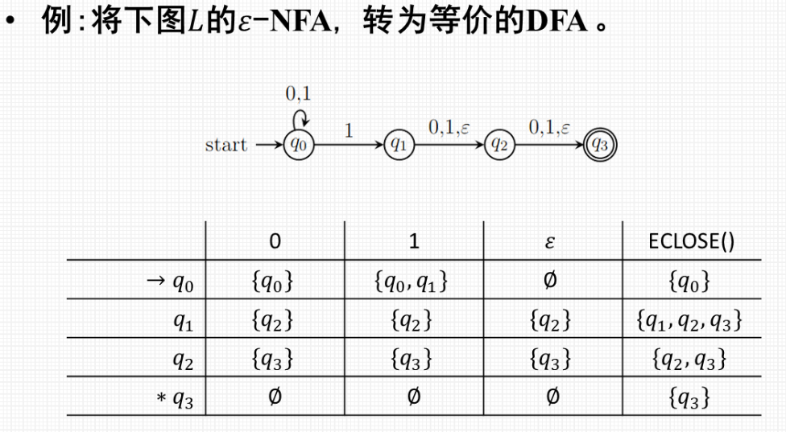
> 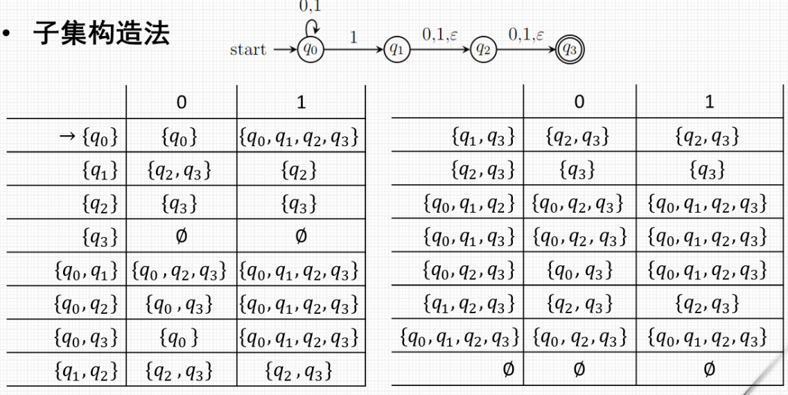
