- [正则表达式](#正则表达式)
    - [语言运算](#语言运算)
    - [四则运算的递归定义](#四则运算的递归定义)
    - [正则表达式的递归定义](#正则表达式的递归定义)
      - [语言的优先级](#语言的优先级)
      - [例题](#例题)
    - [运算的简化规则](#运算的简化规则)
  - [有穷自动机和正则表达式](#有穷自动机和正则表达式)
    - [DFA $\to $ 正则表达式 : 递归法](#dfa-to--正则表达式--递归法)
    - [DFA $\to $ 正则表达式 : 状态消除法](#dfa-to--正则表达式--状态消除法)
      - [例题](#例题-1)

# 正则表达式

### 语言运算
> 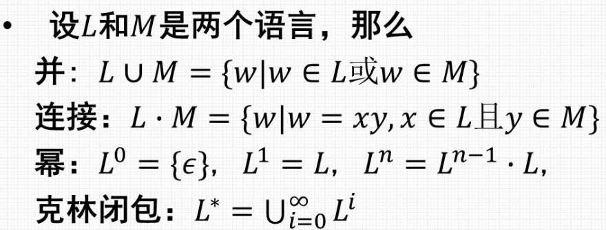

### 四则运算的递归定义
> 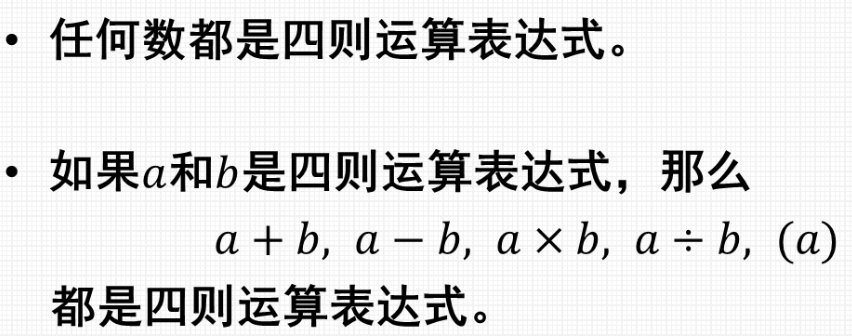

### 正则表达式的递归定义
> 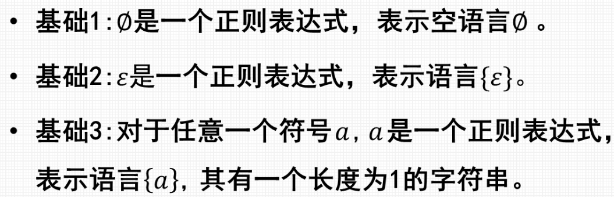
> 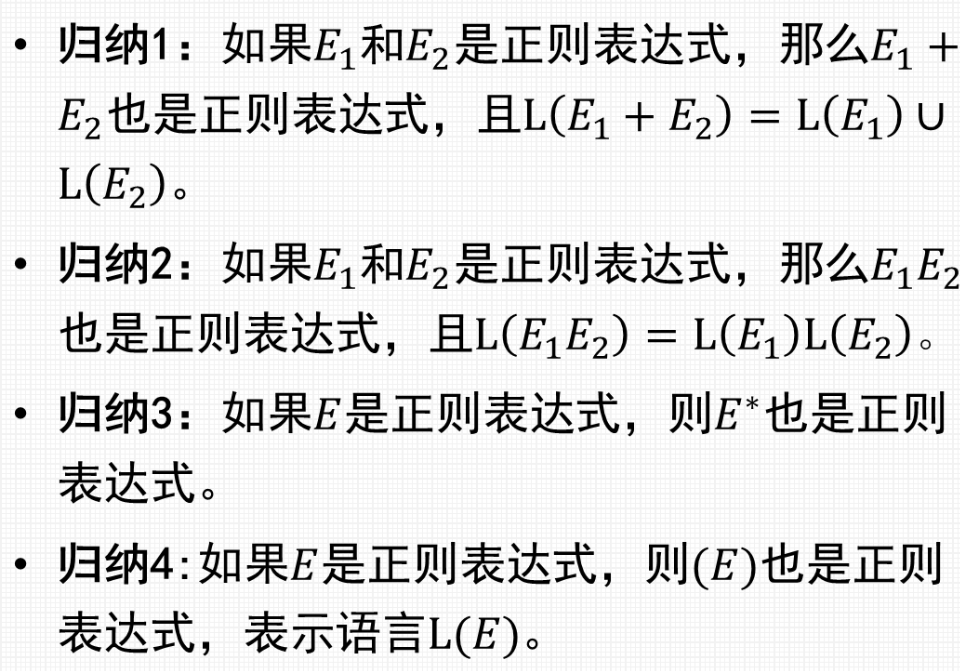

#### 语言的优先级
> 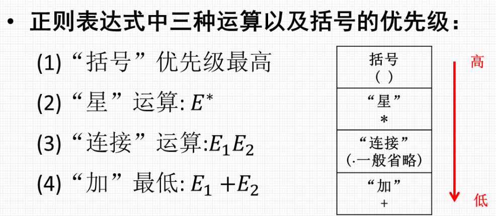

#### 例题
> 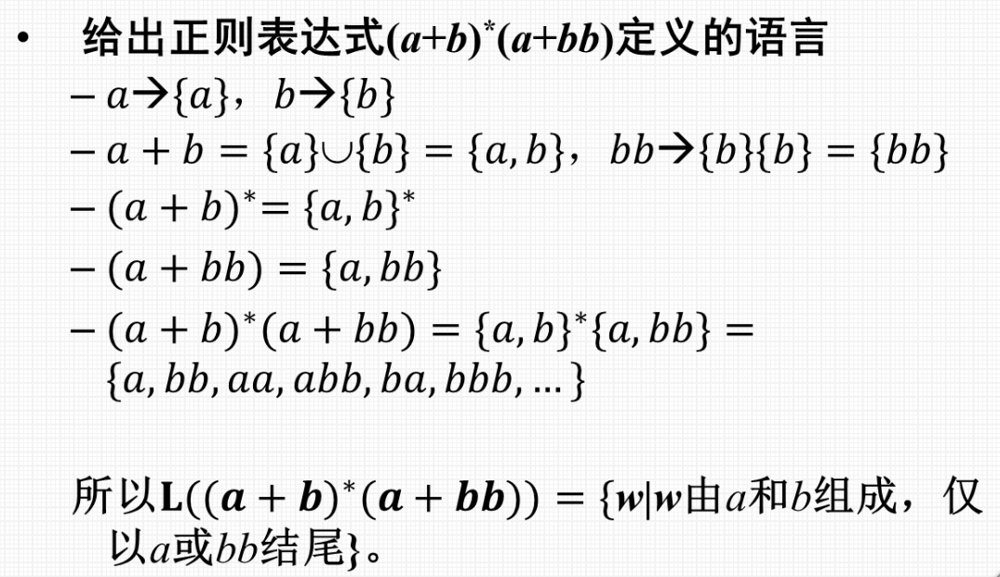

### 运算的简化规则
> 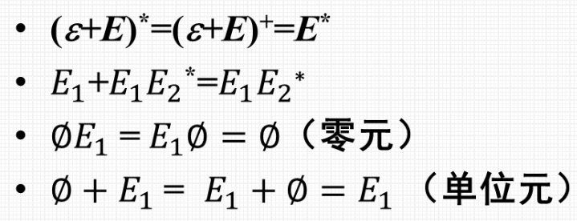

---

## 有穷自动机和正则表达式
> **转换路径**
> 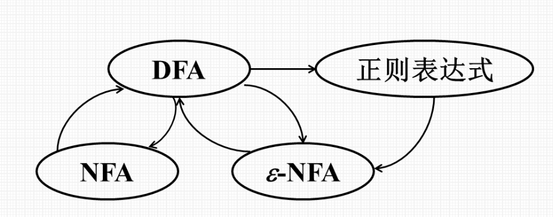

### DFA $\to $ 正则表达式 : 递归法
> 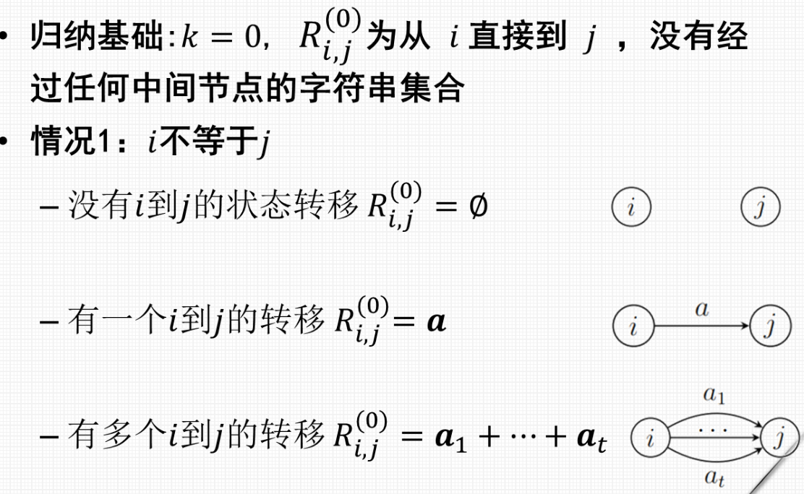
> 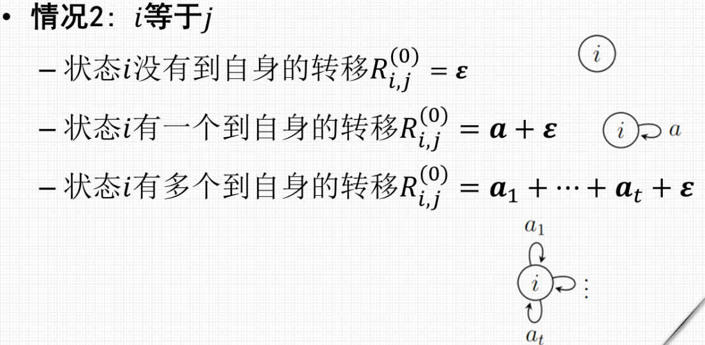
> 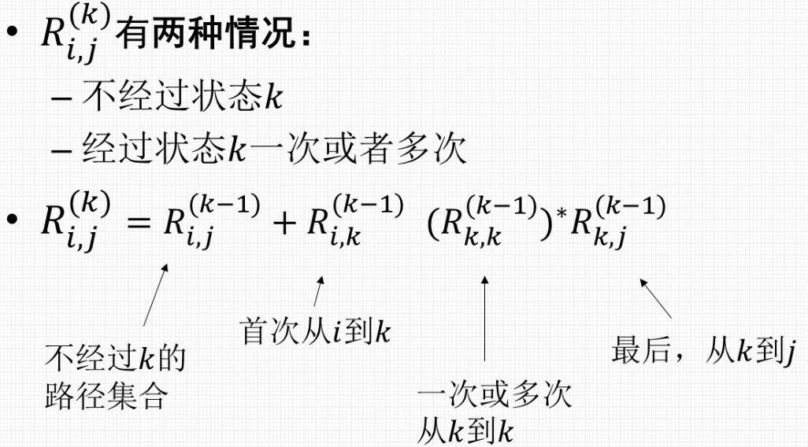
> 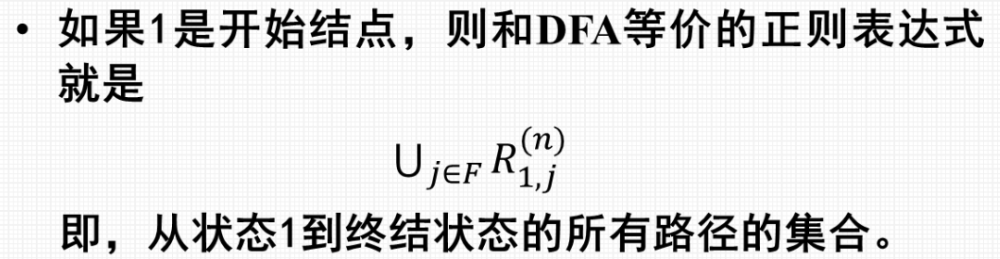

### DFA $\to $ 正则表达式 : 状态消除法
> 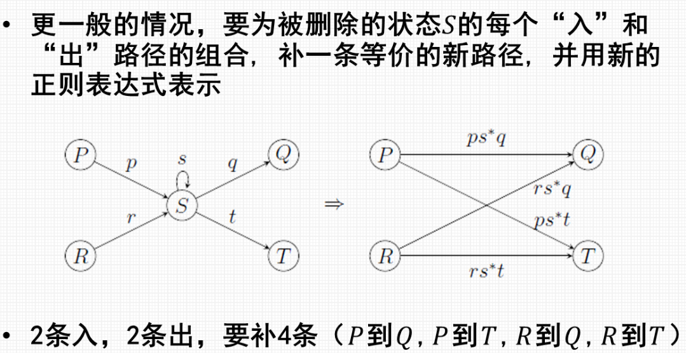
#### 例题
> 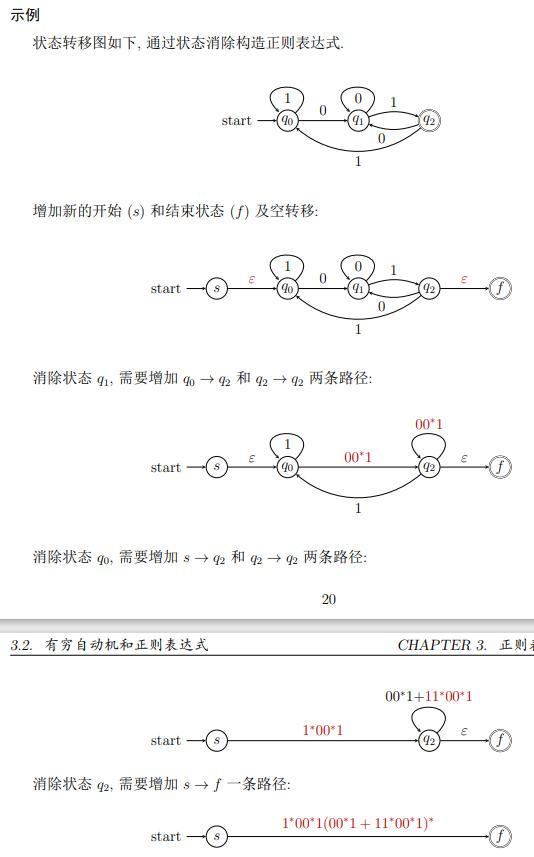