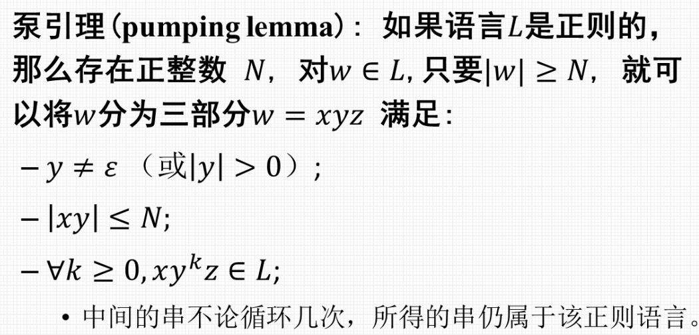

# 正则语言的性质
* 如何证明一个语言不是正则语言
* 证明没有 DFA 能接受
* 困难

## 泵引理
> 

### 例题
> 

* 有限长度的语言都是正则语言

## 正则语言的封闭性
1. 正则语言在**并, 连接和克林闭包**运算下保持封闭.
2. 正则语言在补运算下封闭.
   * 即: 如果 L 是字母表 $Σ$ 上的正则语言, 即 L ⊆ $Σ$ 则L = $Σ^*$ − L 也是正则的.
3. 正则语言在**交运算**下封闭.
4. 正则语言在**差运算**下封闭. 如果 L 和 M 是正则语言, 那么 L − M 也是正则的.