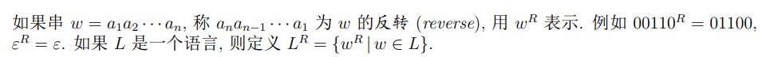
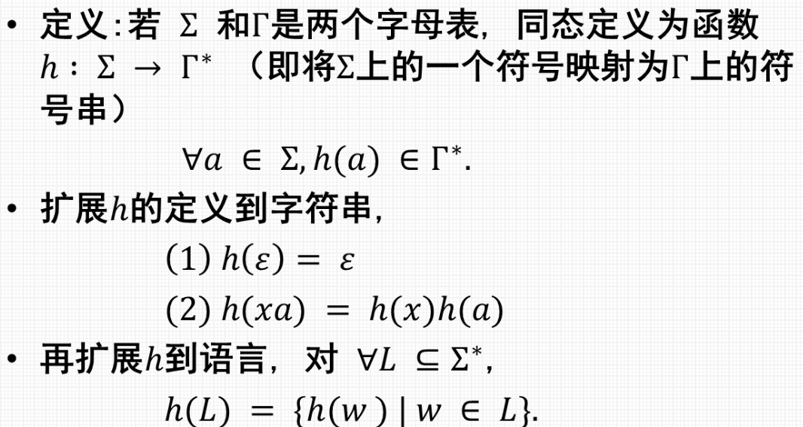
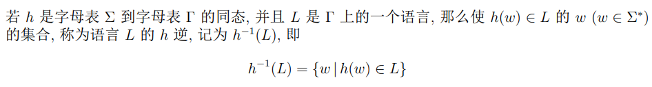
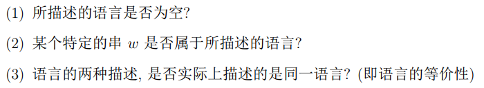
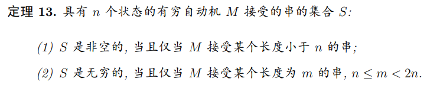
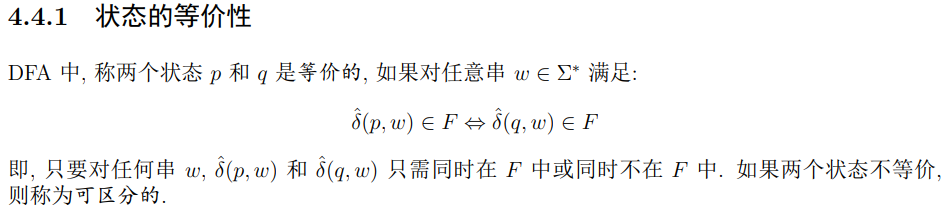
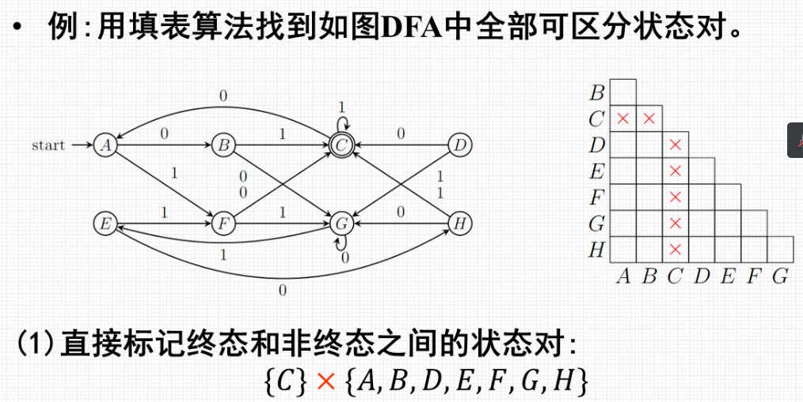
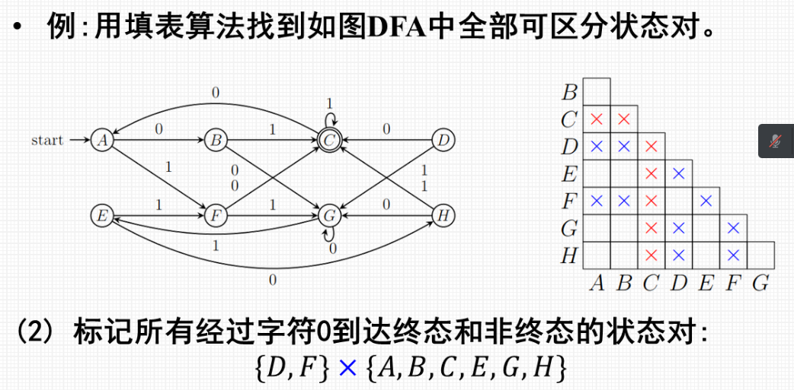
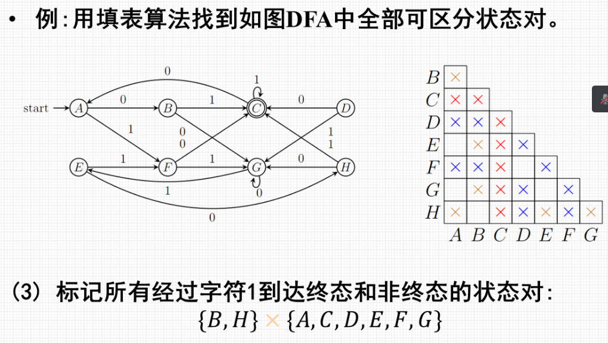
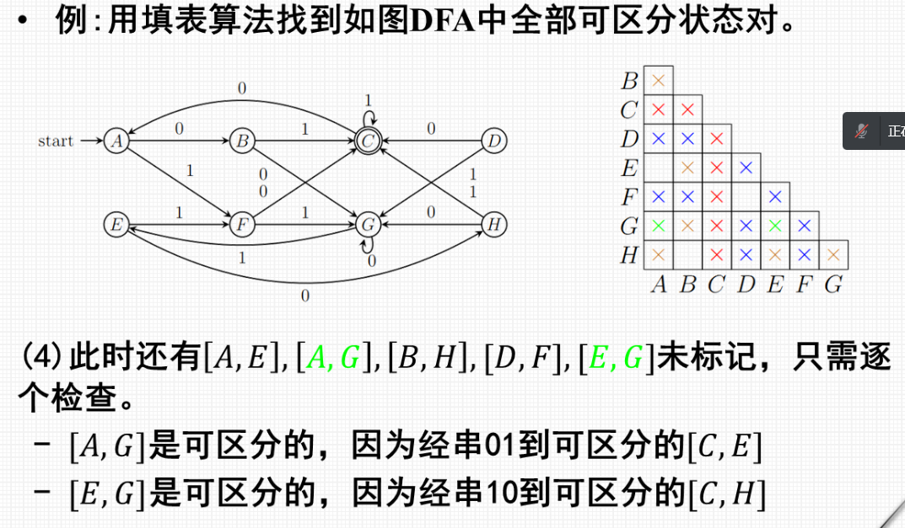

- [反转](#反转)
- [同态](#同态)
- [逆同态](#逆同态)
- [正则语言的判定性质](#正则语言的判定性质)
- [自动机最小化](#自动机最小化)
  - [例题](#例题)

## 反转
> 
> * **反转也封闭**

## 同态
> 
> * **也封闭**

## 逆同态
> 
> * **也封闭**

## 正则语言的判定性质
> 
> 

## 自动机最小化
> 

### 例题
> 
> 
> 
> 

