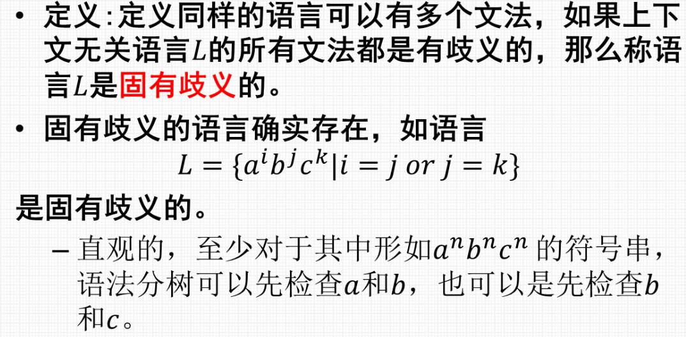

# 上下文无关文法与上下文无关语言

## 上下文无关文法

### 文法示例
* 回文
* > 
* 用泵引理证明

### 上下文无关文法的形式定义
> 

* 使用四元组
* 一些例子
* > 

### 文法的派生
> 
> 

### 最左派生和最右派生
> 
> 

### 文法产生的语言
> 
> 

---

## 语法分析树
> 

### 等价性
> 

### 唯一最左派生
> 

---

## 歧义性
>     
> 
>     
> 
