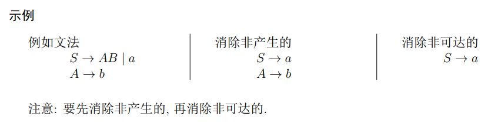

- [上下文无关文法](#上下文无关文法)
  - [上下文无关文法的化简](#上下文无关文法的化简)
  - [3. **消除单元产生式** (unit productions): 形式为 A → B, A 和 B 都是变元.](#3-消除单元产生式-unit-productions-形式为-a--b-a-和-b-都是变元)
    - [消除无用符号](#消除无用符号)
      - [计算"产生的"符号](#计算产生的符号)
      - [计算"可达的"符号](#计算可达的符号)
      - [重要的产生可达的例题](#重要的产生可达的例题)
  - [* > !](#--)
    - [消除 ε-产生式](#消除-ε-产生式)
      - [确定"可空"](#确定可空)
      - [替换带空符号的产生式](#替换带空符号的产生式)
      - [例题](#例题)
  - [> !](#-)
    - [消除单元产生式](#消除单元产生式)
  - [> !](#--1)
    - [文法简化的顺序](#文法简化的顺序)
  - [乔姆斯基范式和格雷巴赫范式](#乔姆斯基范式和格雷巴赫范式)
    - [乔姆斯基范式](#乔姆斯基范式)
    - [格雷巴赫范式](#格雷巴赫范式)

# 上下文无关文法

## 上下文无关文法的化简

文法的化简主要包括:
1. **消除无用符号** (useless symbols): 不在 S ⇒∗ w(w ∈ T∗)的派生过程中出现的变元和终结符;
2. **消除 ε 产生式**(ε-productions): 形式为 A → ε, A 是变元 (得到语言 L − {ε});
3. **消除单元产生式** (unit productions): 形式为 A → B, A 和 B 都是变元.
---
### 消除无用符号
#### 计算"产生的"符号
1. 每个 T 中的符号都是产生的;
1. 如果有产生式 A → α 且 α 中符号都是产生的, 则 A 是产生的.
#### 计算"可达的"符号
1. 符号 S 是可达的;
2. 如果有产生式 A → α 且 A 是可达的,则 α 中的符号都是可达的.

* 每个非空的 CFL 都能被一个不带无用符号的 CFG 产生.
#### 重要的产生可达的例题
* > 
---
### 消除 ε-产生式
#### 确定"可空"
1. 如果 A → ε, 则 A 是可空的;
2. 如果 B → α 且 α 中的每个符号都是可空的, 则 B 是可空的.

#### 替换带空符号的产生式
* A → X1X2 · · · Xn 是产生式, 那么用所有的 A → Y1Y2 · · · Yn 产生式代替
    1. 若 Xi 不是可空的, 则 Yi = Xi
    2. 若 Xi 是可空的, 则 Yi 是 Xi 或 ε
    3. 但 Yi 不能全部为 ε

#### 例题
> 
---
### 消除单元产生式
> 
---
### 文法简化的顺序
> 

---
---
## 乔姆斯基范式和格雷巴赫范式

### 乔姆斯基范式
* 每个**不带 ε** 的 CFL 都可以由这样的 CFG G 产生, G 中所有产生式的形式或为 **A → BC, 或为 A → a**, 这里的 **A, B 和 C 是变元, a 是终结符**.

> 

### 格雷巴赫范式
* 每个**不带 ε** 的 CFL 都可以由这样的 CFG G 产生, G 中的每个产生式的形式为 **A → aα**, 这里 **A 是变元, a 是终结符, α 是零个或多个变元的串**.

> 