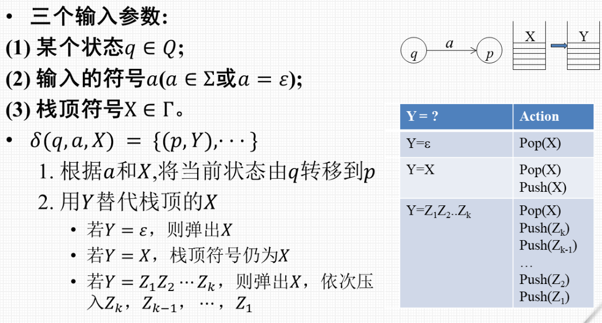
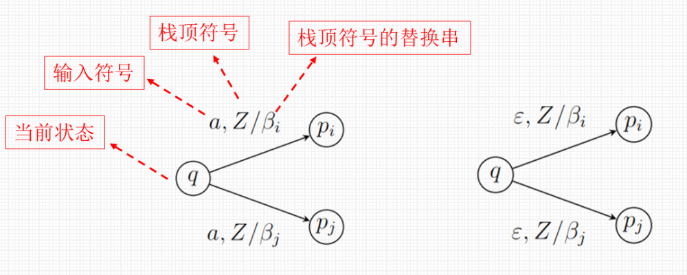
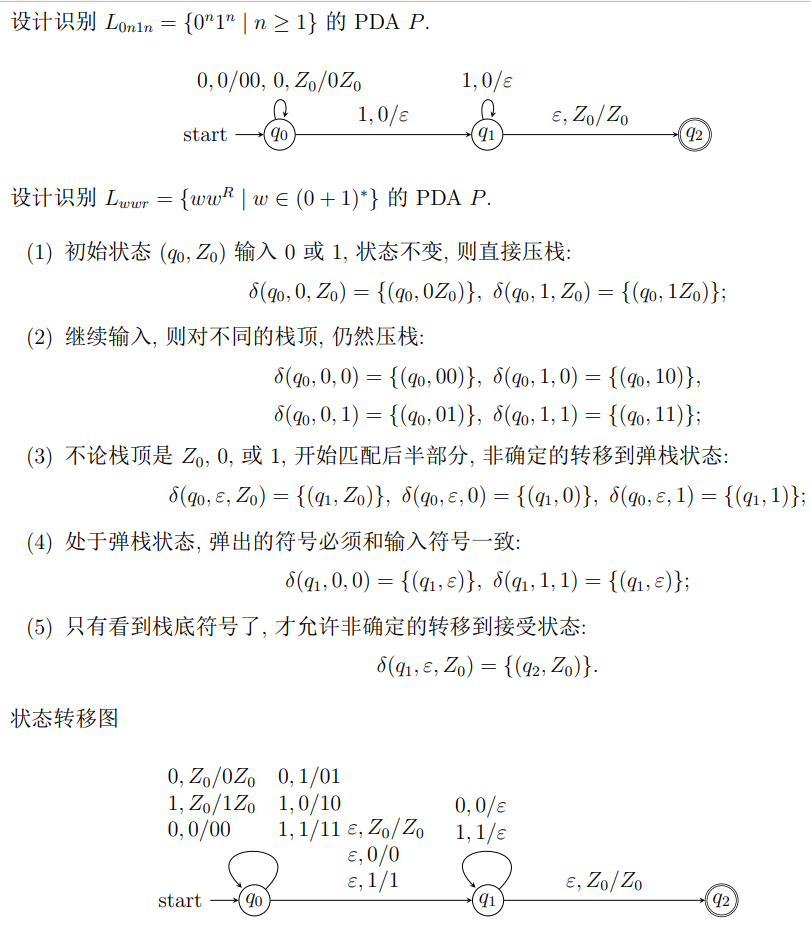
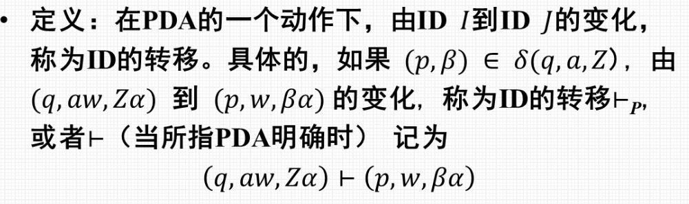
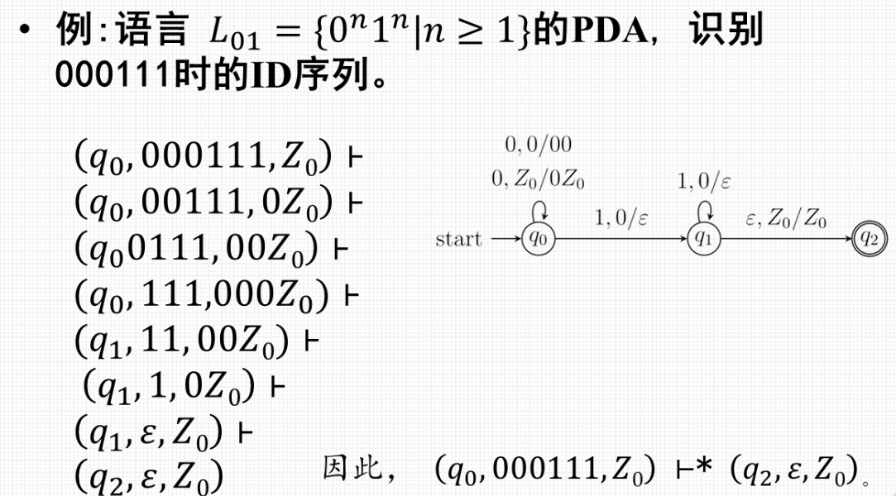
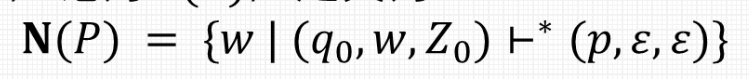
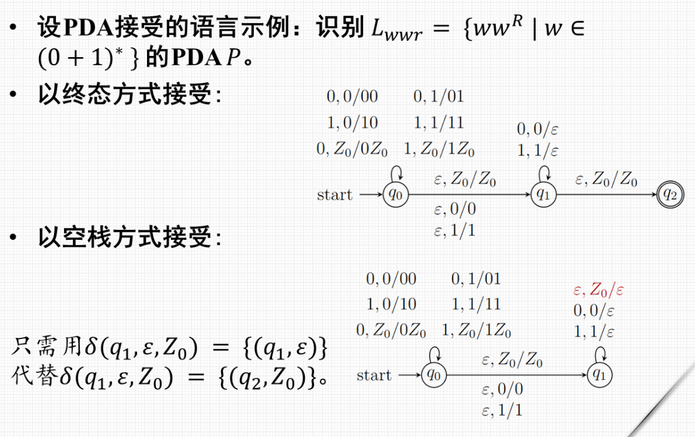
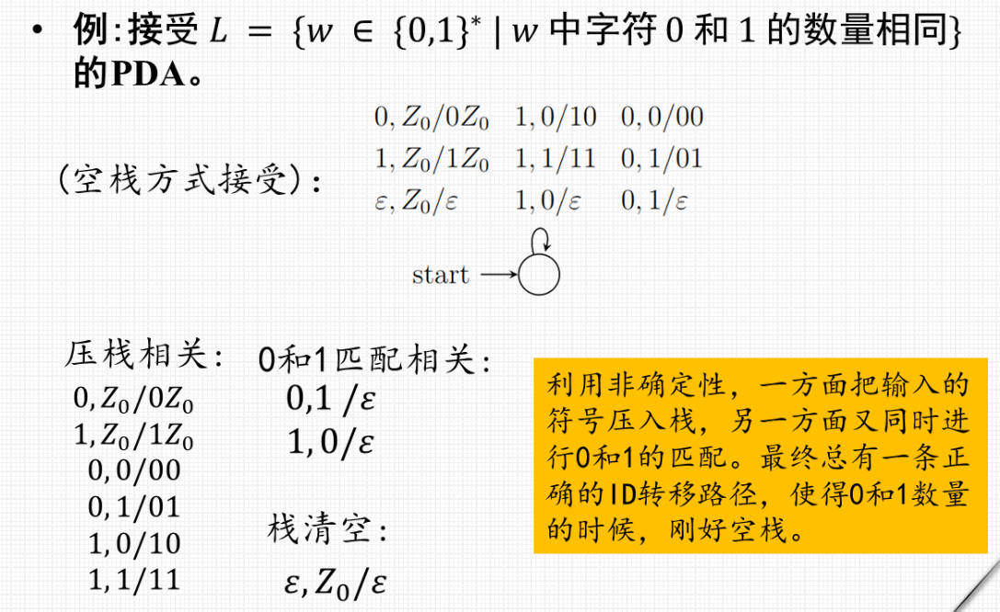
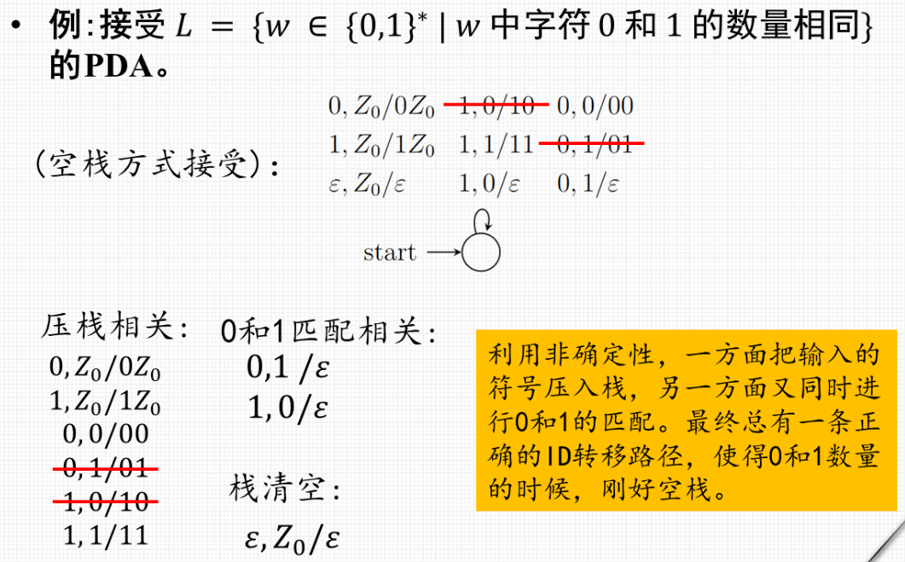
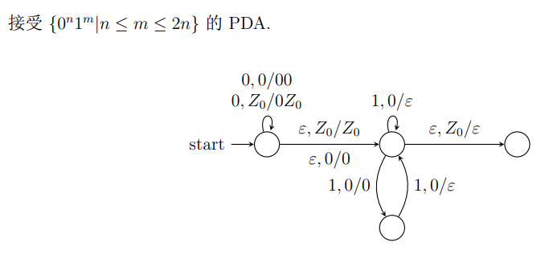

- [下推自动机](#下推自动机)
  - [输入参数及动作](#输入参数及动作)
  - [图的意义](#图的意义)
    - [例子](#例子)
  - [瞬时描述](#瞬时描述)
    - [转移符号](#转移符号)
      - [例题](#例题)
  - [下推自动机接受的语言](#下推自动机接受的语言)
    - [从终态方式到空栈方式](#从终态方式到空栈方式)
      - [例子](#例子-1)

# 下推自动机

* 等价于 上下文无关文法
* ε-NFA + 栈 = PDA
* 七元组 P = (Q, Σ, Γ, δ, q0, Z0, F):
   1. Q, 有穷状态集;
    1. Σ, 有穷输入字母表;
    2. Γ, 有穷栈字母表, 或栈符号集;
    3. δ : Q × (Σ ∪ {ε}) × Γ → $2^{QΓ∗}$, 状态转移函数;
    4. q0 ∈ Q, 初始状态;
  1. Z0 ∈ Γ − Σ, 初始符号, PDA 开始时, 栈中包含这个符号的一个实例, 用来表示栈底, 栈底符号之下无任何内容;
  2. F ⊆ Q, 接收状态集或终态集.

## 输入参数及动作
> 

## 图的意义
> 

### 例子
> 
> $ww^R表示w和w的转置$
> * 不知道什么时候会到wR，所以在任何时候都会开始检测后半段。相当于 q0 和 q1 并存

## 瞬时描述
* **三元组 (q, w, γ)**, 是 Q × Σ∗ × Γ∗ 中的元素, q 表示状态, w 表示剩余的输入串, γ 表示栈中的符号串.

### 转移符号
> 

#### 例题
> 

## 下推自动机接受的语言

### 从终态方式到空栈方式
> 

#### 例子
> 

> 
> * 压栈与匹配**同时进行**
> * 推荐使用下面的方法
> 

> 
> * 直线表示 0 和 1 相等的情况
> * 闭环表示读取两个 1, 弹出一个 0
> * 这样在n 到2n 之间都可以被读取