- [DCFL 的重要应用](#dcfl-的重要应用)
  - [前缀性质](#前缀性质)
- [上下文无关文法的泵引理](#上下文无关文法的泵引理)
  - [例题](#例题)
- [封闭性](#封闭性)
  - [代换](#代换)
    - [例题](#例题-1)

## DCFL 的重要应用
* 确定型下推自动机
* > 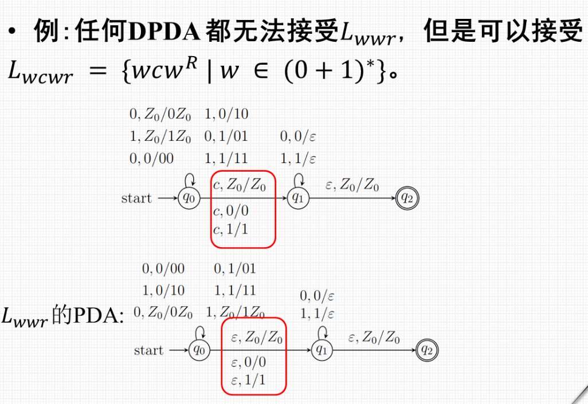

> 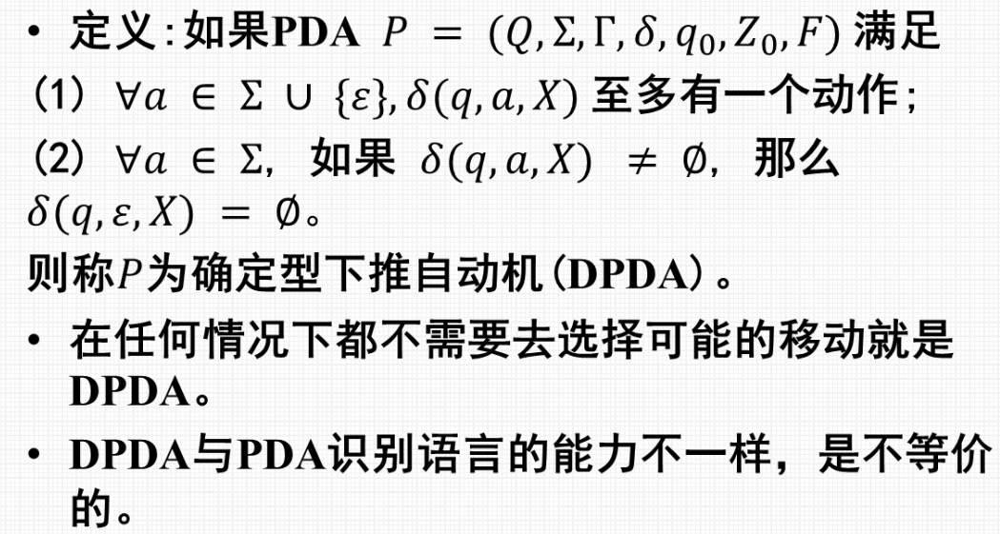
> 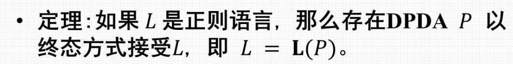

### 前缀性质
* L 中不存在 x 为 y 的前缀
* > 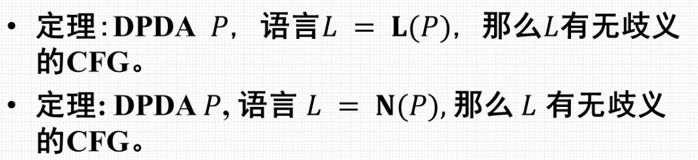
* 并非所有 CFL 都能被 DPDA 接受

> 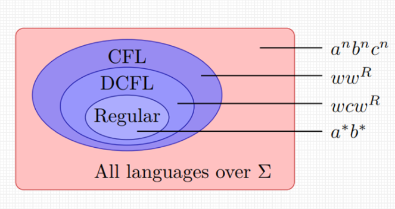

---
---

## 上下文无关文法的泵引理
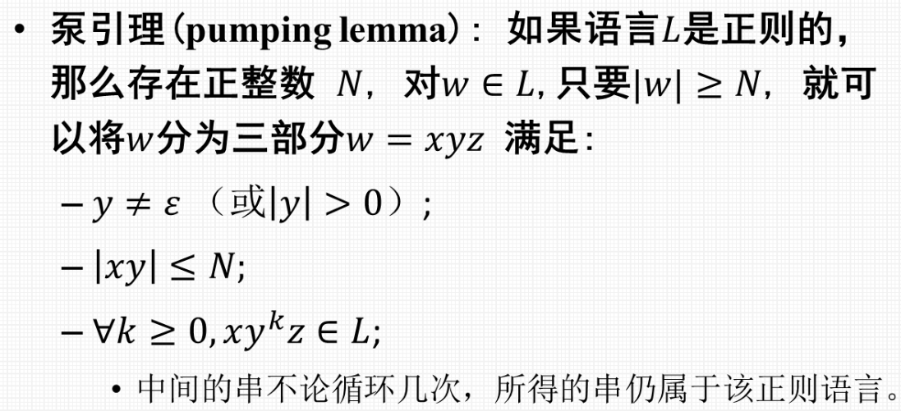
> 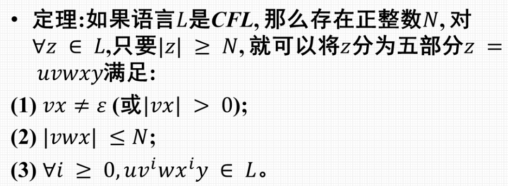

### 例题
> 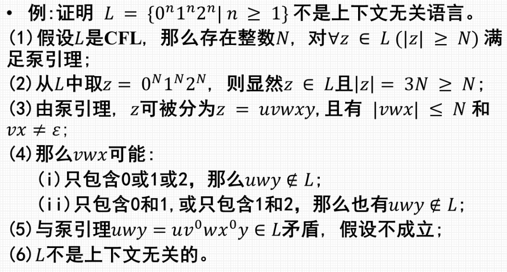
> 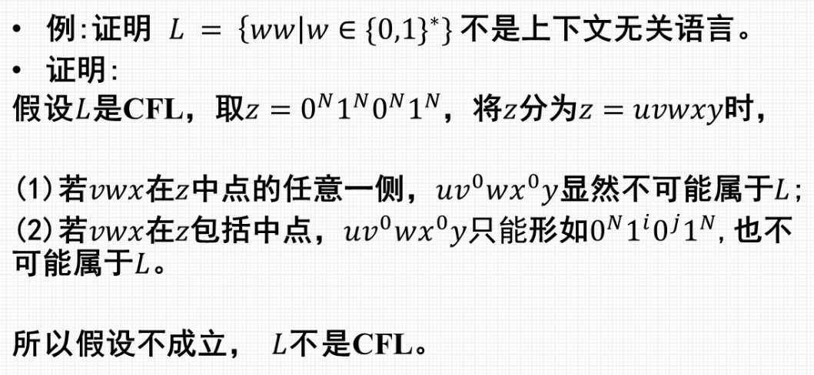

## 封闭性
### 代换
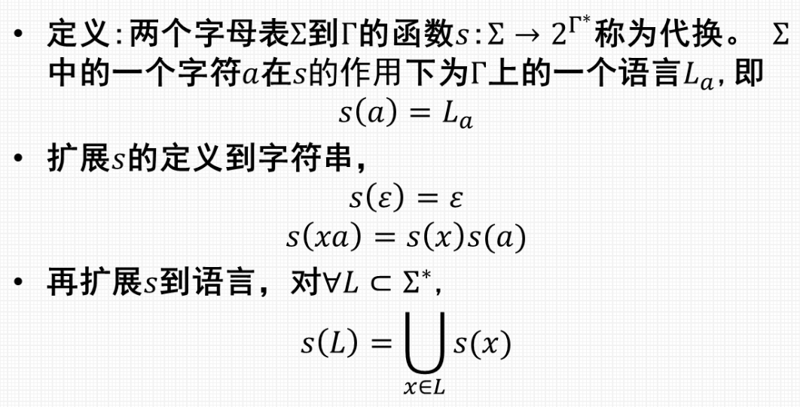

* 上下文无关文法在代换上封闭

#### 例题
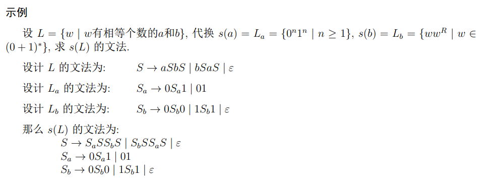