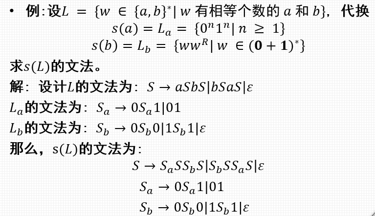
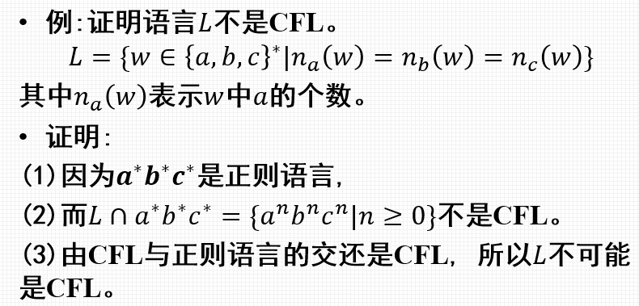
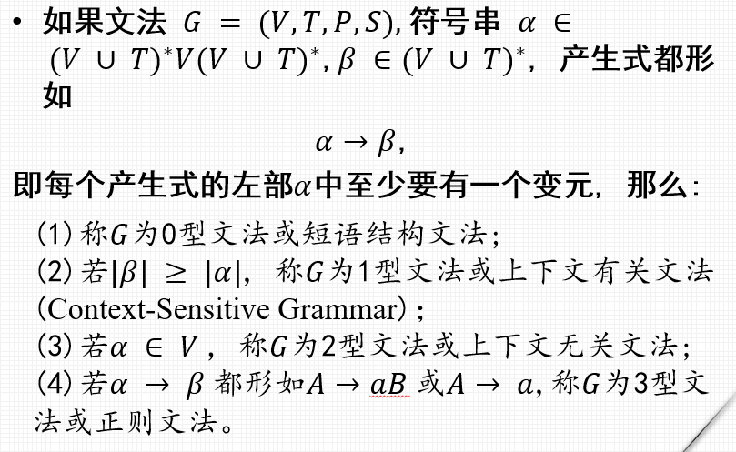
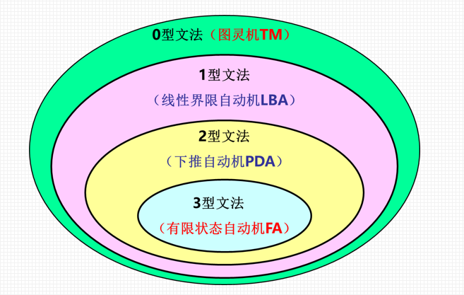
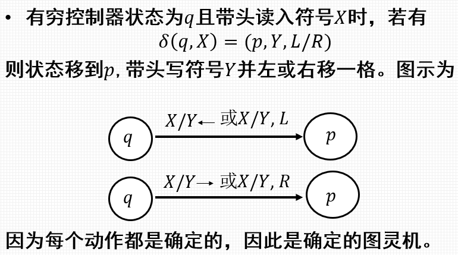
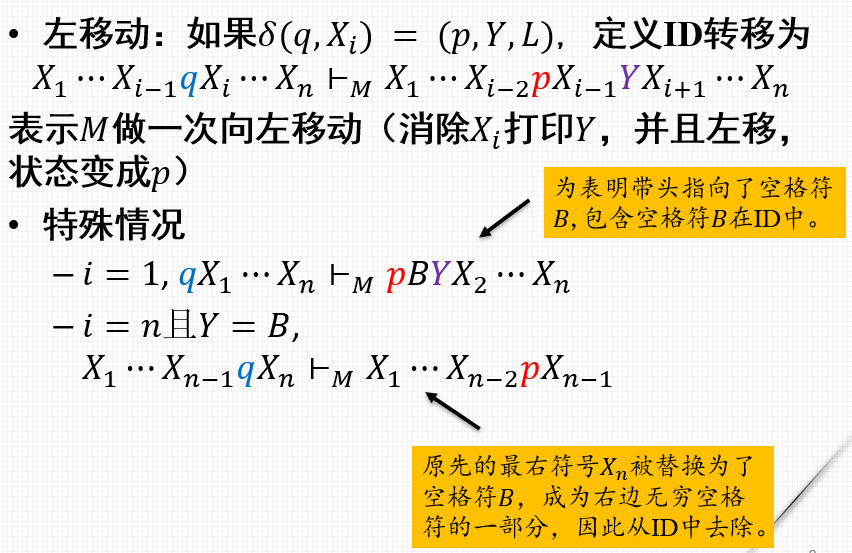
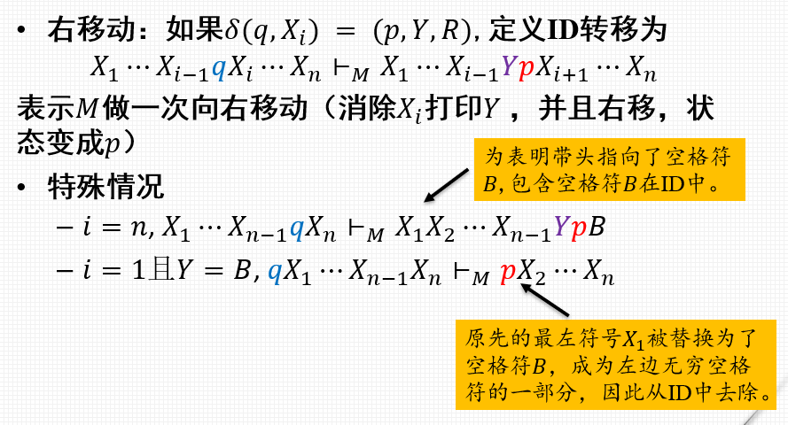
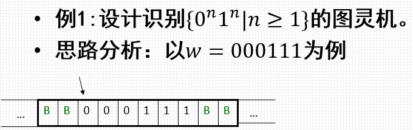
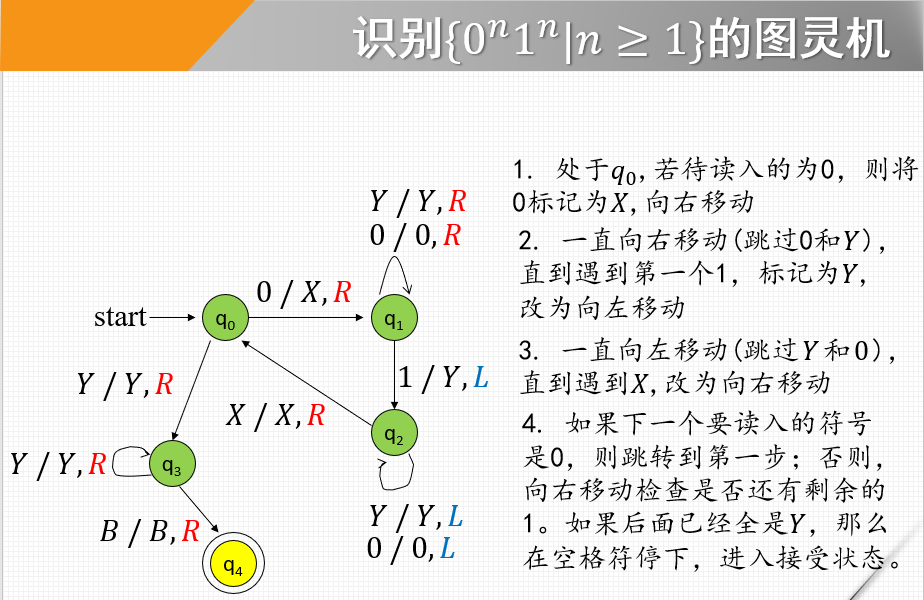
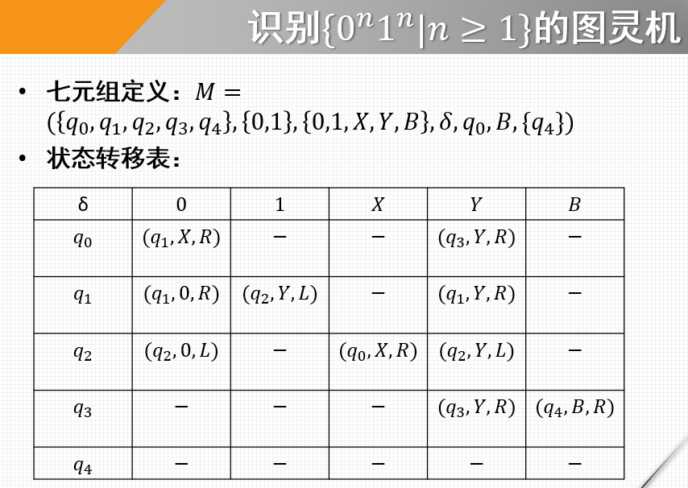

- [上下文无关文法](#上下文无关文法)
  - [封闭性](#封闭性)
    - [代换](#代换)
    - [代换的封闭性](#代换的封闭性)
- [### 例题](#-例题)
    - [CFL 封闭性](#cfl-封闭性)
      - [例题-封闭性的应用](#例题-封闭性的应用)
  - [上下文无关文法的判定性质](#上下文无关文法的判定性质)
    - [可判定的 CFL 问题](#可判定的-cfl-问题)
  - [乔姆斯基文法体系](#乔姆斯基文法体系)
- [图灵机](#图灵机)
  - [定义](#定义)
  - [动作及状态转移图](#动作及状态转移图)
    - [瞬时描述](#瞬时描述)
      - [移动符号](#移动符号)
      - [例子](#例子)

# 上下文无关文法

## 封闭性
### 代换
* 定义 : 两个字母表 Σ 到 Γ 的函数 $𝑠:Σ→2^{Γ^∗}$ 称为代换。 Σ 中的一个字符 𝑎 在 𝑠 的作用下为 Γ 上的一个语言𝐿_𝑎 , 即 𝑠(𝑎) = 𝐿_𝑎
* 扩展𝑠的定义到字符串，
𝑠(𝜀) = 𝜀
𝑠(𝑥𝑎) = 𝑠(𝑥) 𝑠(𝑎)
* 再扩展𝑠到语言，对 ∀𝐿⊂$Σ^∗$,
𝑠(𝐿)=⋃_(𝑥∈𝐿)▒〖𝑠(𝑥)〗 (克林闭包)

### 代换的封闭性
* 定理 : 如果有 Σ 上的 CFL 𝐿 和代换 𝑠, 且每个 𝑎 ∈ Σ 的 𝑠(𝑎) 都是 CFL , 那么 𝑠(𝐿) 也是 CFL。

# ### 例题
> 

### CFL 封闭性
* 定理 : 上下文无关语言在**并, 连接, 闭包, 正闭包, 同态**下封闭。

* 定理 : 如果 𝐿 是 CFL, 那么$𝐿^𝑅$也是CFL (**反转**)
 
* 定理 : 如果 𝐿 是字母表 ∆ 上的 CFL, ℎ 是字母表 Σ 到 $Δ^∗$的同态, 那么$ℎ^{−1}(𝐿)$ 也是 CFL  (**逆同态**)

* CFL 对**交/补运算***不封闭*

* 定理 : 若 𝐿 是 CFL 且 𝑅 是正则语言, 则 𝐿 ∩ 𝑅 是 CFL

#### 例题-封闭性的应用
> 

## 上下文无关文法的判定性质

### 可判定的 CFL 问题
* 空性 : 只需判断文法的开始符号 𝑆 是否为非产生的。
* 成员性 : 利用**CNF范式**, 有CYK算法检查串𝑤是否属于𝐿。

## 乔姆斯基文法体系
> 

# 图灵机
* 每个过程都是有穷可描述的
* 过程必须是由离散的、可以机械执行的步骤组成

## 定义
* 有一个**有穷控制器**，一条**两端无穷的输入输出带**和一个**带头**

* 图灵机为**七元组**, M
  (1) 𝑄:有穷状态集
(2) Σ:有穷输入符号集(input alphabet)
(3) Γ:有穷带符号集(tape alphabet)，且总有Σ⊆Γ
(4) 𝛿: 𝑄×Γ→𝑄×Γ×{𝐿,𝑅}:转移函数
(5) 𝑞_0∈𝑄：初始状态
(6) 𝐵∈Γ−Σ:空格/空白符号(Blank Symbol)
(7) 𝐹⊆𝑄：接受状态集

## 动作及状态转移图
> 

### 瞬时描述
* 定义瞬时描述(**ID**) : $𝑋_1 𝑋_2⋯𝑋_(𝑖−1) 𝑞𝑋_𝑖 𝑋_(𝑖+1) ⋯𝑋_𝑛$
  (1) 𝑞 是图灵机的当前状态;
    (2)带头在左起第𝑖个非空格符$𝑋_𝑖$上;
    (3)$𝑋_1 𝑋_2⋯𝑋_𝑛$是从最左到最右非空格内容（ 𝑖 = 0 表示带头左端有空格符号，𝑖 = 𝑛 表示带头右端有空格符号)。
    * ID转移符号$⊢_𝑀$。若某ID是从另一个经有限步转移而得到的, 记为$⊢_𝑀^∗$。若 𝑀 已知, 简记为 ⊢ 和 $⊢^∗$。

#### 移动符号
> 
> 

#### 例子
* 设计识别{$0^n1^n$}的图灵机
* > 
* > 
* > 

