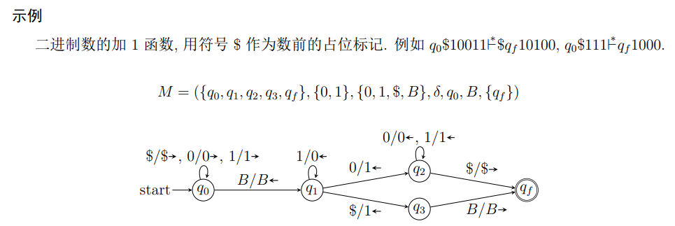
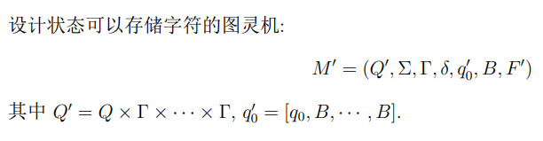
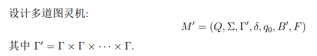
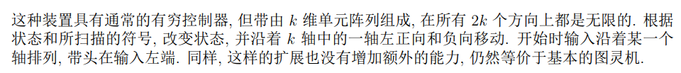

- [图灵机](#图灵机)
  - [语言与停机](#语言与停机)
  - [整数计算器](#整数计算器)
- [扩展的图灵机](#扩展的图灵机)
  - [状态中存储](#状态中存储)
  - [多道图灵机](#多道图灵机)
  - [多带图灵机](#多带图灵机)
  - [非确定图灵机](#非确定图灵机)
  - [多维图灵机](#多维图灵机)
- [受限图灵机](#受限图灵机)
  - [半无穷带](#半无穷带)
  - [多栈机器](#多栈机器)

# 图灵机

## 语言与停机

* 一般假定当输入串被接受时 M 总会停机 (halt), 即没有下一个动作的定义. 而对于不接受的输入, TM 可能永远不停止. 我们永远也不会知道, 到底是因为运行的时间不够长而没有接受呢, 还是根本就不会停机.

## 整数计算器
> 

# 扩展的图灵机
TM M = (Q, Σ, Γ, δ, q0, B, F)

## 状态中存储
> 

## 多道图灵机
> 

## 多带图灵机
>多带图灵机由有限控制器, k 个带头和 k 条带组成. 在一个动作中, 根据有限控制器的状态和每个带头扫视的符号, 机器能够:
(1) 改变状态;
(2) 在带头所在单元, 打印一个符号;
(3) 独立的向左或向右移动每个单元, 或保持不动.
>开始时, 输入在第 1 条带上, 其他都是空的. 形式定义非常繁琐, 因此省略.

* 如果语言 L 被一个多带图灵机接受, 那么 L 能够被某个单带图灵机接受

## 非确定图灵机
>非确定型图灵机 (NTM) 的对每个状态 q 和每个带符号 X 的转移可以有有限个选择, 即
δ(q, X) = {(q1, Y1, D1),(q2, Y2, D2), · · · ,(qk, Yk, Dk)}.
>NTM 每步能选择任何一个三元组. 图灵机增加非确定性并未使这个装置接受新的语言

* 如果 L 被一个非确定图灵机接受, 那么 L 被某个确定的图灵机接受

## 多维图灵机
> 

# 受限图灵机

## 半无穷带
* 图灵机的输入带, 若只有一侧是无穷的, 其能力与图灵机**等价**

## 多栈机器
基于下推自动机的扩展, k 栈机器是具有 k 个栈的确定型下推自动机
* 如果图灵机接受 L, 那么双栈机接受 L
