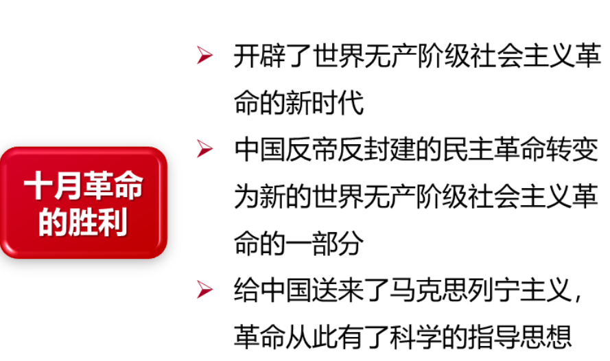
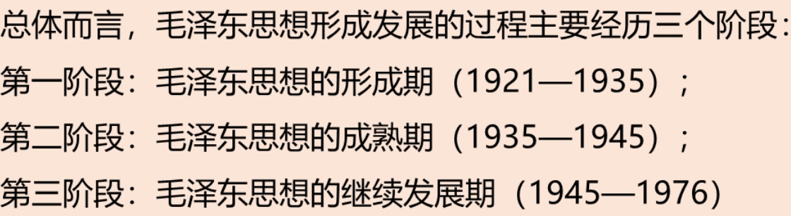
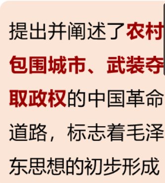
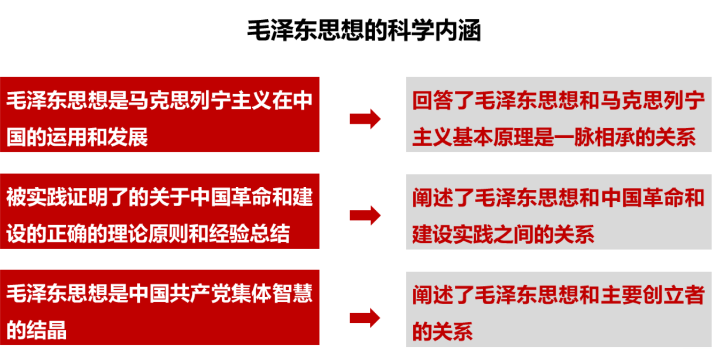
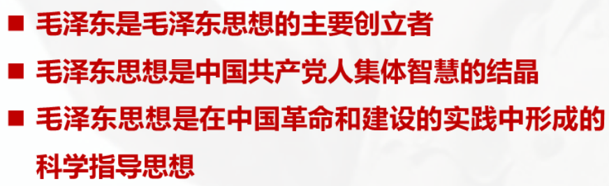

# 毛泽东思想及其历史地位

## 毛泽东的思想历程

* 从无政府主义向马克思主义转变的关键性人物 : **李大钊 , 陈独秀**

## 毛泽东思想形成发展的历史条件
  * 新文化运动 , 十月革命
  >  
  * **1920年**, **陈望道**翻译《**共产党宣言**》

## 毛泽东思想发展的过程

> 

### 毛泽东思想的形成
> 

### 毛泽东成熟的思想
* ==遵义会议==, 1935年
* > 

### 毛泽东思想的继续发展
> 
> 
> 