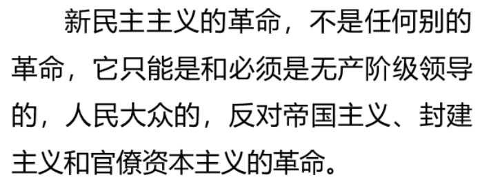
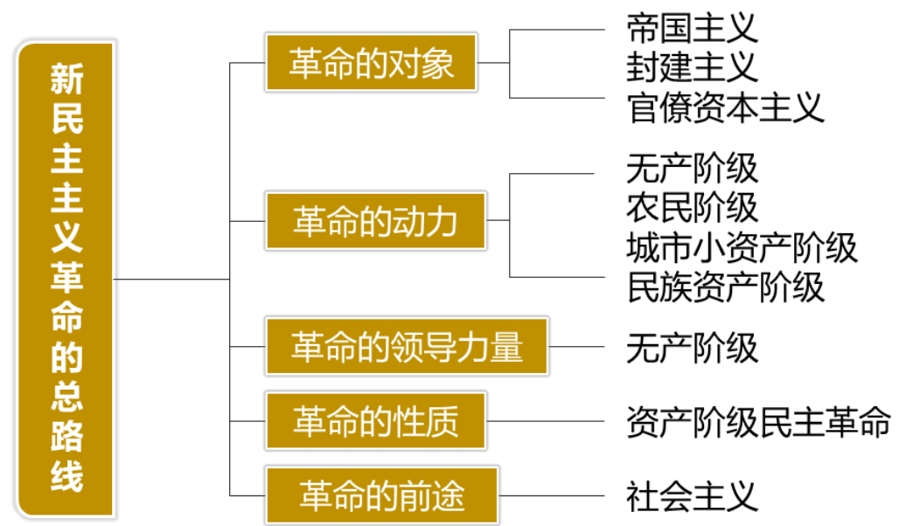

- [新民主主义革命](#新民主主义革命)
  - [新民主主义革命总路线](#新民主主义革命总路线)
  - [重点!](#重点)
    - [中国革命的中心问题](#中国革命的中心问题)
    - [性质与前途](#性质与前途)

# 新民主主义革命

## 新民主主义革命总路线
> 
* 反帝国主义, 封建主义, 官僚资本主义

## 重点!
> 

### 中国革命的中心问题
* 无产阶级的领导权
* 也是新民主主义革命理论的核心问题
* > 

### 性质与前途
> 
> 