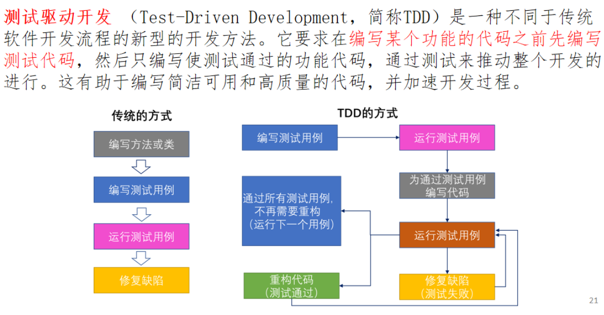
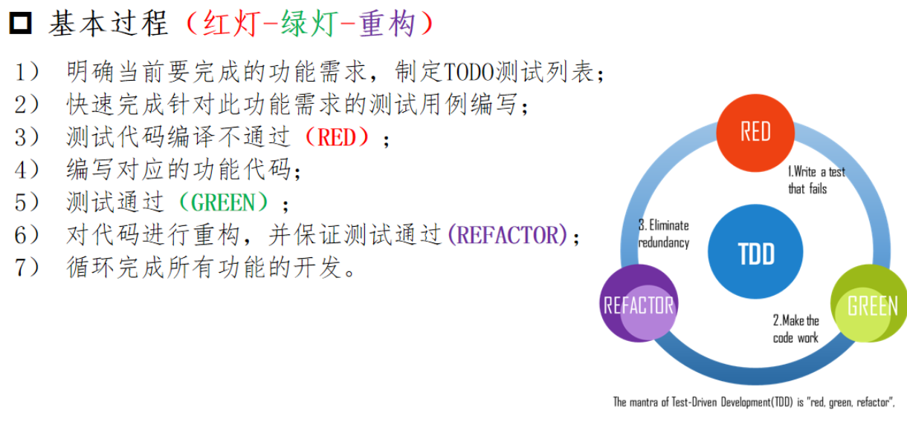
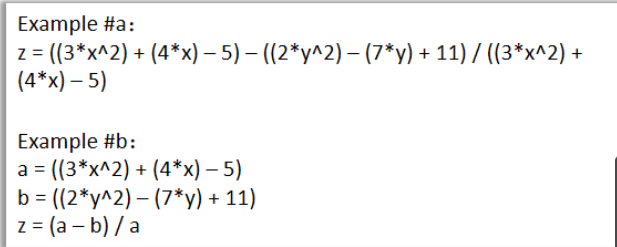

- [面向对象的软件构造概述及 Java 语言简介](#面向对象的软件构造概述及-java-语言简介)
  - [软件构造基本流程及目标](#软件构造基本流程及目标)
    - [软件的定义](#软件的定义)
    - [TDD 测试驱动开发](#tdd-测试驱动开发)
    - [软件构造的目标](#软件构造的目标)
  - [面向对象思想](#面向对象思想)
    - [软件工程方法](#软件工程方法)
      - [结构化方法](#结构化方法)
      - [面向对象方法](#面向对象方法)

# 面向对象的软件构造概述及 Java 语言简介

## 软件构造基本流程及目标

### 软件的定义

* 软件 = 程序 + 数据 + 文档

### TDD 测试驱动开发

* > 
* > 

### 软件构造的目标

* 可理解性
  * > 
* 可维护性
* 可复用性
* 时空性能

---

## 面向对象思想

### 软件工程方法

#### 结构化方法

#### 面向对象方法
* 任何系统由能够完成一组相关任务的==对象==构成
* 调用其他的方法
* 对象之间**不能直接**互相访问内部数据
* 所有交流通过==方法==实现

* 优点:
    1. 模块化
    2. 自然性
    3. 并发性
    4. 重用性

* 三大特性 : 
    1. 封装 : 隐藏对象属性与细节, 安全
    2. 继承 : 子类继承父类, 复用
    3. 多态 : 多个接口, 扩展, 可维护

* 优势 : 解耦, 封装, 复用, 多态

