- [类和对象](#类和对象)
  - [类和对象](#类和对象-1)
    - [三大特性](#三大特性)
    - [对象](#对象)
    - [类](#类)
  - [类的声明与构造](#类的声明与构造)
    - [类的声明](#类的声明)
    - [封装性](#封装性)
    - [类的构造方法](#类的构造方法)
    - [子类的构造方法](#子类的构造方法)
  - [类的访问域](#类的访问域)
  - [static 修饰符](#static-修饰符)
    - [静态成员](#静态成员)
  - [数组](#数组)
    - [快速排序](#快速排序)
    - [多维数组](#多维数组)

# 类和对象

## 类和对象

### 三大特性
* 封装
* 继承
* 多态

### 对象
* 标识符, 属性, 操作

### 类
* 类名, 属性, 操作方法

## 类的声明与构造

### 类的声明
* 格式
```java
[类修饰符] class 类名
{
    成员变量的声明; // 描述属性

    成员方法的声明; // 描述功能

    // public 公共类
    // abstract : 抽象类 (继承)
    // final : 最终类 (非继承)
}
```
* 成员变量
  
* 成员方法
```java
访问控制符  返回值类型  方法名([参数类型 参数, ...])
{
    // 方法体
}
```

### 封装性
* 类内部定义的属性和方法, 外部不能调用
* 用 private
* 使用getter 和 setter 对属性进行访问
* ==vscode : 右键 $\to$ 源代码操作==

### 类的构造方法
* 构造方法**与类名同名**
* 且不需要返回数据类型
```java
public class Person {
    /**
     * 构造器的重载
     * 应对不同的局面
     */
    public Person(){}

    public Person(int a){
        age = a;
    }

    public Person(String n){
        name = n;
    }


    public Person(int age, String name){
        age = this.age;
        name = this.name;
    }
    // 构造方法, 使用此种构造方法, 不会使用默认构造方法

    private int age;
    private String name;
    public void showInfo(){
        System.out.println(age);
        System.out.println(name);
    }
}
```
* 根据不同的数据输入类型, 会选择不同的构造方法
* this 关键字

### 子类的构造方法
* 继承
* 使用关键字
* 子类不能直接 **extends** 继承父类的构造方法
* 子类使用 **super** 语句来继承父类的构造方法
* 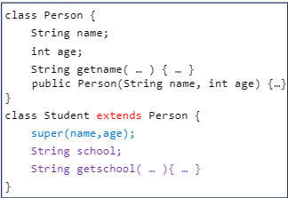

## 类的访问域
> 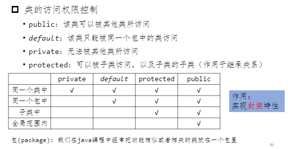


## static 修饰符
### 静态成员
* 静态成员属于类所有的, **不属于某一具体对象**

> 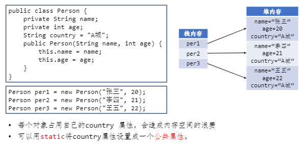

* 用 static 声明属性
* 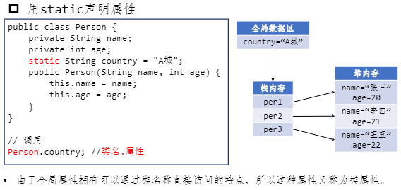

* 用 static 声明方法
* 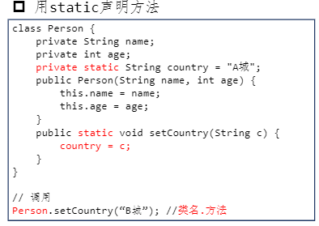
* 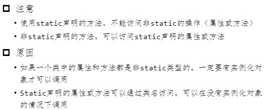

> 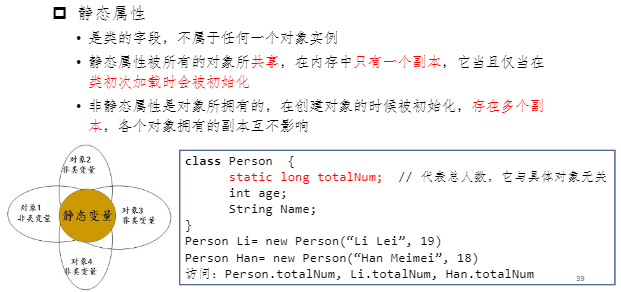
> 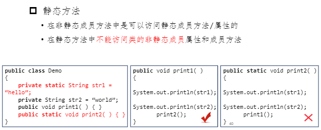
> 牢记, ==静态方法不能访问非静态方法==

* 静态块
* 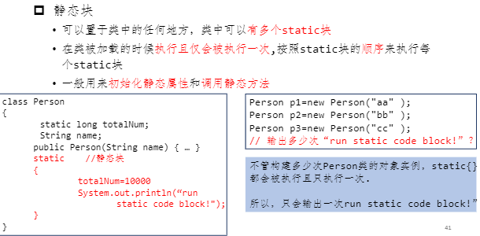

## 数组
> 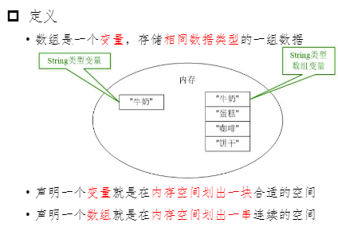
> 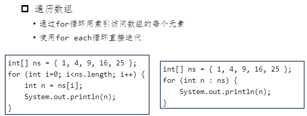

### 快速排序
> 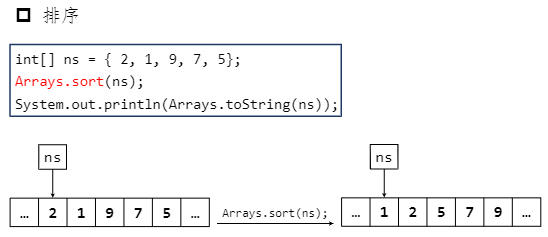

### 多维数组
> 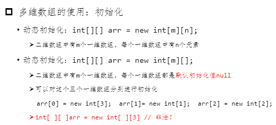
> 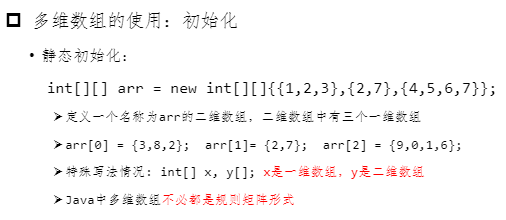

