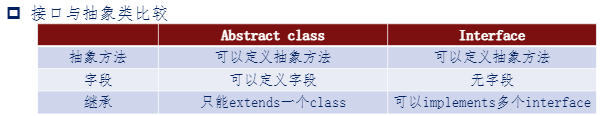

- [接口与继承](#接口与继承)
  - [继承](#继承)
  - [接口和抽象类](#接口和抽象类)
    - [接口](#接口)
    - [区别](#区别)
  - [多态与重写](#多态与重写)
    - [多态的实现1 : 重写](#多态的实现1--重写)
    - [多态的实现2 : 抽象类](#多态的实现2--抽象类)
    - [多态的实现3 : 接口](#多态的实现3--接口)
  - [Java 多继承问题](#java-多继承问题)
    - [内部类](#内部类)
    - [接口](#接口-1)
  - [超类和 super 关键字](#超类和-super-关键字)
    - [Object 超类](#object-超类)
      - [equals 方法](#equals-方法)
    - [super 关键字](#super-关键字)
  - [异常的继承框架](#异常的继承框架)

# 接口与继承

## 继承
* 存在大量重复代码
* $eg\  .\ Student\ is-a-kind-of\ Person$
* 利用 `extends` 关键字 和 `super`(用于构造方法)

---

## 接口和抽象类
* 父类是将子类所共同拥有的属性和方法进行抽取。
* 无法确定的属性和方法, 可以将其定义成 **抽象方法**
* ```abstract``` , 再后面的子类中进行具体化实现
* 子类中不实现会报错, 可以防止忘记定义
* 拥有抽象方法的类就是 **抽象类**
* ==抽象类不能实例化==
<!-- * <font color = red>试试行不行</font> -->

### 接口
* 比抽象类还抽象, 抽象之王, <font color = #b8a5da>简直就是我大哥</font>
* **没有字段**, 所有方法都是抽象方法
* ```interface``` 里面的方法默认为抽象方法
* 不再用继承`extends`, 而用`implements`

### 区别
* > 
  * 有了抽象类, 为什么还需要接口?
    1. 抽象类解决不了多继承问题
    2. 要实现的方法不是当前类的必要方法("唱歌"不是Person特有的)
    3. 为不同类型的多个类实现同一个方法(Person, 手机, 鸟...)

---

## 多态与重写
### 多态的实现1 : 重写
* 父类中的某些方法对子类并不一定适用。需要**重写/覆盖
(override)**父类中的这个方法。
* **重写**：如果在子类中定义一个方法，其**名称、参数、返回类型**
正好与父类中某个方法相同，那么可以说，子类的方法**重写**了
父类的方法。
* 在子类中使用`@Override`
* 通过父类的引用调用子类重写的方法
* <font color = #7c1>父类类名 引用名称 = new 子类类名()</font>
  
### 多态的实现2 : 抽象类
```java
1. //定义一个抽象类  
2. public abstract class Person{
3.     ......
4.     //抽象方法  
5.     //没有方法体，用abstract做修饰  
6.     public abstract void getTarget();
7.     ......
8. }
```
* <font color = #7c1>父类类名 引用名称 = new 子类类名()</font>

### 多态的实现3 : 接口
```java
//接口：目标 
public interface GetTarget(){  
    void getTarget();  
}  
```
* <font color = #7c1>父类类名 引用名称 = new 子类类名()</font>

---

## Java 多继承问题
* Java 不允许多继承, 只允许单继承

### 内部类
```java
public class Father{  
    public int strong(){  
        // 强壮指数  
        return 9;  
    }  
}

public class Mother{  
    public int smart(){  
        // 聪慧指数  
        return 8;  
    }  
}

1. public class Son {  
2.     // 内部类继承Father类  
3.     class Father_Inner extends Father {  
4.         public int strong() {  
5.             return super.strong() + 1;  
6.         }  
7.     }
8.     // 内部类继承Mother类   
9.     class Mother_Inner extends Mother {  
10.        public int smart() {  
11.            return super.smart() + 2;  
12.        }  
13.    }   
14.     public int getStrong() {  
15.         return new Father_Inner().strong();
16.     }  
17.     public int getSmart() {  
18.         return new Mother_Inner().smart(); 
19.     } 
20. }
```

### 接口
```java
1. public interface Father{  
2.     public void strong();  
3. }  
4.   
5. public interface Mother{  
6.     public void smart();  
7. }  
8.   
9. public interface Daughter extends Father, Mother{  
10.    public void kind();  
11.}

1. public class Girl implements Daughter{  
2.     public static void main(String[] args){
3.     }  
4.     @Override  
5.     public void strong(){  
6.         System.out.println(“She’s not strong.");  
7.     }  
8.     @Override  
9.     public void smart(){  
10.        System.out.println(“She’s very smart.");  
11.    }  
12.    @Override  
13.    public void kind(){  
14.        System.out.println(“She’s very kind.")  
15.    }  
16.}

```

---

## 超类和 super 关键字

### Object 超类
* 是所有类的始祖, <font color = Cyan>我超, O!</font>
* 位于 java.lang 包中, 编译时自动导入
* 显式继承, 隐式继承 都可以
* Object 是一个泛容器, 但是使用时还是需要明确的类型
* `Object obj = new Student(“Zhangsan", 19);` 不推荐
  
#### equals 方法
* 用于比较两个对象是否相等
```java
1. class IfStudentEqual {  
2.     public static void main(String[] args) {
3.         // 创建两个对象  
4.         Object Student_1 = new Student("Zhangsan",19);
5.         Object Student_2 = new Student("Lisi",18);
6.
        // 不同对象，内存地址不同，不相等，返回 false  
7.         System.out.println(Student_1.equals(Student_2));
8.
        // 对象引用，内存地址相同，相等，返回 true  
9.         Object Student_3 = Student_1;
10.        System.out.println(Student_1.equals(Student_3));
11.    }
12.}
```

### super 关键字
* 在子类的构造方法中显式地**调用父类构造方法**。
* 访问父类的**成员方法和变量**
* 基础格式 : `super(parameter-list)`
  * 如
```java
1. public class Person {  
1.     public Person(String name, int age) {  
2.     }  
3. }  
4. public class Student extends Person {  
5.     public Student(String name, int age, String birth) {  
6.         super(name, age); // 调用父类中含有2个参数的构造方法  
7.     }  
8. }
```

* 同名时, 访问子类用`this.X`, 访问父类用`super.X`
* 下列代码输出 `学生年龄: 39`
```java
1. class Person {  
2.     int age = 39;  
3. }  
4. class Student extends Person {  
5.     int age = 18;  
6.     void display() {  
7.         System.out.println("学生年龄：" + super.age);  
8.     }  
9. }  
10.class Test {  
11.    public static void main(String[] args) {  
12.        Student stu = new Student();  
13.        stu.display();  
14.    }  
15.}
```

---

## 异常的继承框架
* <font color = LightCoral>不被期望的事件</font>

1. 检查性异常
2. 运行时异常
3. 错误

* 可用于判断程序错误类型

* `Error` 和 `Exception`
```java
// 自定义异常类  
class MyException extends Exception{  
  
}

1. public class MyException extends Exception {  
2.     public MyException() {  
3.         super();  
4.     }  
5.     public MyException(String str) {  
6.         super(str);  
7.     }  
8. }

1. import java.util.InputMismatchException;  
2. import java.util.Scanner; 
3. public class exception_eg {  
4.     public static void main(String[] args) {  
5.         int score;  
6.         Scanner input = new Scanner(System.in);  
7.         System.out.println("请输入你的考试成绩：");
8. ...... 
try {  
10.            score = input.nextInt();    // 获取成绩
11.            if(score < 0) {  
12.                throw new MyException("成绩为负！");  
13.            } else if(score > 100) {  
14.                throw new MyException("你的优秀已经溢出了！");  
15.            } else {  
16.                System.out.println("你的成绩为："+score);  
17.            }  
18.        } catch(InputMismatchException e1) {  
19.            System.out.println("输入的成绩不是数字！");  
20.        } catch(MyException e2) {  
21.            System.out.println(e2.getMessage());
22.        }  
23.......

```
