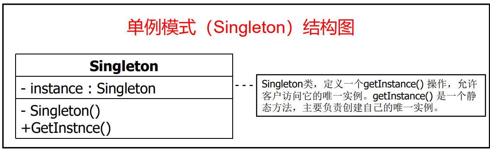
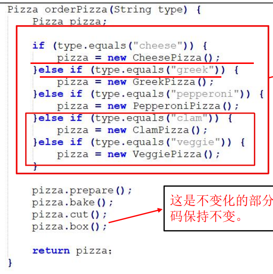
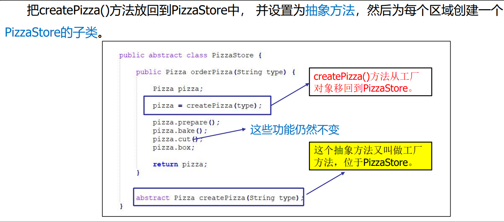
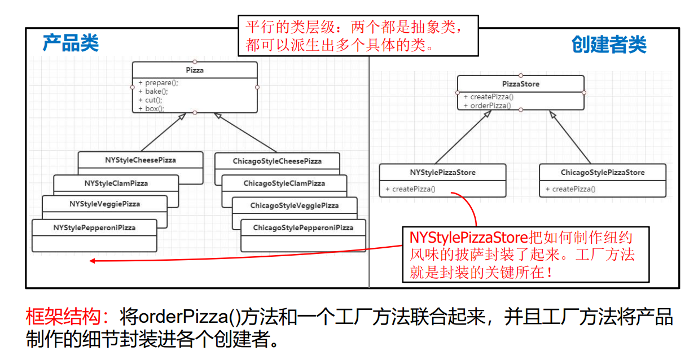

- [设计模式](#设计模式)
  - [七个原则](#七个原则)
    - [单一职责原则](#单一职责原则)
    - [开闭原则](#开闭原则)
    - [里氏代换原则](#里氏代换原则)
    - [依赖倒转原则](#依赖倒转原则)
    - [合成复用原则](#合成复用原则)
    - [接口隔离原则](#接口隔离原则)
    - [迪米特法则](#迪米特法则)
  - [设计模式的概念](#设计模式的概念)
    - [四个要素](#四个要素)
  - [设计模式的作用](#设计模式的作用)
    - [根据目的划分](#根据目的划分)
    - [根据范围划分](#根据范围划分)
  - [单例模式](#单例模式)
  - [工厂模式](#工厂模式)

# 设计模式
## 七个原则
### 单一职责原则
* 就一个类而言, 应该**只有一个引起它变化的原因**
  * 高复用, 低耦合

### 开闭原则
* <font color = red>对扩展开放, 对修改关闭</font>
  * 低耦合, 易扩展, 可复用

### 里氏代换原则
* T2 中有 T1 的所有对象
* 在 P 中将 T1 的 O1 全部替换为 T2 的 O2, 程序 P 行为没有变化
* T2 是 T1 的子类型
* 多态

### 依赖倒转原则
* 高层模块不应该依赖底层模块, 应该都依赖抽象
* <font color = red>针对接口编程</font>

### 合成复用原则
* 尽量使用对象组合, 和不是继承来到复用的目的

### 接口隔离原则
* 客户端不应该依赖它不需要的接口

### 迪米特法则
* 一个软件实体应该尽可能少的与其他实体发生相互作用
* "不该问的不问, 不该说的不说"

## 设计模式的概念
### 四个要素
1. 模式名
2. 问题
3. 解决方案
4. 效果

## 设计模式的作用 
* 重用设计
* 为设计提供共同词汇
* 让其他人更容易理解
* 确保开发正确的代码
* 支持变化
* 节省时间

### 根据目的划分
* 创建型
* 结构型
* 行为型

### 根据范围划分
* 类模式
* 对象模式

## [单例模式](https://www.runoob.com/design-pattern/singleton-pattern.html)

* 保证一个类仅有一个实例，并提供一个访问它的全局访问点。
* > 
    1. 饿汉式
    2. 懒汉式
    3. 同步锁

> 1、单例类只能有一个实例。
2、单例类必须自己创建自己的唯一实例。
3、单例类必须给所有其他对象提供这一实例。

```java
public class SingleObject {
 
   //创建 SingleObject 的一个对象
   private static SingleObject instance = new SingleObject();
 
   //让构造函数为 private，这样该类就不会被实例化
   private SingleObject(){}
 
   //获取唯一可用的对象
   public static SingleObject getInstance(){
      return instance;
   }
 
   public void showMessage(){
      System.out.println("Hello World!");
   }
}
```


## [工厂模式](https://www.runoob.com/design-pattern/factory-pattern.html)
> 
> * 违反对扩展开放

> 
`abstract Product factoryMethod (Sting type)`
> 