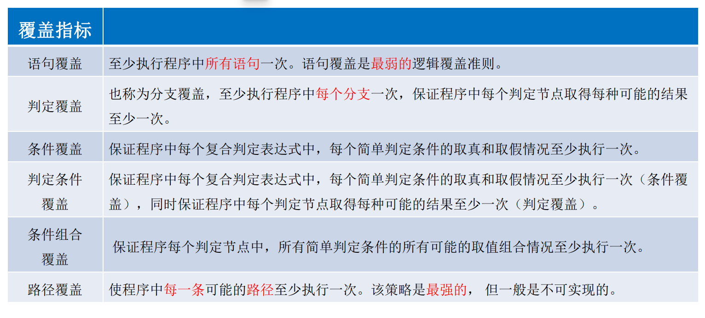
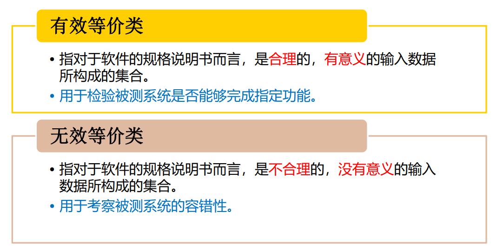
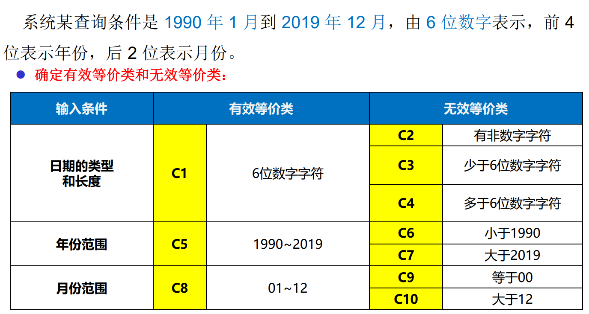
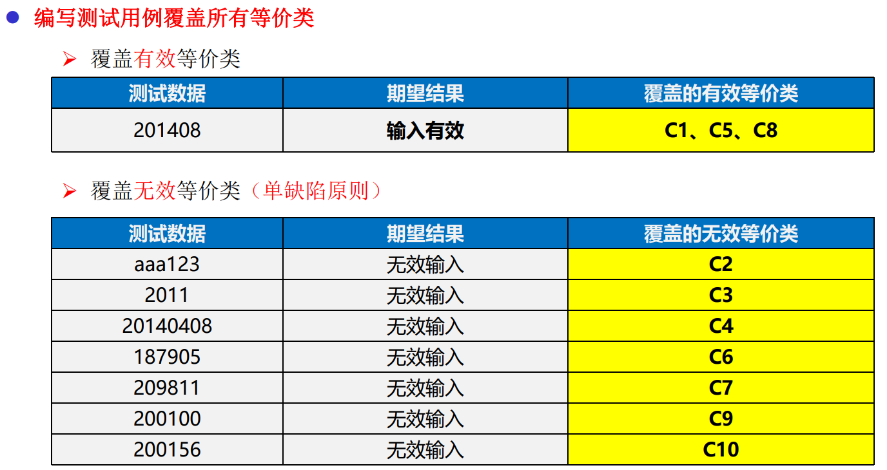
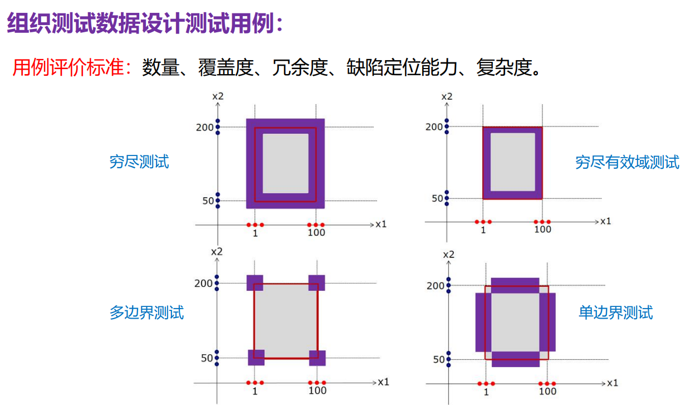
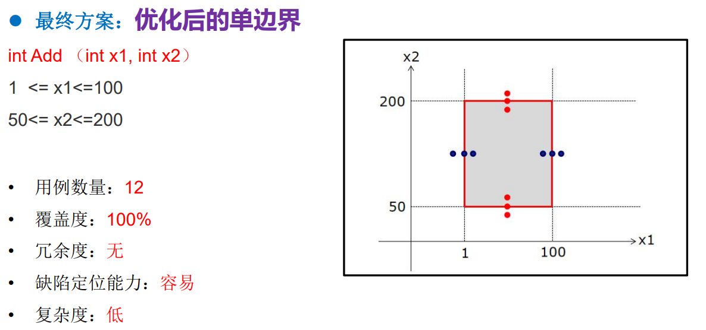
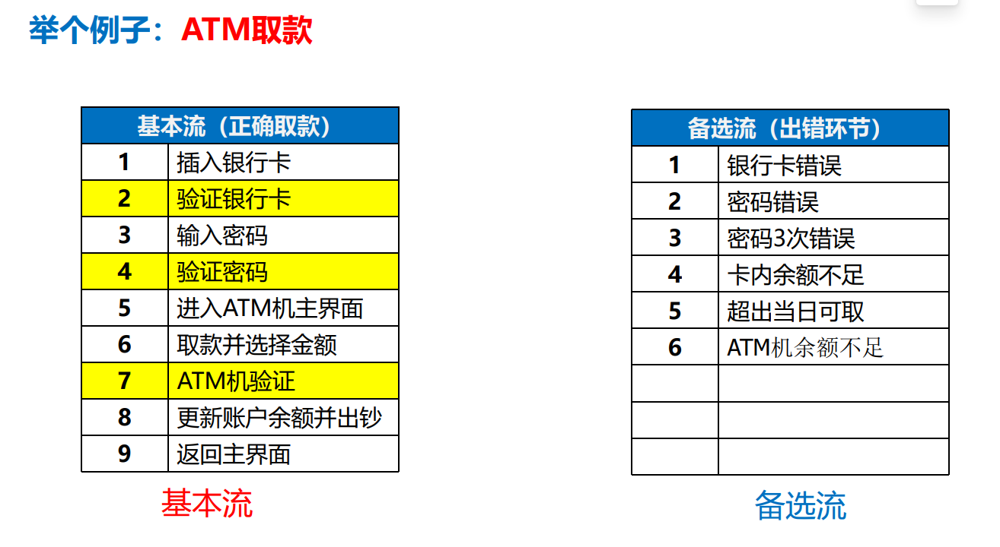

- [软件测试](#软件测试)
  - [类型](#类型)
  - [白盒测试](#白盒测试)
  - [黑盒测试](#黑盒测试)
    - [**划分原则**：](#划分原则)
      - [例子](#例子)
    - [边界值分析](#边界值分析)
    - [场景法](#场景法)
      - [例子](#例子-1)
- [性能测试](#性能测试)
  - [性能测试](#性能测试-1)
  - [压力测试](#压力测试)

# 软件测试

## 类型
* V 型
* W 型

## 白盒测试
* 要求较高, 需要懂代码
* > 

## 黑盒测试
* 要求较低
* 等价类划分
  * 等价类 : 输入域的一个子集，在该子集中，各个输入数据对揭示程序中错误是等效的。
  * 将**无穷多**的数据缩减到**有限个**等价区域中，通过测试等价区域完成穷尽测试。

> 

### **划分原则**：
  1. 如果输入条件规定了一个**取值范围**或**取值个数**，则可确定一个有效等价类和两个无效等价类。
  2. 如果输入条件规定了一个**输入值的集合**（假定n个），而且软件要对**每个输入值进行不同处理**，则可确定n个有效等价类和一个无效等价类。
  3. 如果存在输入条件规定了**“必须是”**的情况，则可确定一个有效等价类和一个无效等价类。（如：标识符第一个字符必须是字母）
  4. 如果输入的是**布尔表达式**，则可确定一个有效等价类和一个无效等价类。

#### 例子
> 
> * 单缺陷原则
> 

### 边界值分析
* 倾向于选择系统边界或边界附近的数据来设计测试用例，考虑了边界条件的测试用例具有更高的测试回报率。
* > 
* > 

### 场景法
1. 基本流
2. 备选流

#### 例子
> 

# 性能测试

## 性能测试
* Load impact

## 压力测试
* JMeter

