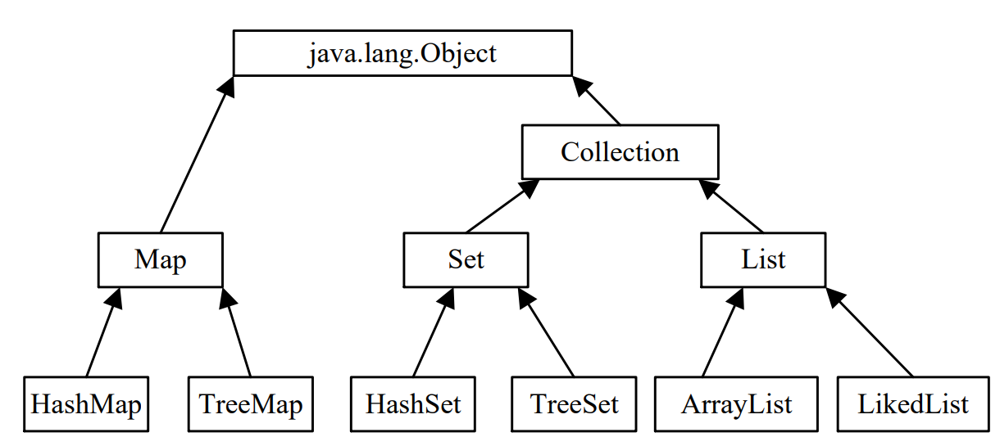
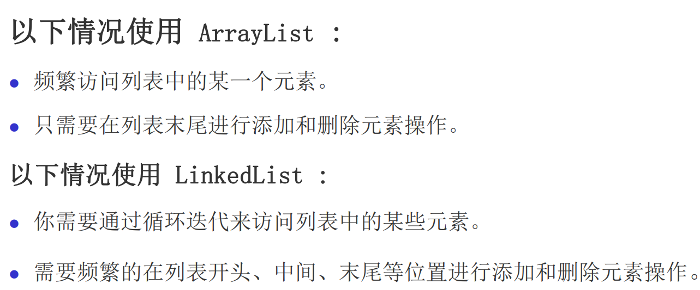
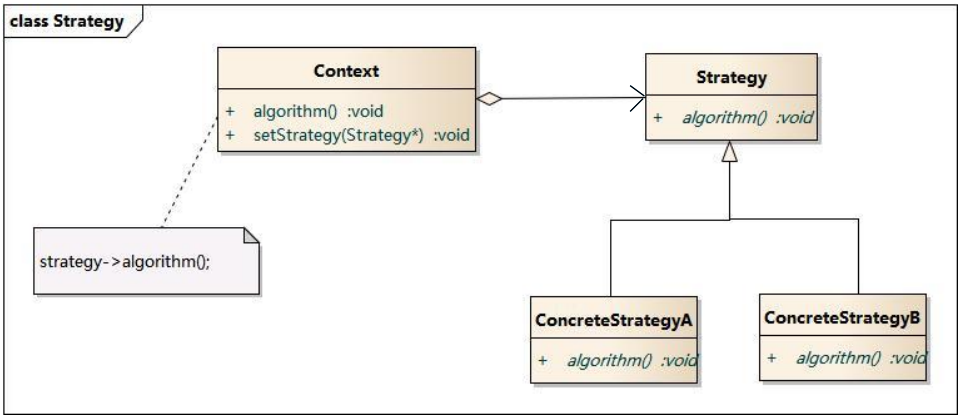
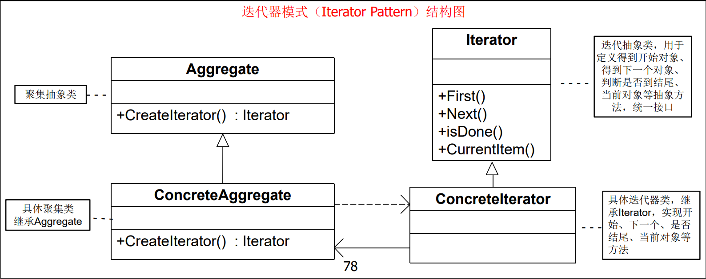

- [集合类](#集合类)
  - [List 接口](#list-接口)
    - [ArrayList](#arraylist)
    - [LinkedList](#linkedlist)
  - [Set 接口](#set-接口)
    - [HashSet](#hashset)
  - [Map 接口](#map-接口)
    - [HashMap](#hashmap)
- [策略模式](#策略模式)
  - [角色](#角色)
  - [使用](#使用)
  - [优缺点](#优缺点)
- [迭代器模式](#迭代器模式)

> 

# 集合类
## List 接口
* 定义一个有序的对象集合, **允许重复元素存在**。

### ArrayList
* 可以**动态修改**的数组
* `.add(x)`  插入 x
* `.add(1, x)`  在 1 处插入 x
* `.get(1)`  获取 1 处元素
* `.set(1, x)`  修改 1 处元素为 x
* `.remove(1)`  删除 1 处元素
* `.size()`  长度


### LinkedList
* 与 ArrayList 相比，LinkedList 的**增加和删除**的操作效率更高，而查找和修改的操作效率较低。
> 
* `.addFirst(x)`  在头部插入 x
* `.addLast(x)`  在尾部插入 x

## Set 接口
* <font color = red>Set集合中不能包含重复对象</font>

### HashSet
* 无序, 不可重复
* 线程不安全
* `.contain(x)`  判断是否含有 x
* `.clear()`    清空

## Map 接口

### HashMap
* 散列表, 键值对
* `.put(1, x)`  插入键值对 (1, x)
* `.get(1)` 获取 1 对应键值对的元素


# 策略模式
* 在有多种算法相似的情况下，使用**多个 if-else 语句**会使代码变得复杂和难以维护，而策略模式**允许策略随着对象改变而改变**。
* 定义一系列的算法,把每一个**算法封装**起来, 并且使它们可**相互替换**，从而使得算法可**独立于使用它的客户而变化**。并将**逻辑判断移到Client**中去（即由客户端决定在什么情况下使用什么具体策略）

## 角色
* **环境**（Context）角色：**持有一个Strategy的引用**
* **抽象策略**（Strategy）角色：这是一个**抽象角色**，通常由一个接口或抽象类实现。此角色**给出所有的具体策略类所需的接口。**
* **具体策略**（ConcreteStrategy.角色：包装了**相关的算法或行为**
> 

## 使用
* 策略模式的重心：策略模式的重心不是如何实现算法，而是如何**组织、调用这些算法**，从而让程序结构更灵活，具有更好的维护性和扩展性
* 算法的**平等性**

## 优缺点
* 提供了一种**替代继承**的方法，而且既保持了继承的优点（代码重用）还比继承更灵活（算法独立，可以任意扩展）


# 迭代器模式
* 在客户访问类与聚合类之间插入一个迭代器，这**分离**了聚合对象与其遍历行为

> 

* Java Iterator（迭代器）不是一个集合，它是一种**用于访问集合的方法**，可用于迭代 ArrayList 和HashSet 等集合。
*  Iterator 是 Java 迭代器最简单的实现，ListIterator 是 Collection API 中的接口， 它扩展了 Iterator 接口

* 迭代器 it 的三个基本操作是 next 、hasNext 和 remove

```java
while(it.hasNext()) {
    System.out.println(it.next());
}
```
