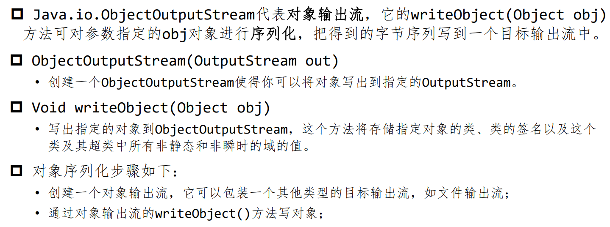

# 流
* 流是一组**有序的数据序列**，将数据从一个地方带到另一个地方

## 流的分类
### 方向
* 输入流
* 输出流
* > **方向是相对的**

### 数据单位
* 字节流：基本单位为字节
* 字符流：基本单位为字符

### 功能
* 节点流：可以从或向一个**特定的地方**（节点）读写数据，与数据源**直接相连**
* 处理流：通过一个**间接流类**去调用节点流类（用来包装节点流），以达到更加灵活方便地读写各种类型的数据


# 输入输出流
## Java系统流
* 对应类 : java.lang.System
  1. `System.in`：标准输入流，默认设备是键盘
  2. `System.out`：标准输出流，默认设备是控制台
  3. `System.err`：标准错误流，默认设备是控制台

### 读取控制台输入
* **BufferedReader**
`BufferedReader br = new BufferedReader(new InputStreamReader(System.in));`
* BufferedReader对象创建后，我们便可以使用**read()方法**从控制台读取一个字符，或者用readLine()方法读取一个字符串

### 文件的输入输出
* **FileInputStream** 和
**FileOutputStream**

#### FileInputStream
1. 使用**字符串类型的文件名**来创建**一个输入流对象**来读取文件
`InputStream f = new FileInputStream("C:/java/hello");`
2. 使用一个**文件对象**来创建一个**输入流对象**来读取文件
```java
File f = new File("C:/java/hello");
InputStream in = new FileInputStream(f);
```
#### FileOutputStream
* 基本一致

# java流继承框架
## 完整流家族
> 
### 字符与字节
> 

* 字节流与字符流是**可转换的**


# 操作文件
* **Path**和**Files**类封装了在用户机器上处理文件系统所需的所有功能

## Path
* Path(路径) 表示的是一个**目录名序列**，其后还可以跟着一个文件名

### 绝对路径 相对路径
```java
Path absolute = Paths.get("c:\data\myfile.txt");
// Paths.get(basePath，relativePath)
// 假设当前基础路径“c:\data”
Path relative = Paths.get(“myfile.txt");
```
* 静态的Paths.get方法**接受一个或多个字符串**，并**将它们**用默认文件系统的路径分隔符(类UNIX文件系统是/，Windows是\\)**连接起来**

## 读写文件
* **Files**

* 读取文件的所有内容
  *  `byte[] bytes = Files.readAllBytes(path);`
`var content = Files.readString(path, charset)`
* 行序列读入
  * `List<String> lines = Files.readAlllines(path, charset)`
> 

> 
> 
> 
> 


# 对象输入/输出流与序列化

## 对象序列化
* 将任何对象写出到输出流中，并在之后将其读回
* **序列化** : 把对象转换为字节序列
* **反序列化** : 把字节序列恢复为对象

## JDK 类库中序列化的 API
> 
> 


# 数据访问对象模式

> 


