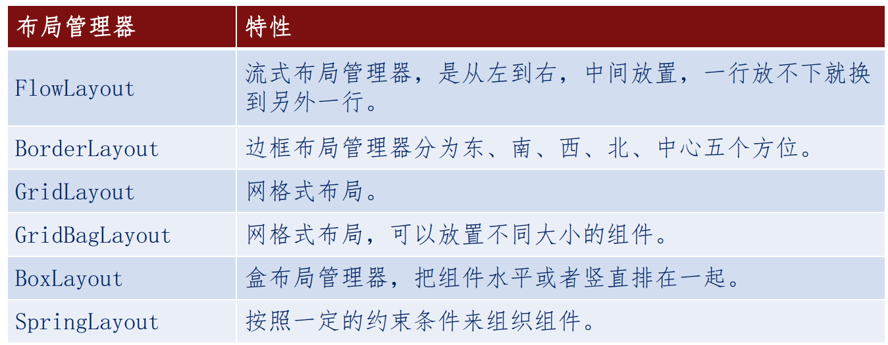
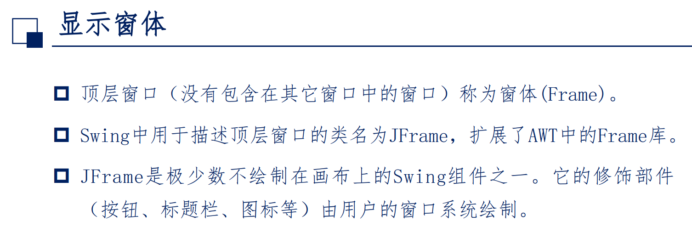
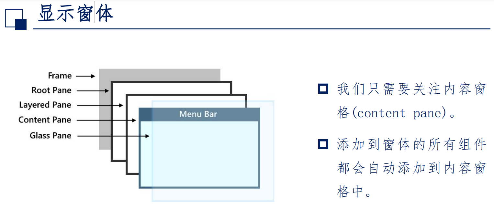
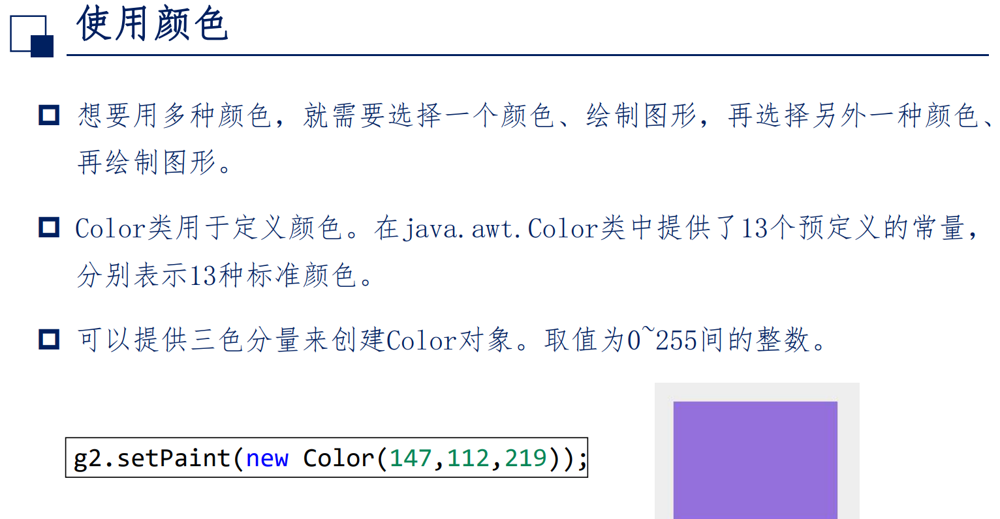
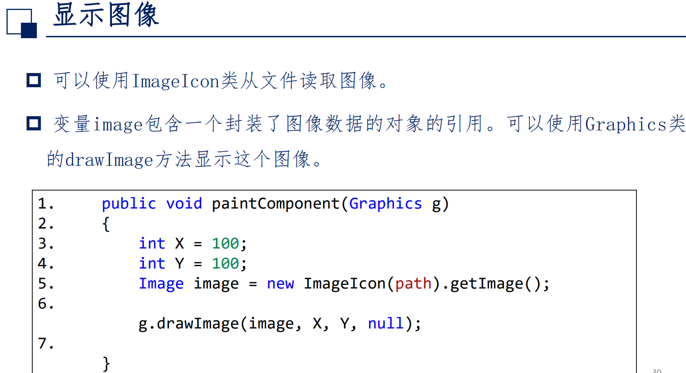
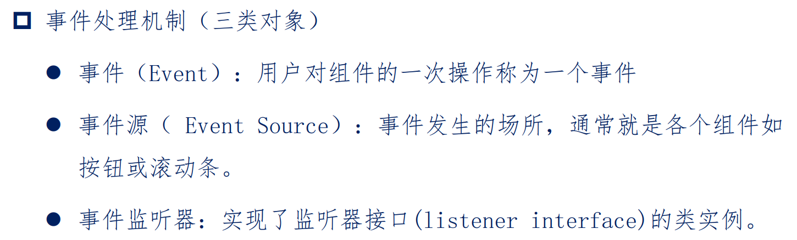

- [Swing 框架](#swing-框架)
  - [容器与组件](#容器与组件)
  - [布局管理器](#布局管理器)
  - [窗体 颜色](#窗体-颜色)
  - [图像](#图像)
  - [事件机制](#事件机制)

# Swing 框架
* 抽象窗口工具包(Abstract Window Toolkit, **AWT**).

## 容器与组件
* Swing GUI 包含两种元素, 组件和容器

* **容器**是可以包含组件的特殊组件
  * 重量级容器 : 不能被其他容器包含
  * 轻量级容器 : 可以包含与被包含

## 布局管理器
* 控制着容器中组件的位置
* > 

## 窗体 颜色
> 
> 
> 

## 图像
> 

## 事件机制
> 
> 

