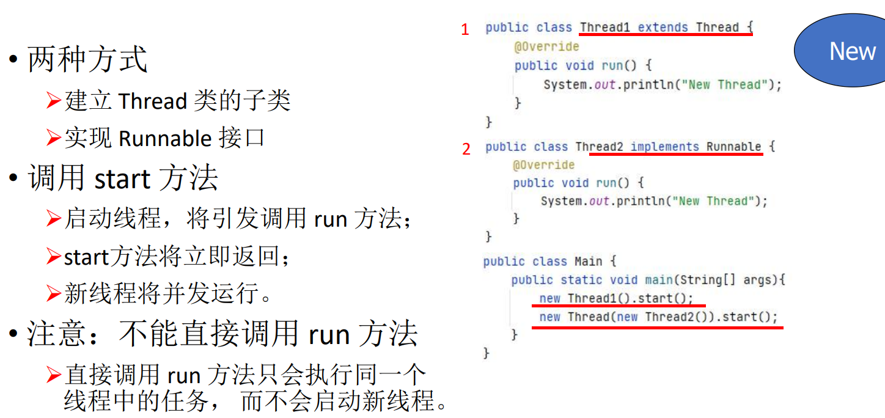

- [多线程](#多线程)
  - [进程和线程](#进程和线程)
    - [进程](#进程)
    - [线程](#线程)
    - [进程与线程](#进程与线程)
  - [Java 中对线程的控制](#java-中对线程的控制)
    - [线程的状态](#线程的状态)
      - [创建线程](#创建线程)
      - [终止线程](#终止线程)
      - [线程的状态](#线程的状态-1)
      - [线程阻塞](#线程阻塞)
      - [线程等待](#线程等待)
      - [线程计时等待](#线程计时等待)
      - [中断线程](#中断线程)
      - [线程优先级](#线程优先级)
      - [守护线程](#守护线程)
    - [总结](#总结)
  - [同步, 死锁如何避免](#同步-死锁如何避免)
    - [线程同步](#线程同步)
    - [线程死锁](#线程死锁)
  - [生产者-消费者设计模式](#生产者-消费者设计模式)
  - [任务与线程池](#任务与线程池)
    - [任务](#任务)
      - [FutureTask](#futuretask)
    - [线程池](#线程池)

# 多线程

## 进程和线程

### 进程
* 正在运行的程序的<font color = red>实例</font>
  1. **私有空间**, 彼此隔离
  2. 多进程间不共享内存
  3. 进程 == 应用

### 线程
* 进程中一个单一顺序的控制流
* 轻量级
* 一个进程的多个线程间共享内存

### 进程与线程
* **进程**表现为**虚拟机**
* **线程**表现为**虚拟 cpu**

* 多线程共享内存, 不共享**寄存器和栈**

## Java 中对线程的控制

### 线程的状态


#### 创建线程
> 

* Runnable更常用，其优势在于：
Ø任务与运行机制**解耦**，降低开销；
Ø更容易实现多线程资源共享；
Ø**避免**由于**单继承局限**所带来的影响。

* 简写
* > 

#### 终止线程
> 

#### 线程的状态
> 

#### 线程阻塞
> 

#### 线程等待
> 

#### 线程计时等待
> 
> * 一般以毫秒为单位

#### 中断线程
> 

#### 线程优先级
> 

#### 守护线程
> 

### 总结


* 加🔒主要是为了防止main函数提前访问


## 同步, 死锁如何避免

### 线程同步
* 原子操作 : ☞不能被中断的操作

* 加锁
```java
synchronized(a.lock){

}
```

### 线程死锁
> 
> 


## 生产者-消费者设计模式
> 
> 
> 


> 


## 任务与线程池
### 任务
* 问题：希望线程结束时返回一个运行/计算结果
• Runnable：封装一个异步运行的任务，没有参数和返回值
• Callable：封装一个异步运行的任务，有返回值
Ø需实现 call 方法
ØCallable<Integer> 表示返回 Integer 对象的异步计算任务
Ø可以抛出异常
Ø不能直接进行线程操作，也不能传入Thread
```java
public interface Callable<V>{
    V call throws Exception;
}
```

#### FutureTask
* FutureTask：执行 Callable的一种方法
Ø控制 Callable 任务的执行，获得其运算结果
Ø间接实现了Runnable 接口，
进而可以通过Thread启动线程
>

> 


### 线程池


