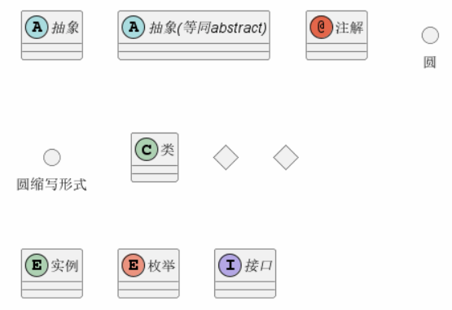
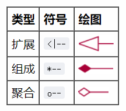
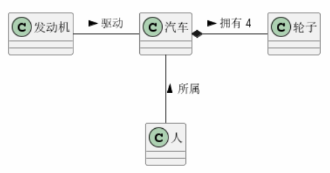
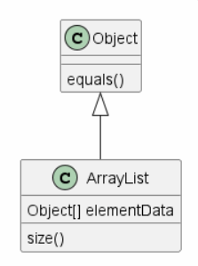
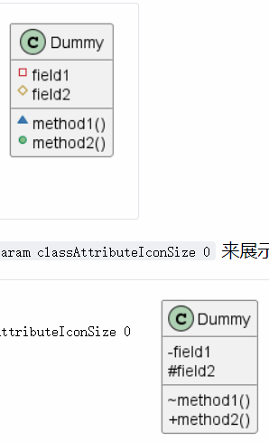

# PlantUML 学习

## [元素声明](PlantUML/元素声明.puml)
> 

## [类之间的关系](PlantUML/类之间的关系.puml)
> 

## [关系上的标签](PlantUML/关系上的标签.puml)
> 
> 

## [添加方法](PlantUML/添加方法.puml)
>

## [定义可访问性](PlantUML/定义可访问性.puml)
> 

## [抽象与静态]
> 通过修饰符`{static}`或者`{abstract}`，可以定义静态或者抽象的方法或者属性。
> 这些修饰符可以写在行的开始或者结束。也可以使用`{classifier}`这个修饰符来代替`{static}`.

