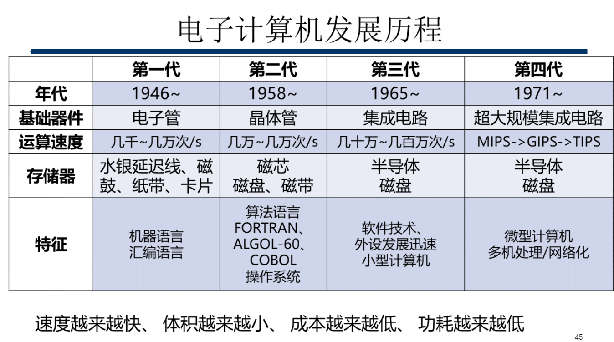
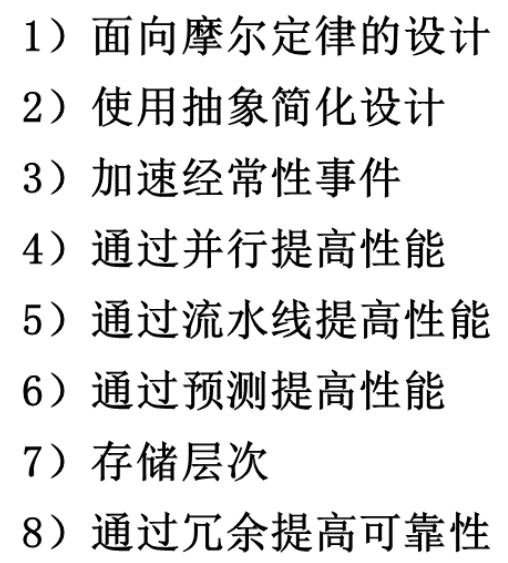
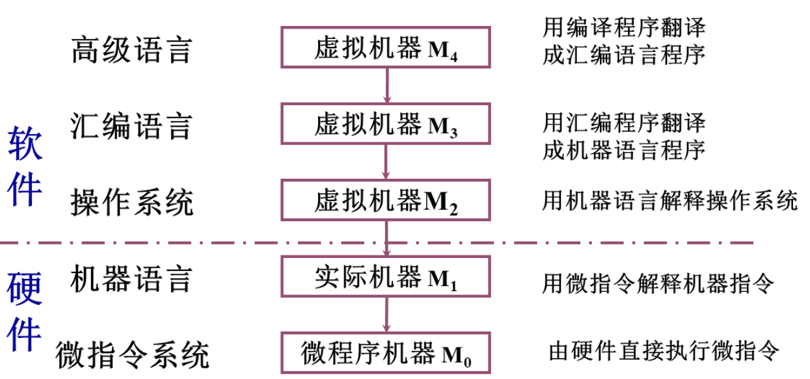
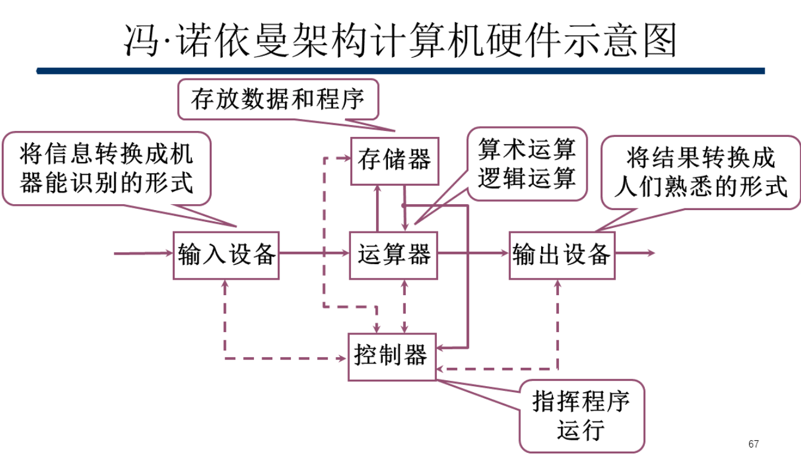
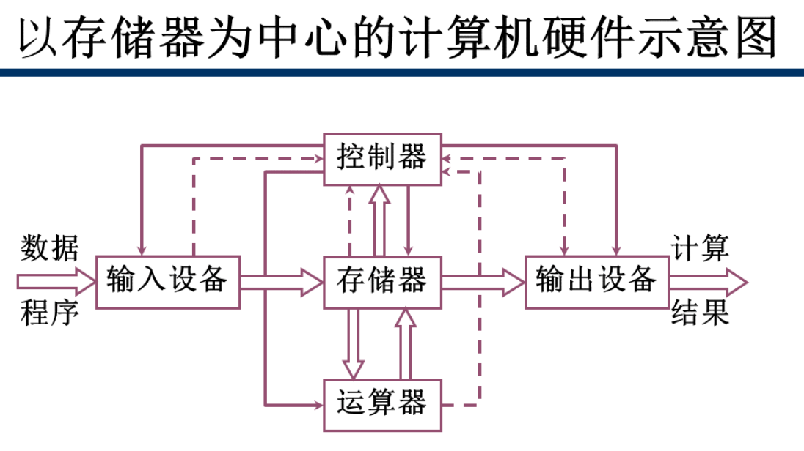
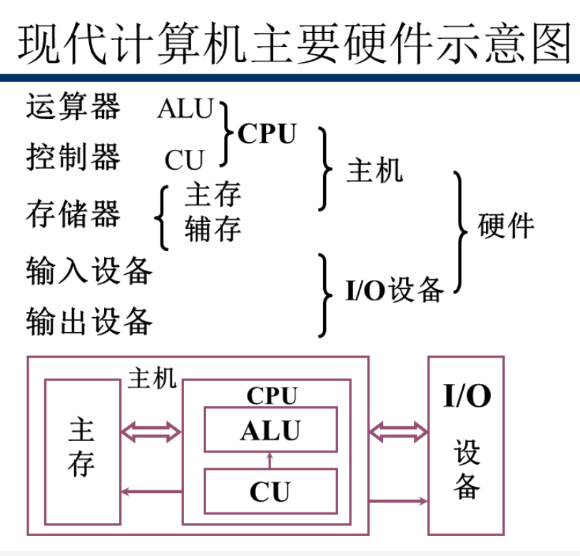
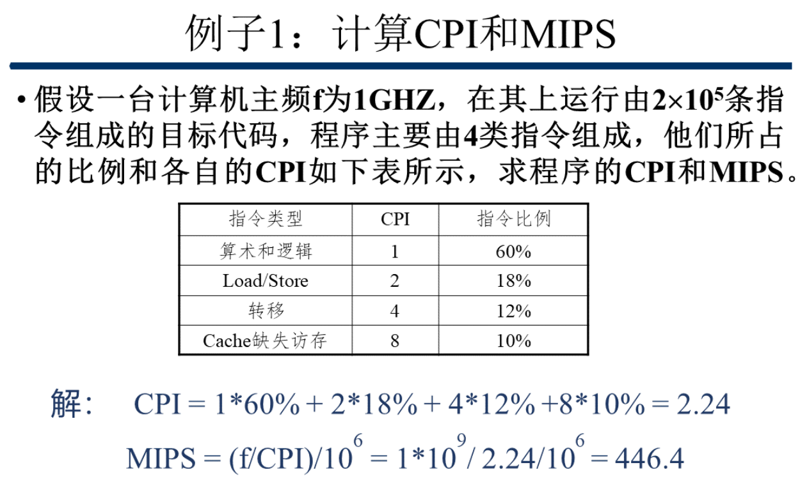
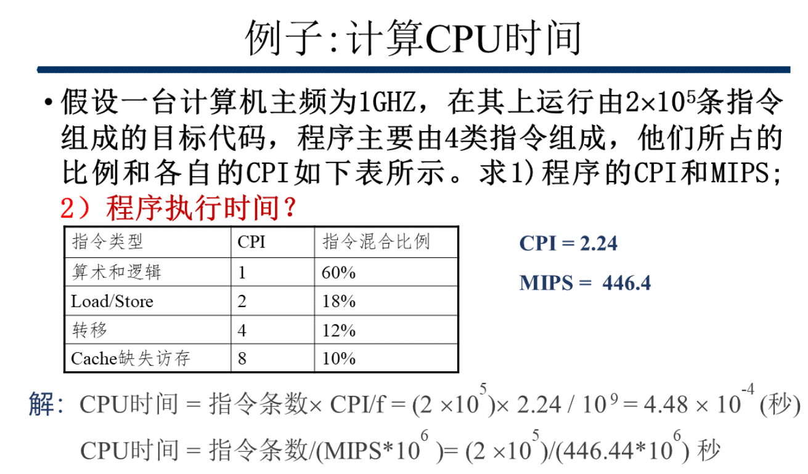
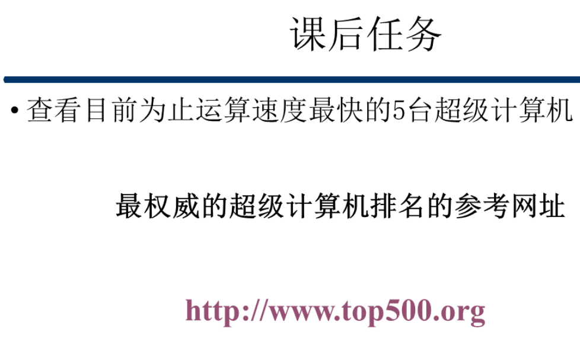

[TOC]

# 计算机组成原理

* #### 计算机组成 (偏重实现)
  * **比如具体指令的实现**

---

## 1.1 计算机发展历史
* 简单了解
* 现代计算机之父 : ==冯诺依曼==
* **晶体管**造就了第二代计算机

>**微型计算机**的发展以**集成电路**为标志
>**第四代**计算机的基础器件是 **超大规模集成电路**

---

## 1.2 计算机体系结构中的8个伟大思想

#### 面向摩尔定律的设计

* **摩尔定律** : 单片机上所集成的晶体管资源每**18至24**月翻一番
* **新摩尔定律** : 每**18**个月新增的存储量等于有史以来存储量之和

#### 使用抽象简化设计

#### 加速经常性事件

#### 通过并行提高性能

#### 通过流水线提高性能

#### 通过预测提高性能

#### 存储层级

#### 通过冗余提高可靠性

---

## 1.3 计算机层级结构

>

>

#### 冯诺依曼架构计算机的特点
* 计算机由五大部件组成
* 指令和数据以同等地位存于存储器, 可以按址寻访
* 指令和数据用二进制表示
* 指令由操作码和地址码组成
* 存储程序
  * 指令在存储器中按照顺序存放, 通常是按顺序运行, 特定条件下可以根据条件改变执行顺序
* 以运算器为中心

>

#### 哈佛架构和冯诺依曼架构的区别
* 程序空间和数据空间 : 哈佛分开, 冯诺依曼不分开
* 冯诺依曼 : X86
* 哈佛 : DSP & ARM
* 现在的处理器外部总线看是冯诺依曼, 但由于内部cache存在, 内部看是改进的哈佛

>

---

## 1.4 计算机性能指标

#### 非时间指标

* ##### 机器字长
  * **CPU** 一次能够处理的数据的位数
  * 一般与内部寄存器的位数一致
  * 32 / 64
* ##### 总线宽度
  * **数据总线一次能并行传送的最大信息数**
* ##### 主存容量
  * **主存所包含的==存储单元总数 * 存储字长==**
* ##### 存储带宽
  * **单位时间内与主存交换的二进制信息量, 单位 Byte/s**

#### 时间指标

##### 主频, 时钟周期
* 主频 : CPU 工作的时钟频率
* **时钟周期 * 主频 = 1**
* 时钟周期数 : 滴答数, 周期数

##### CPI MIPS, MFLOPS
* **CPI(指令平均时钟周期数)**
  * 每条指令所需的时钟周期平均数
  * 所有指令的时钟周期数之和 / 指令条数
  * 指令数 : 执行某程序所需的总指令数量
  * **==程序的CPU时钟周期数 = 程序的指令数 * CPI==**
* **MIPS(million instructions per second)**
* **MFLOPS**(million floating-point operations per second)

##### CPU (执行) 时间, 响应时间, 吞吐率
* CPU时间 : **执行任务在 CPU 上所花费的时间**
  * 不包括I/O
  * **==CPU执行时间 = 程序的指令数 * CPI * 时钟周期==**
    * 用户CPU时间 : 程序本身
    * 系统CPU时间 : 在操作系统上
* 响应时间 : **执行时间, 计算机完成某个任务所需的总时间**
* 吞吐率 : 带宽, **单位时间内完成的任务数量**

>
>* **==程序CPI = 对应的指令CPI * 各自的比例==**
>* **==MIPS = (主频/CPI) / $10^6$ `(million)`==**
>
>

---

>
>* [计算机排名](http://www.top500.org)
>   1. Supercomputer Fugaku -- Japan
>   2. Summit -- US
>   3. Sierra -- US
>   4. Sunway TaihuLight -- China
>   5. Perlmutter -- US

