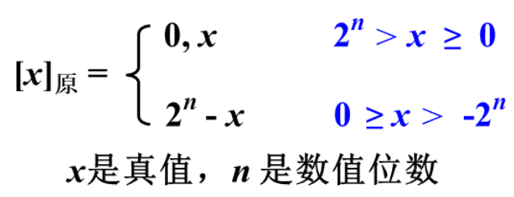
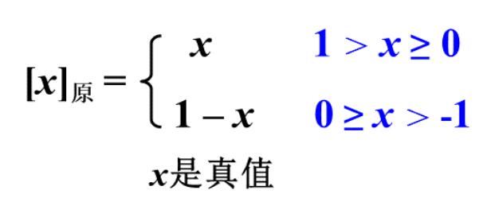
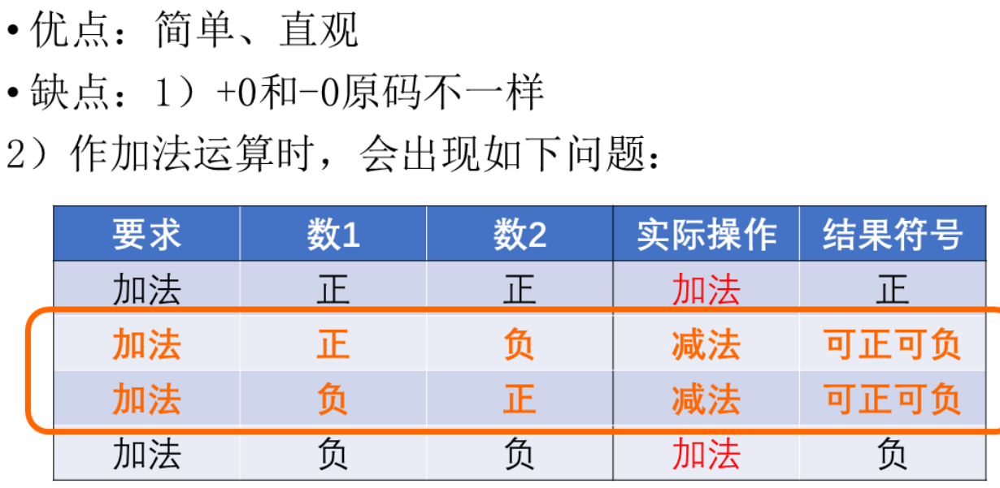
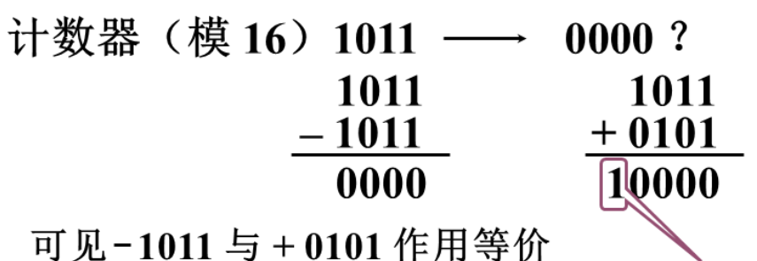
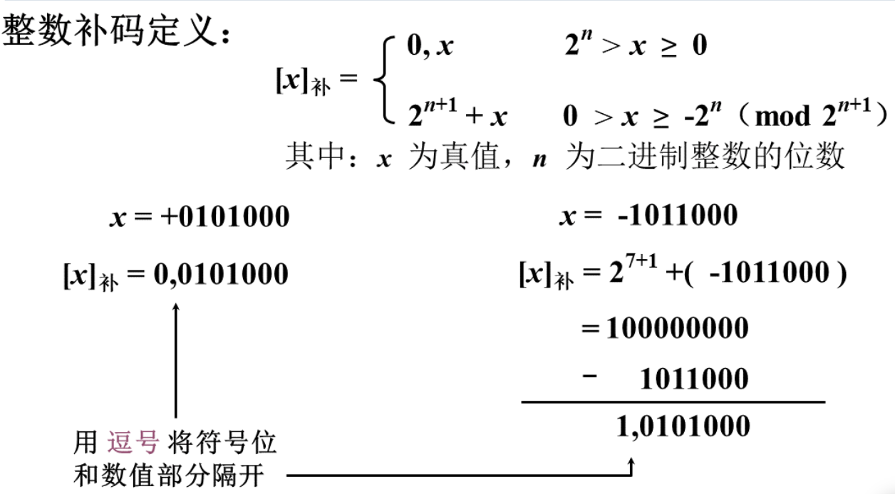
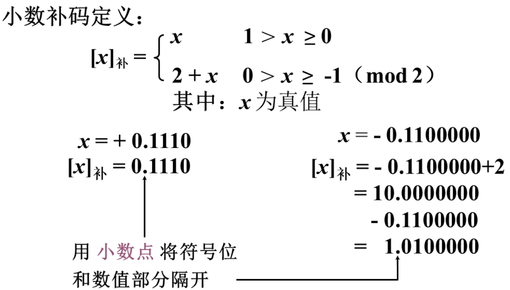
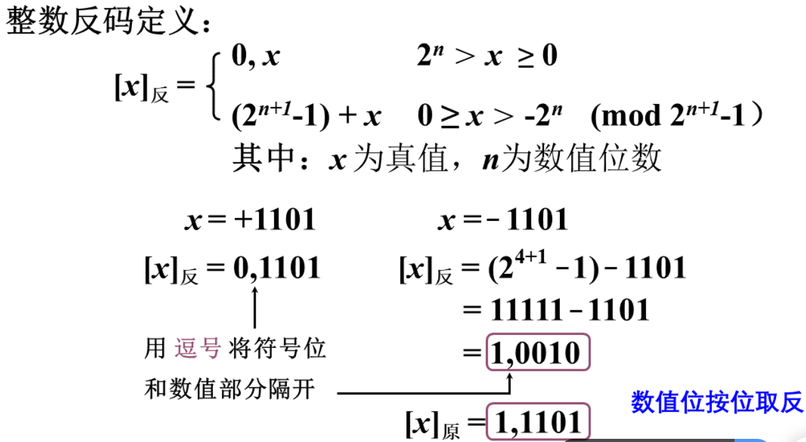
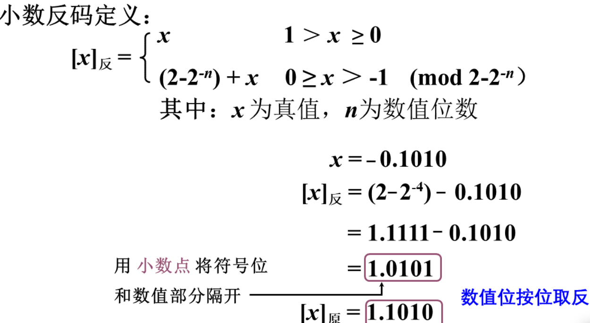
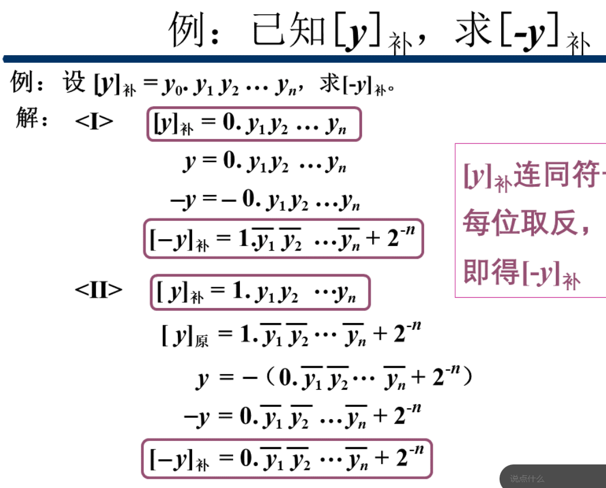
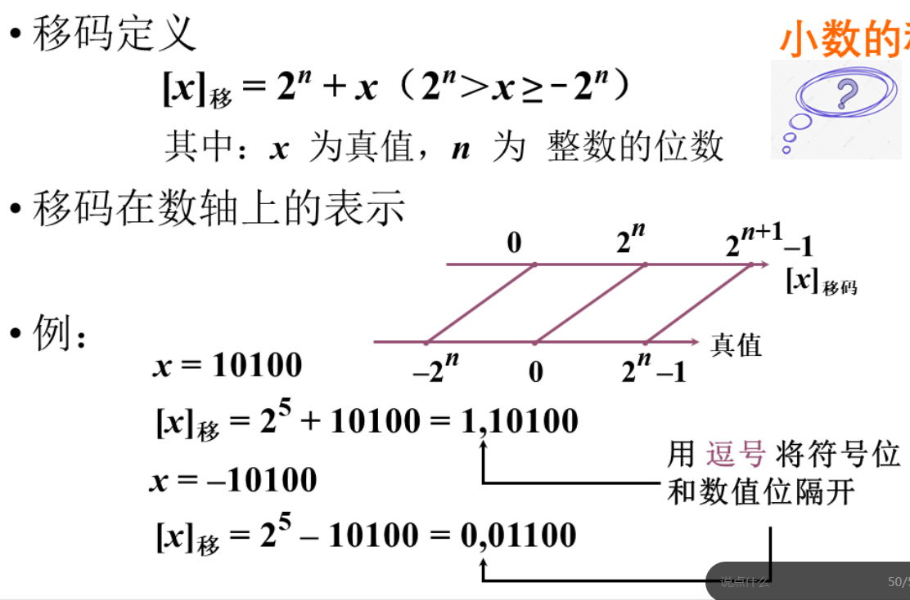

- [RICS-V 汇编及其指令系统](#rics-v-汇编及其指令系统)
  - [计算机中数的表示](#计算机中数的表示)
    - [无符号数和有符号数](#无符号数和有符号数)
      - [原码表示法](#原码表示法)
        - [优缺点](#优缺点)
      - [补码表示法](#补码表示法)
      - [反码表示法](#反码表示法)
      - [例子](#例子)
      - [移码表示法](#移码表示法)

# RICS-V 汇编及其指令系统

---

## 计算机中数的表示

### 无符号数和有符号数

#### 原码表示法

* ##### 整数
  * $x = +1110 \to x_{[原]} = 0 , 1110$
  * $x = -1110 \to x_{[原]} = 1 , 1110$
  * 
* ##### 小数
  * $x = +0.1101 \to x_{[原]} = 0 . 1101$
  * $x = -0.1101 \to x_{[原]} = 1 . 1101$
  * 

##### 优缺点
  * > 

---

#### 补码表示法

* ##### 补数
  * > 
  

* ##### 整数
  * > 

* ##### 小数
  * > 

* 补码中, $0$ 都表示为 $0.0000$
* **$1.0000$ 表示 $-1.0000$**

---

#### 反码表示法

* ##### 整数
  * > 

* ##### 小数
  * > 

#### 例子
  * > 

#### 移码表示法

* 可以直观的判断大小
* 都加上 $2^n$
* **移码与补码只有符号位是反的**
  * > 