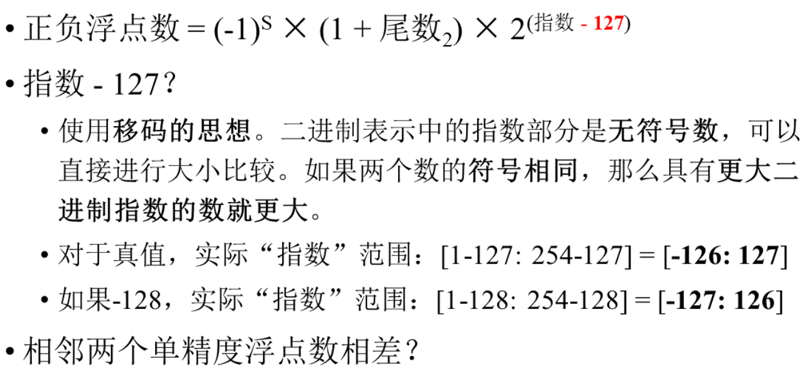

- [定点表示和浮点表示](#定点表示和浮点表示)
  - [定点表示](#定点表示)
  - [浮点表示](#浮点表示)
    - [例子](#例子)
  - [规格化](#规格化)
    - [例子](#例子-1)
  - [溢出判断](#溢出判断)
- [IEEE754 标准](#ieee754-标准)
  - [例题](#例题)
- [算数移位与逻辑移位](#算数移位与逻辑移位)
  - [例题](#例题-1)
- [> !](#-)

## 定点表示和浮点表示

### 定点表示
> * 

---

### 浮点表示
  
  * > 
  * > 

#### 例子

### 规格化
 > 
 > 

#### 例子
 > 
 > 
  * ==在正数时, 尾数不变, 阶码按照规则改变==
 
 > 

  * ==在整数时, 小数点一开始在末尾==

### 溢出判断

---

## IEEE754 标准

> 
> 
> 
> 

### 例题
>

---

## 算数移位与逻辑移位

> 
> 

### 例题

> 
> 
> 
> 
 ---
> 
> 
