- [RISC-V汇编及其指令系统](#risc-v汇编及其指令系统)
  - [RISC-V概述](#risc-v概述)
    - [指令系统的基本概念](#指令系统的基本概念)
      - [指令集架构](#指令集架构)
      - [ISA 位宽](#isa-位宽)
      - [指令系统的评价](#指令系统的评价)
    - [存储器寻址](#存储器寻址)
      - [尾端问题](#尾端问题)
      - [对齐问题](#对齐问题)
      - [寻址方式](#寻址方式)
    - [操作数类型,表示](#操作数类型表示)
    - [主流指令集及发展方向](#主流指令集及发展方向)

# RISC-V汇编及其指令系统

## RISC-V概述

### 指令系统的基本概念
> 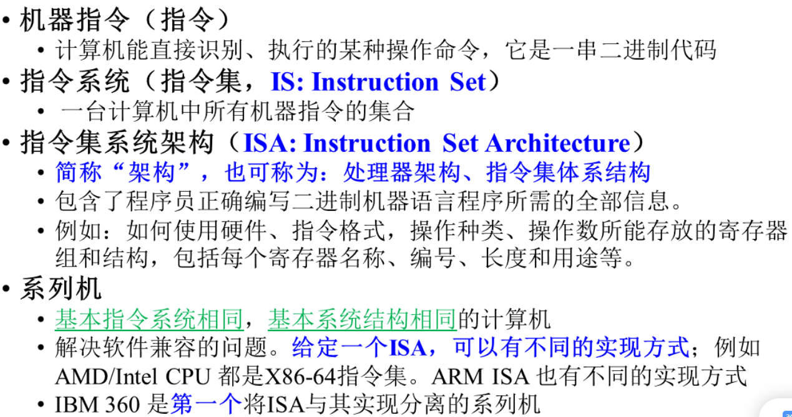
> 
#### 指令集架构
> 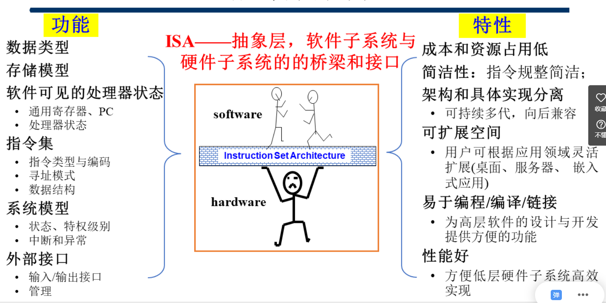
> 
#### ISA 位宽
> 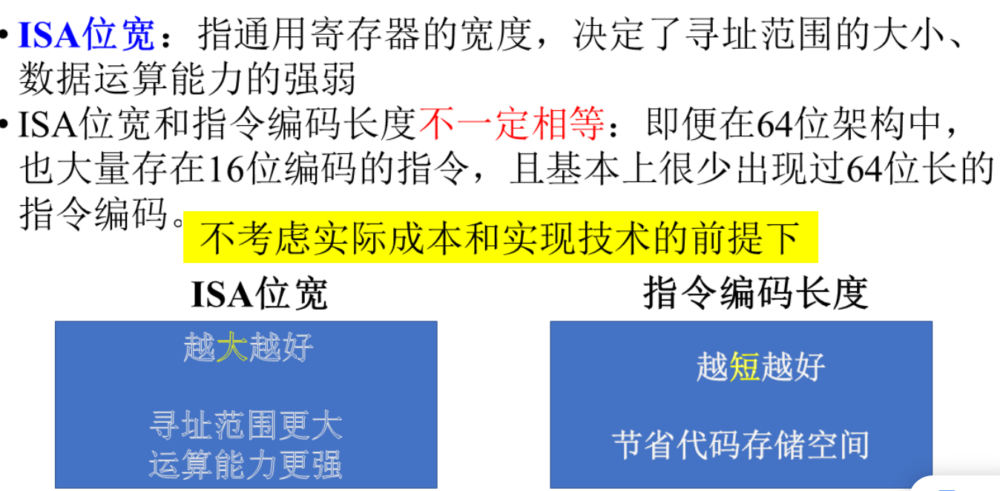

#### 指令系统的评价
> 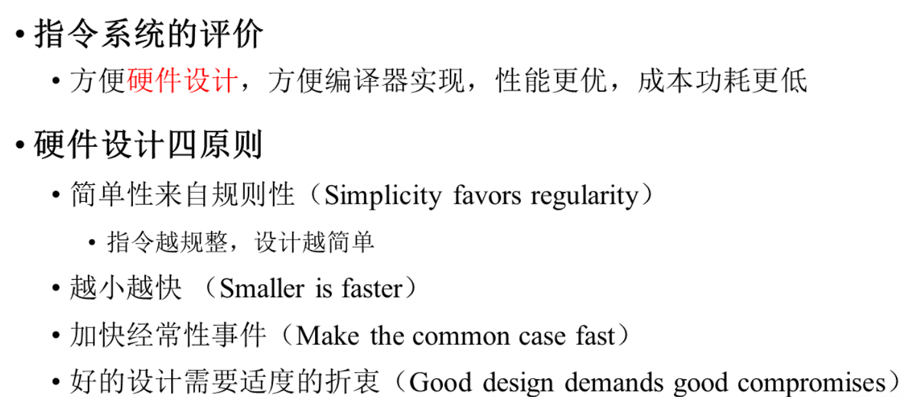
> 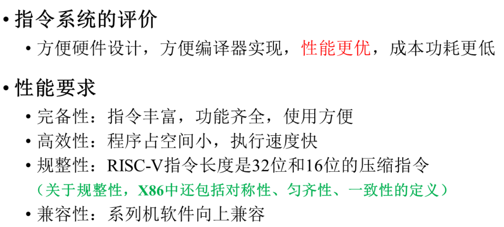

### 存储器寻址
#### 尾端问题
> 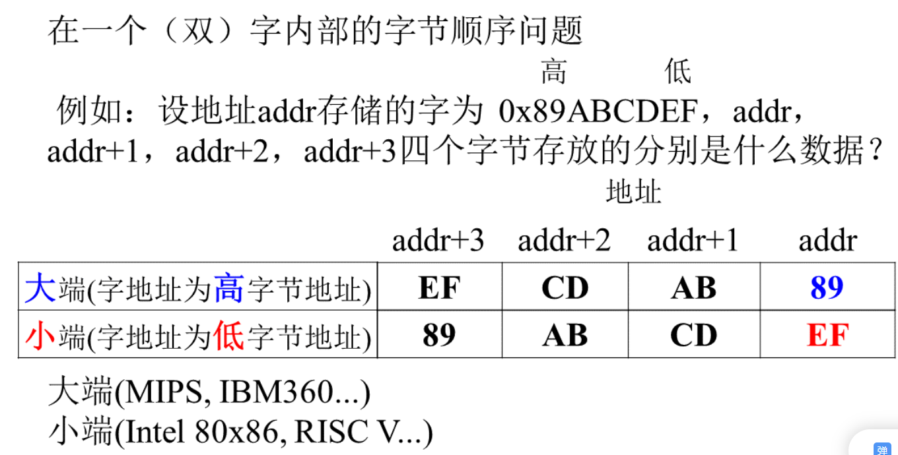
#### 对齐问题
> 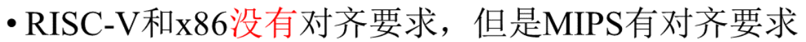

#### 寻址方式
> 

### 操作数类型,表示
> 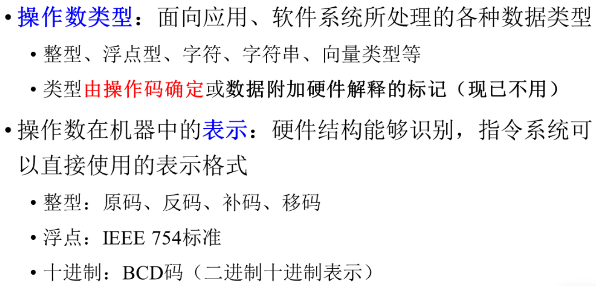
> 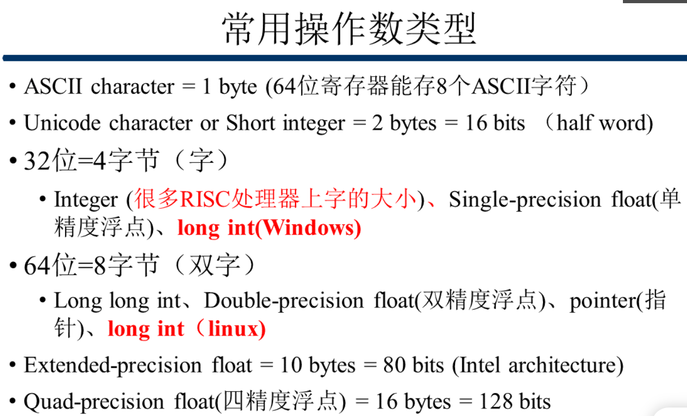

### 主流指令集及发展方向
> 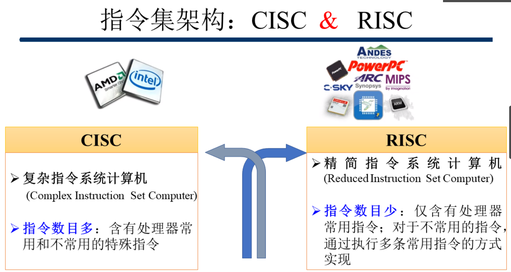
> 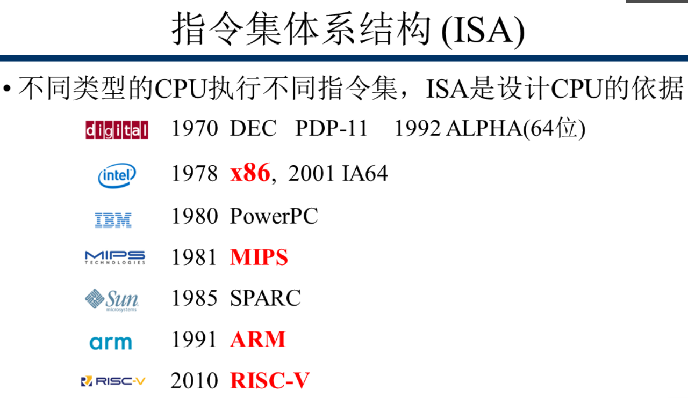
> 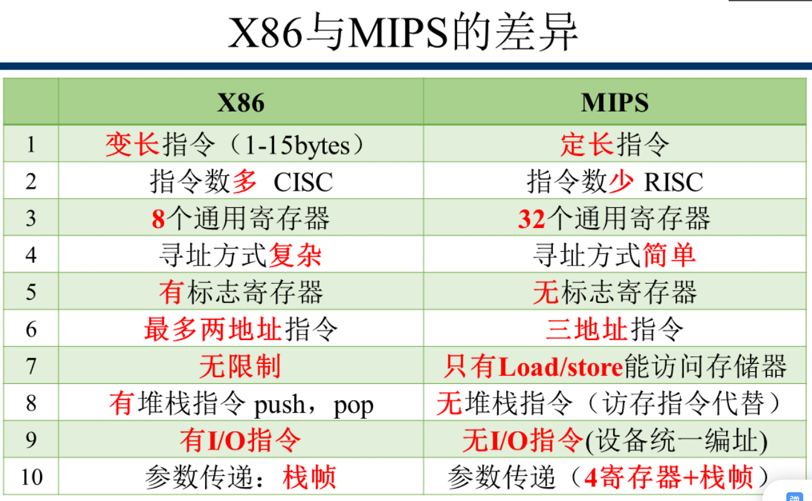