- [硬布线和微程序](#硬布线和微程序)
- [RISC 和 CISC](#risc-和-cisc)
- [RISC-V 指令集](#risc-v-指令集)
  - [发展历史](#发展历史)
  - [设计理念](#设计理念)
  - [架构特点](#架构特点)
  - [模块化设计](#模块化设计)
  - [指令子集](#指令子集)
  - [寄存器组](#寄存器组)
  - [规整的指令编码](#规整的指令编码)
  - [数据传输指令](#数据传输指令)
- [RISC-V 汇编语言](#risc-v-汇编语言)
  - [简介](#简介)
  - [汇编指令](#汇编指令)
    - [指令格式](#指令格式)
  - [操作对象](#操作对象)
    - [寄存器](#寄存器)
  - [常用汇编指令](#常用汇编指令)
    - [算术运算](#算术运算)

## 硬布线和微程序
> 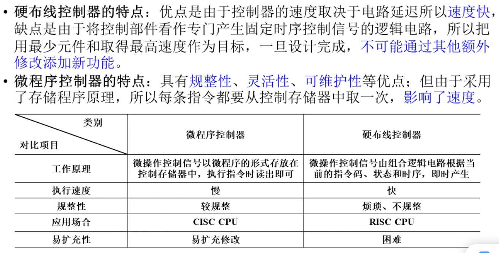

## RISC 和 CISC
> 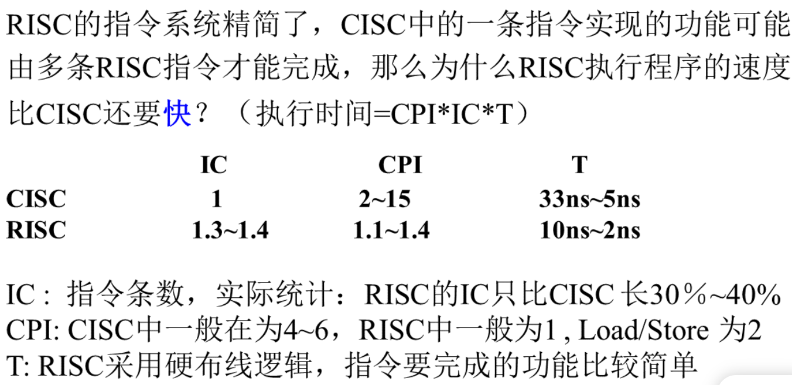
> 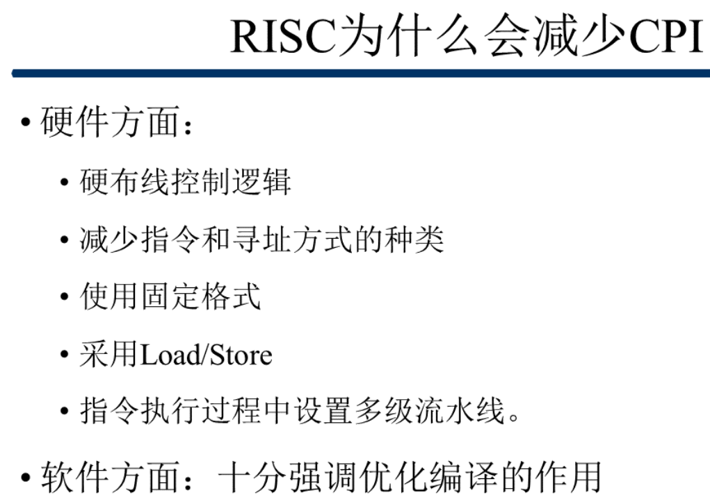

---

## RISC-V 指令集
### 发展历史

### 设计理念

### 架构特点

### 模块化设计

### 指令子集
> 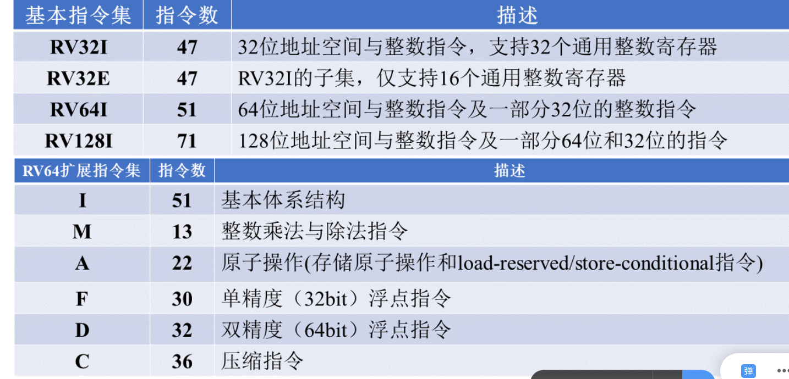

### 寄存器组
> 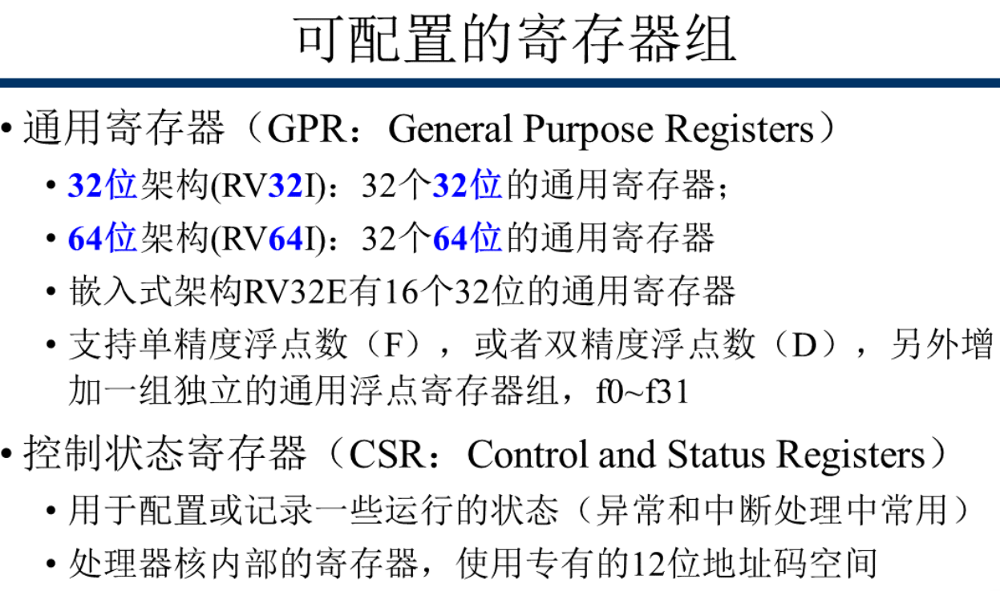

### 规整的指令编码
> 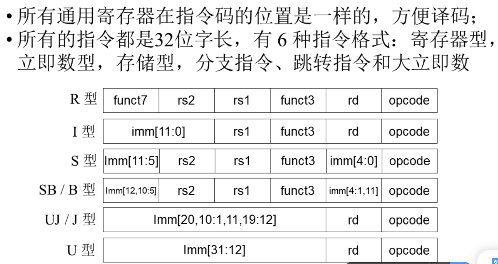

### 数据传输指令
> 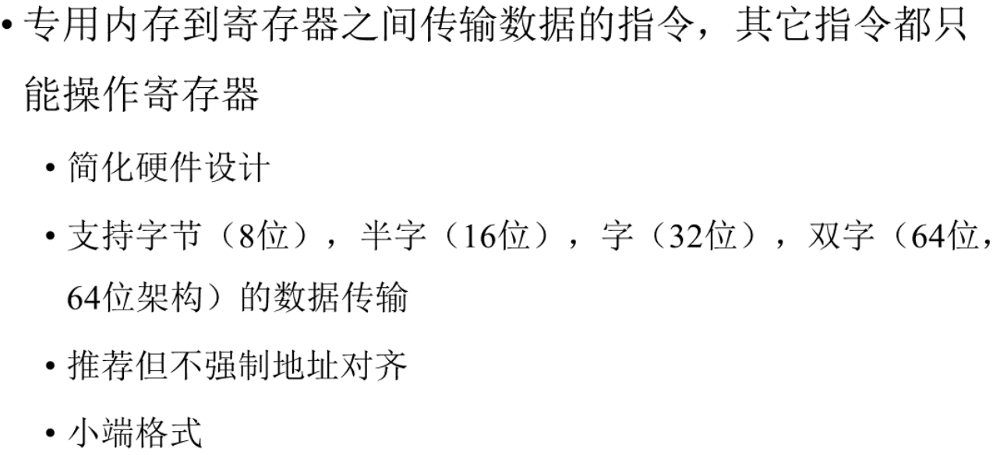

---

## RISC-V 汇编语言
### 简介
> 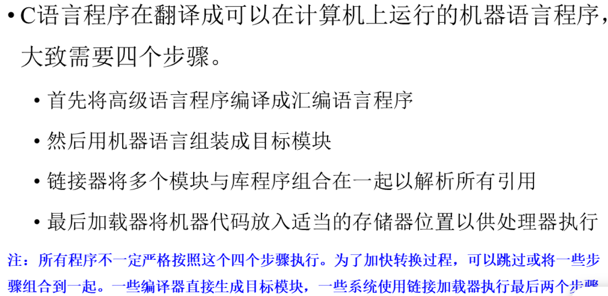

### 汇编指令
#### 指令格式
> 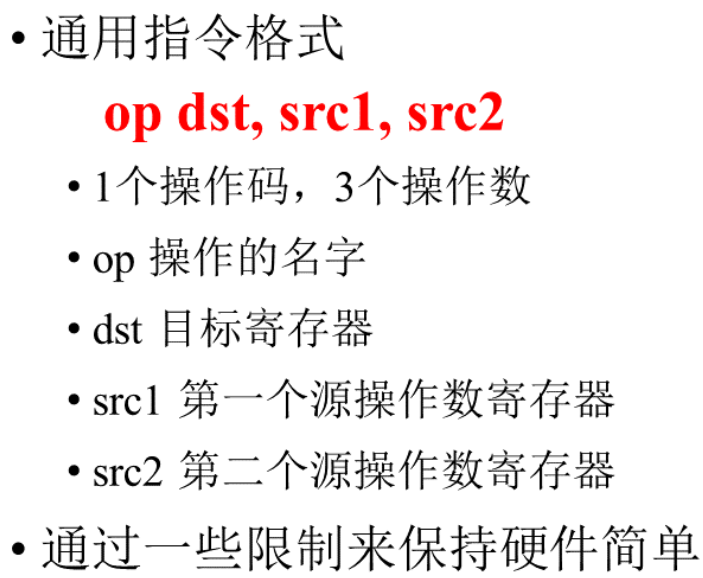
> 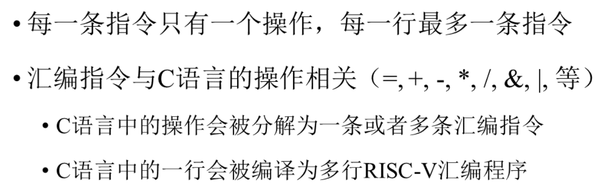

### 操作对象
> 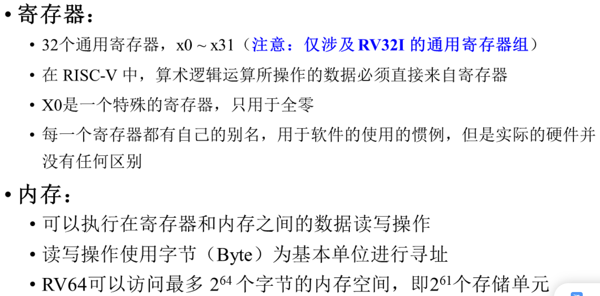

#### 寄存器
> 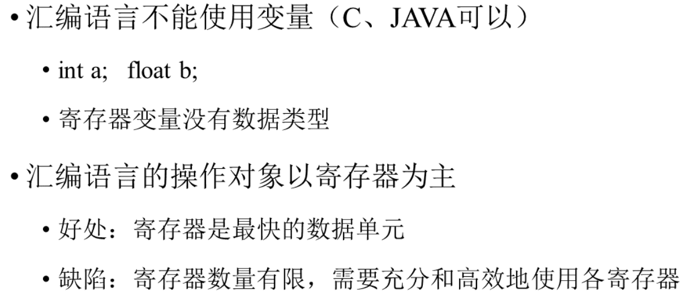
> 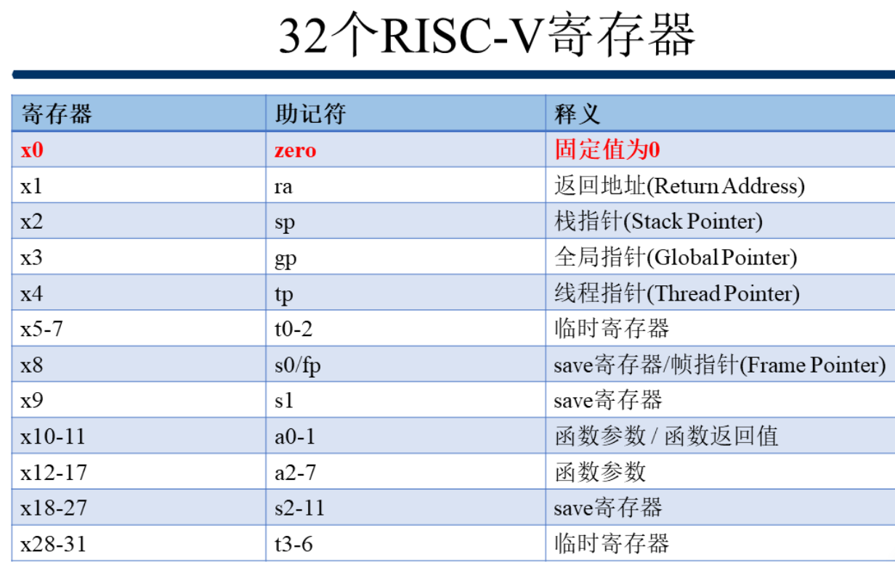

### 常用汇编指令
> 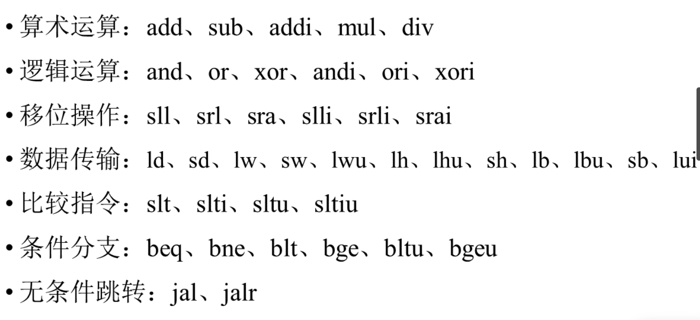

#### 算术运算
> 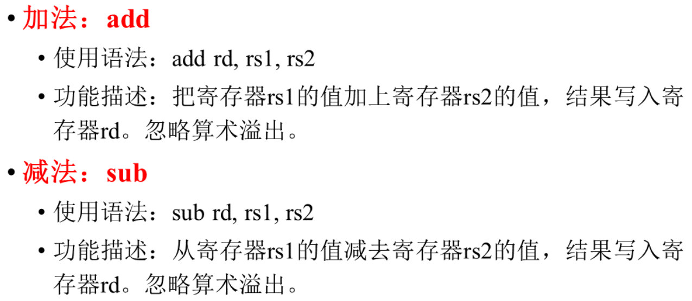
> 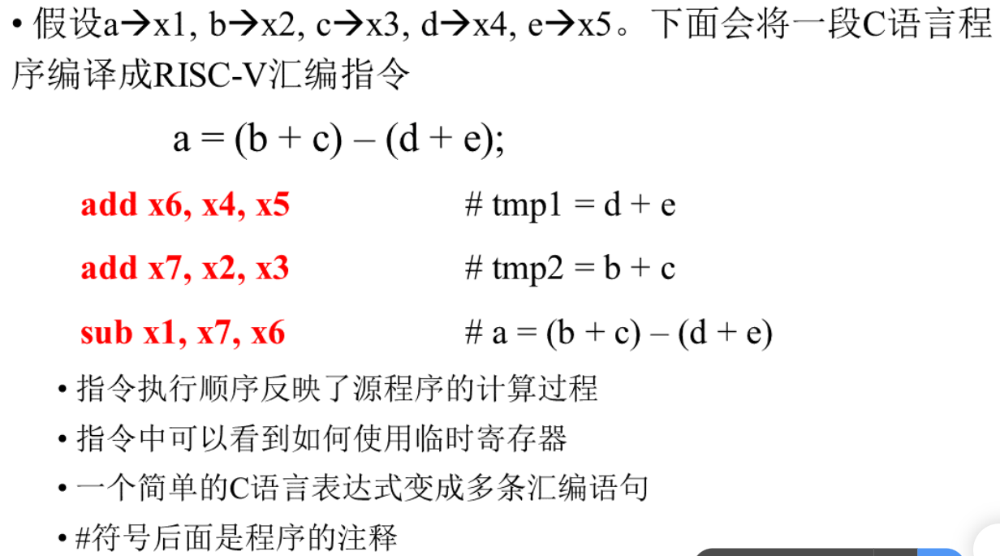
> * **==从右向左==**
> * x0 寄存器 , 值始终为 0 , 无法更改
> 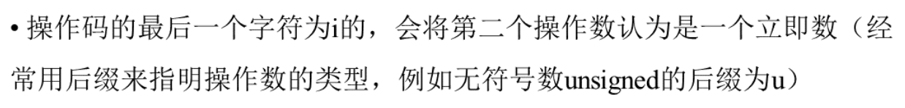
