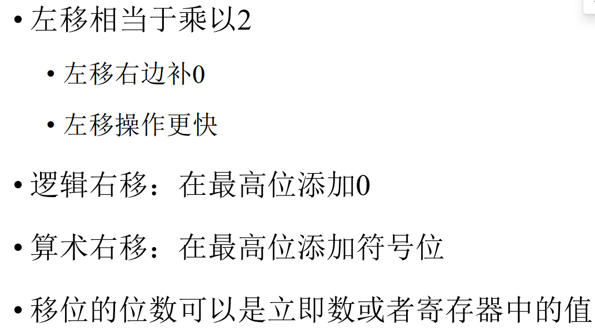

## RISC-V汇编语言

### 汇编语言简介

* <font color = blue>在汇编语言中，用助记符代替机器指令的操作码，用地址符号或标号代替指令或操作数的地址。</font>

#### 优缺点
* 缺点：难读、难写、难移植
* 优点：灵活、强大
* 应用场景：
    • 需要直接访问底层硬件
    • 需要对性能进行优化

### RISC-V汇编指令概览
#### 立即数
* opi dst, src, imm
* `addi x1, x2, 5 # a=b+5`

#### 算术操作的溢出
* RISC-V 忽略溢出问题，**高位被截断**，低位写入到目标寄存器中

#### 乘法, 除法
* `mul rd, rs1, rs2`
* `div rd, rs1, rs2`
* 四种 mul
    1. mul : 得到整数32位乘积（**64位中的低32位**）
    2. mulh : 得到高32位，如果操作数都是有符号数
    3. mulhu : 操作数都是无符号数
    4. mulhsu : 一个有符号一个无符号
```c
mulh[[s]u] rdh, rs1, rs2; 
mul rdl, rs1, rs2 
```
* div 求商
* rem 求余数

### 逻辑运算
* <font color = red>and、or、xor、andi、ori、xori</font>
* > 
* 没有<font color = red>NOT</font>
    • 对 111111112 使用`xori`
    • 例：`xori x5, x6, -1` # x5 = (x6)'

### 移位操作
* <font color = red>sll、srl、sra、slli、srli、srai</font>
* > 
* > 

### 数据传输
* <font color = red>ld、sd、lw、sw、lwu、lh、lhu、sh、lb、lbu、sb、lui</font>
* > 
* ==**RISC-V 是小端机**==
* 最低的字节在最低的地址，字的地址等于最低字节的地址
* > 

### 比较指令
* <font color = red>slt、slti、sltu、sltiu</font>
* > 

### 条件分支
* <font color = red>beq、bne、blt、bge、bltu、bgeu</font>
* > 
* > 

### 无条件跳转
* <font color = red>jal, jalr</font>
* > 

### 伪指令
* <font color = red>mov </font>
* li : Load Immediate 装入一个立即数
* la : Load Address 装入一个地址
* > 
* > 

> 
> 
> 


### 基本块
> 


## 函数调用及栈的使用
### 函数调用
> 

### 栈的调用
• 在调用函数之前需要一个保存旧值的地方，在返回时还原它们，然后删除
• 堆栈：后进先出（LIFO）队列
    • push：将数据放入堆栈
    • pop：从堆栈中删除数据
• **sp是RISC-V中的堆栈指针**
• 按历史惯例，栈按照从高到低的地址顺序增长
• push 减 sp, pop 增 sp
> 
* RISC-V函数调用约定将寄存器分为两类：
    * 在函数调用中保留 sp, gp, tp, x8-x9,x18-x27
    * 在函数调用中不保留 x10-x17, x1(ra), x5-x7,x28-x31

### 内存布局
> 

#### 函数嵌套
> 

```C
fact: 
addi sp,sp,-16
sw x1,8(sp)
sw x10,0(sp)
addi x5,x10,-1
bge x5,x0,L1
addi x10,x0,1
addi sp,sp,16
jalr x0,0(x1)
L1: addi x10,x10,-1
jal x1,fact
addi x6,x10,0
lw x10,0(sp)
lw x1,8(sp) 
addi sp,sp,16
mul x10,x10,x6
jalr x0,0(x1)
```


