# RISC-V 指令表示

## 扩展操作码技术 (RISC-V 中没有)

>* 16 位 OP-A1-A2-A3
>* 4 位操作码, 15 条三地址指令
>* 8 位操作码, 15 条二地址指令 , OP1-OP2-A1-A2
>* 12 位操作码, 15 条1地址指令 , OP1-OP2-OP3-A1
>* 16 位操作码, 16 条无地址指令 , OP1-OP2-OP3-OP4

* 每减少一种 $n$ 地址指令, 可以多构成 $2^4$ 次方个 $n-1$ 地址指令 ($n > 1$)

## RISC-V 六种指令格式
> 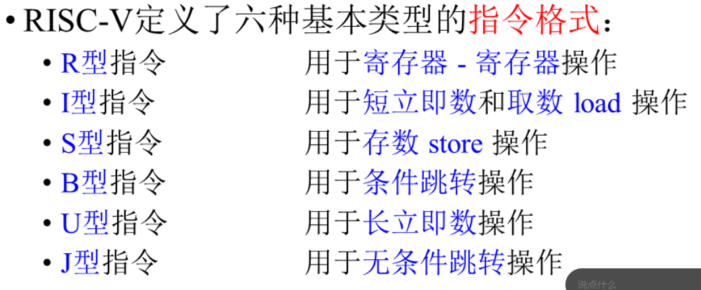
> 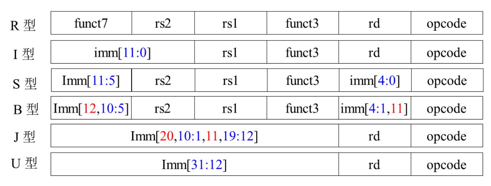

> 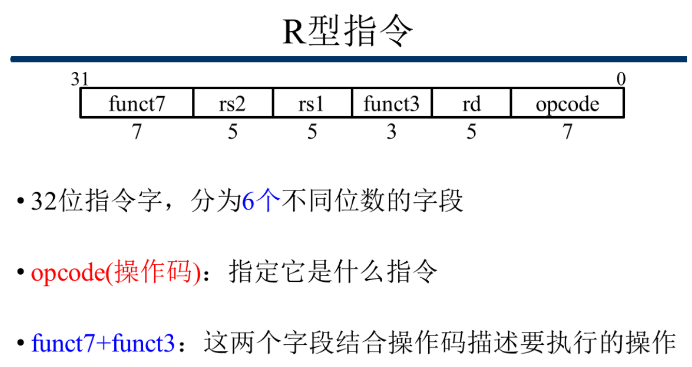
> 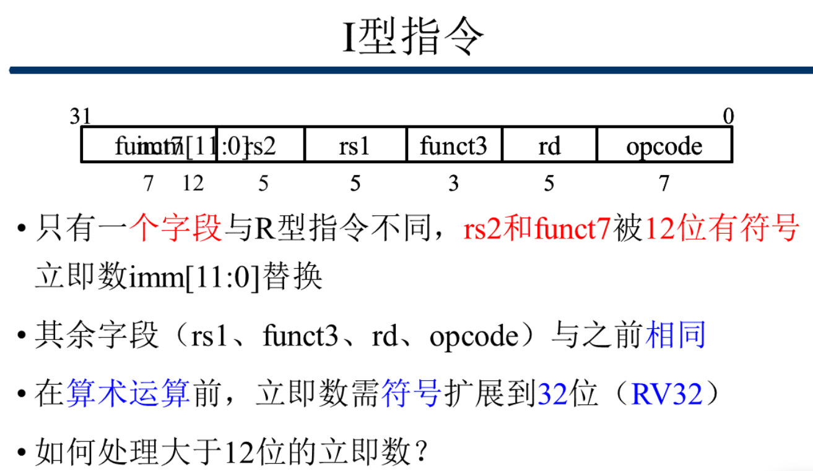
> 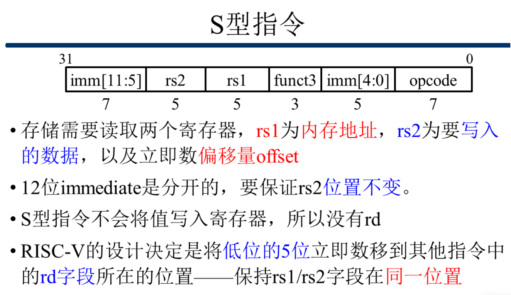

> 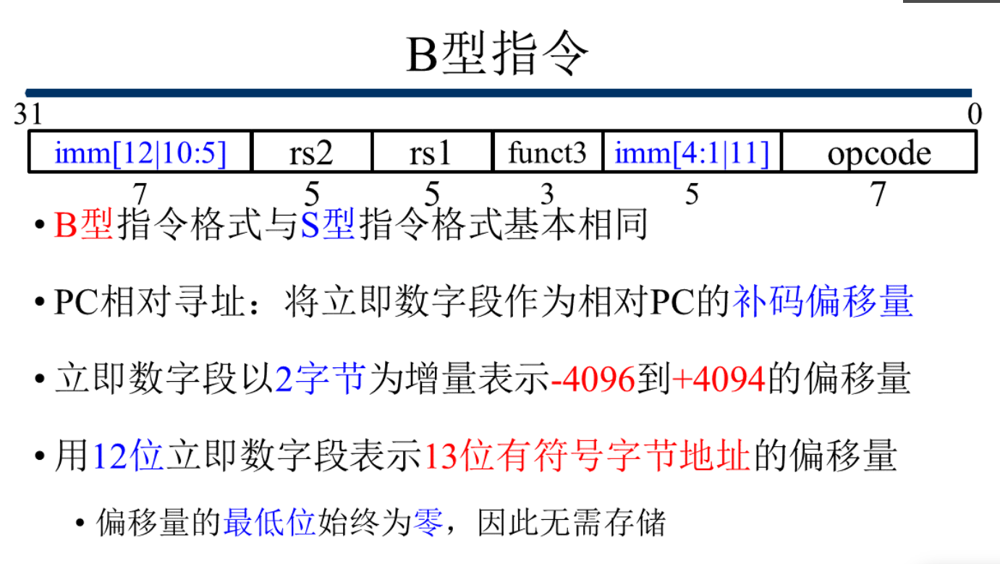
> 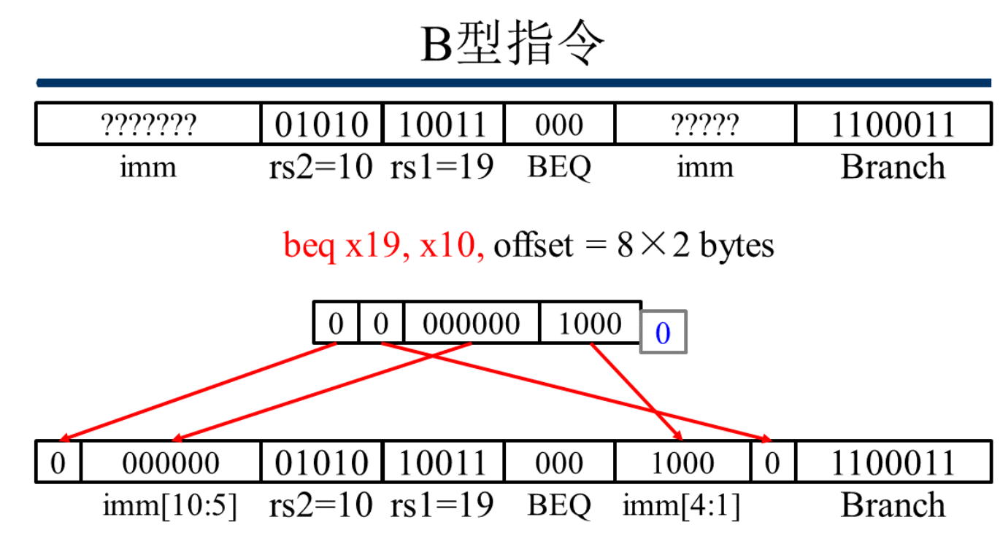

> 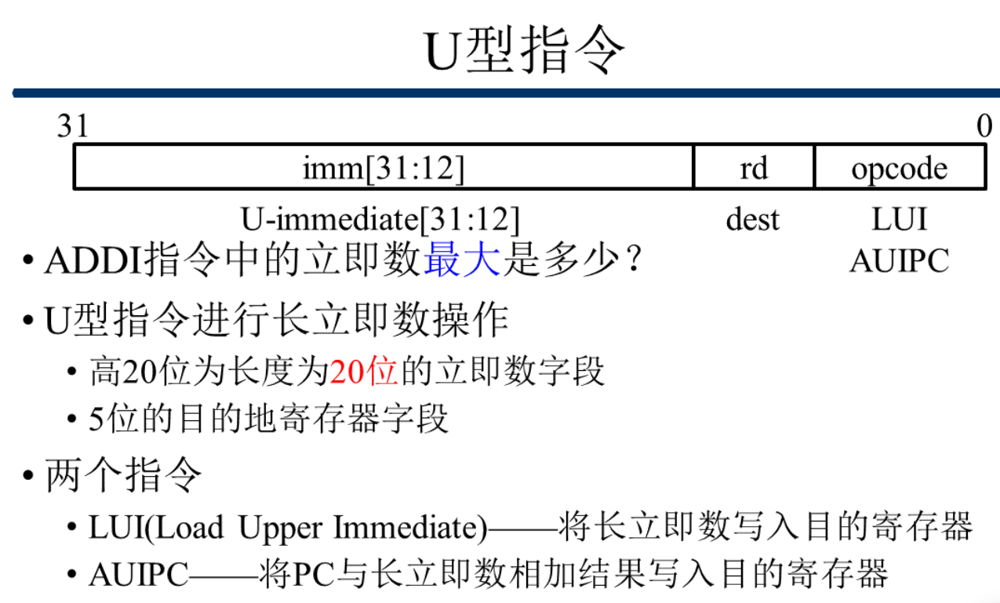
> 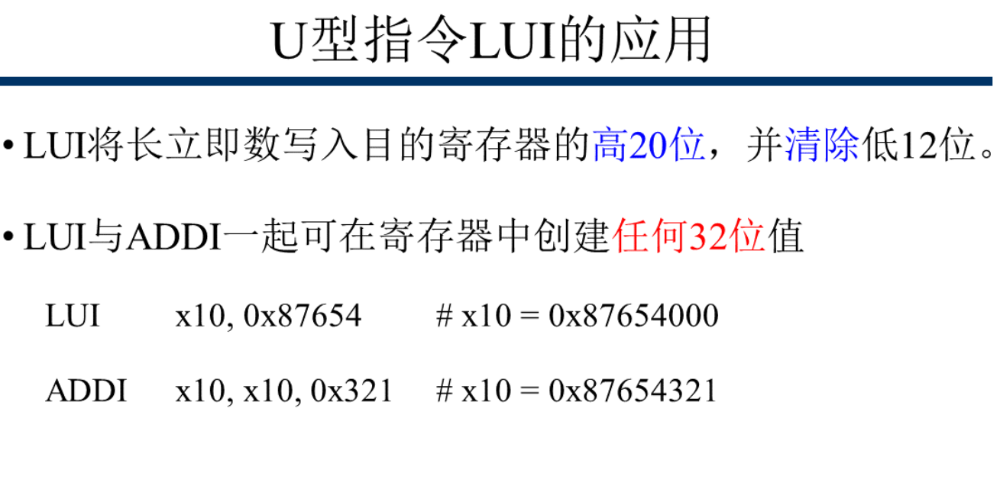
> 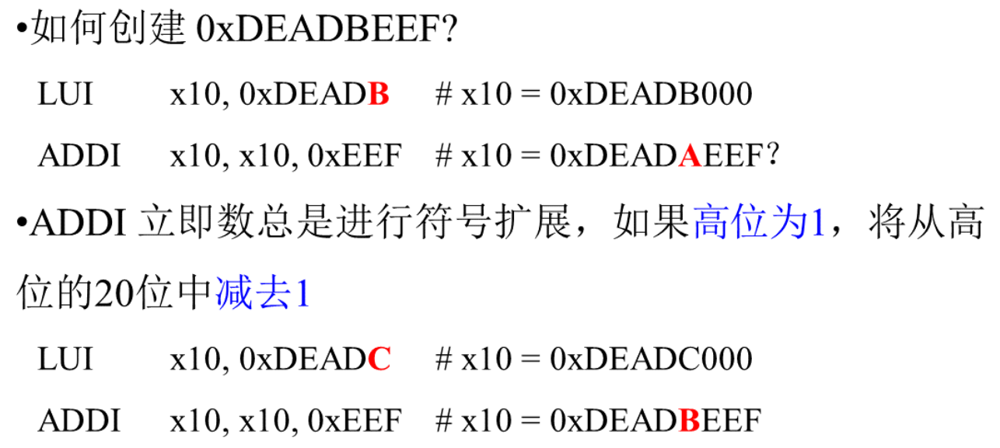
> * **伪指令 li x10, 0xDEADBEEF**
> 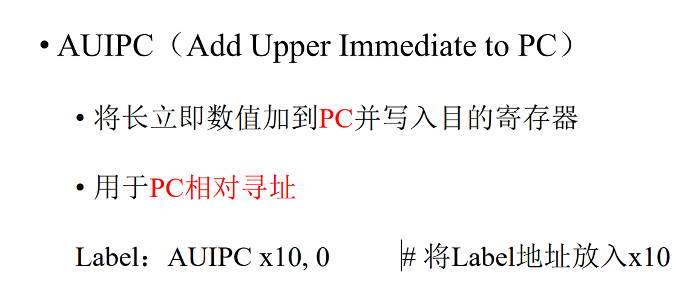