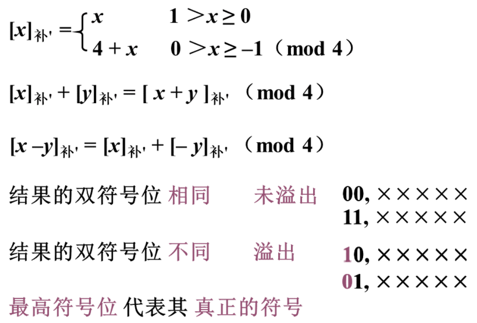

- [案例分析](#案例分析)
  - [数据与指针](#数据与指针)
- [计算机的运算方法](#计算机的运算方法)
  - [定点运算](#定点运算)
    - [例题](#例题)
  - [判断溢出](#判断溢出)
    - [一位符号位判断溢出](#一位符号位判断溢出)
    - [两位符号位判断溢出](#两位符号位判断溢出)
  - [乘法](#乘法)
    - [原码乘法](#原码乘法)

## 案例分析

### 数据与指针
> 
> 
> 
* 编程推荐使用**下标法**

## 计算机的运算方法

### 定点运算
* 加减法运算
* > 
* > 

* **已知$[y]_补, 求 [-y]_补$**
* > 
* **连同符号位**, 每位取反, 末位加 1 

#### 例题
> 

> 
> 

### 判断溢出
#### 一位符号位判断溢出
> 

#### 两位符号位判断溢出
> 

### 乘法
> 
* 都转换为**移位**

#### 原码乘法
> 
> 

