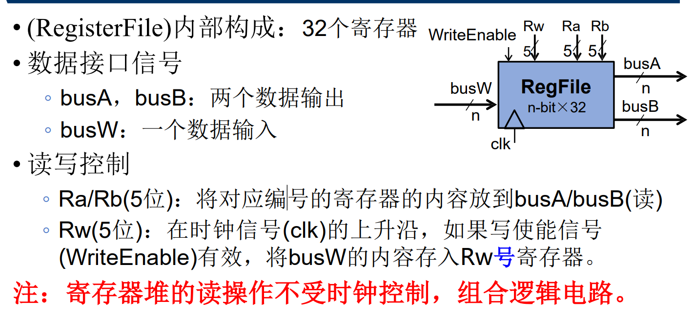
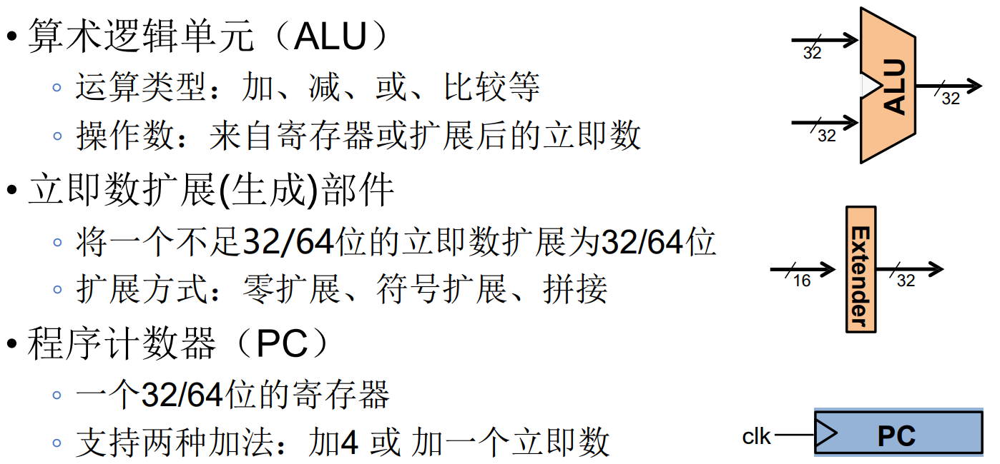
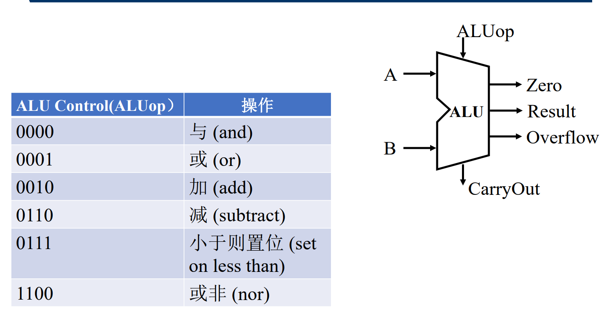
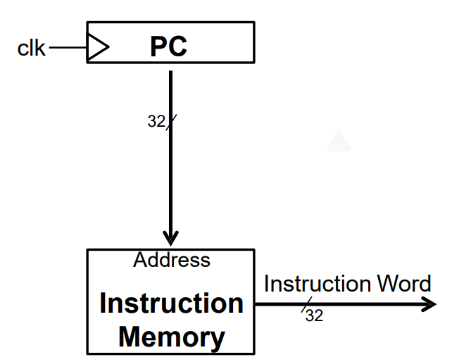
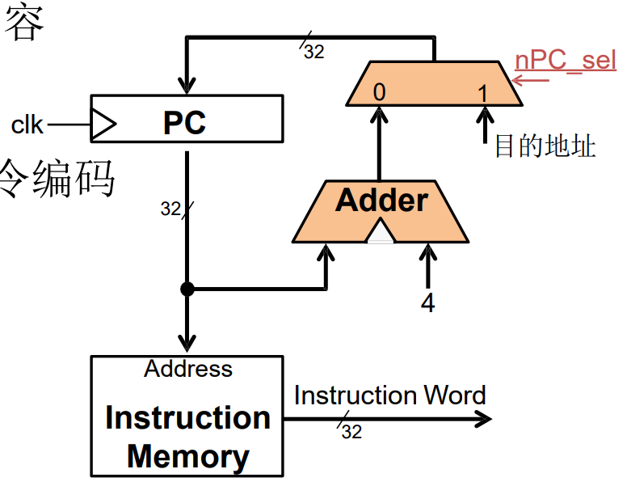
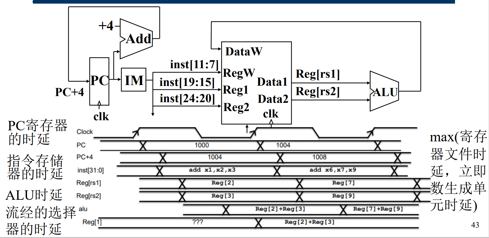
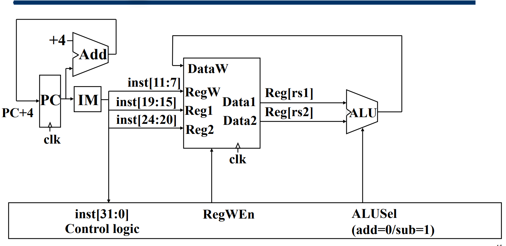
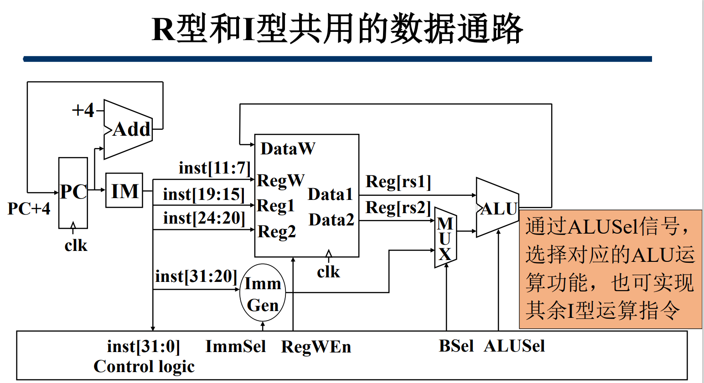
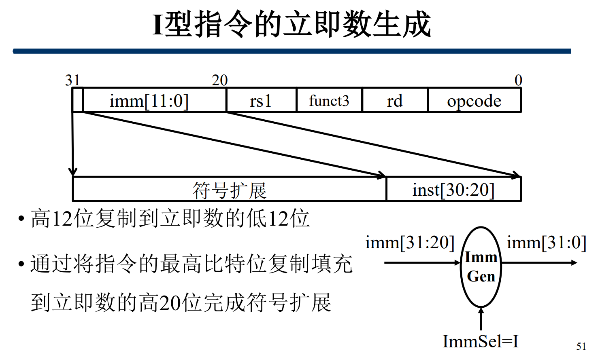

- [处理器设计步骤](#处理器设计步骤)
- [RISC-V数据通路的组件选择](#risc-v数据通路的组件选择)
  - [RISC-V 主要状态单元——存储器](#risc-v-主要状态单元存储器)
    - [数据存储器 (DM)](#数据存储器-dm)
    - [指令存储器 (IM)](#指令存储器-im)
  - [寄存器堆 (RF)](#寄存器堆-rf)
  - [数据通路需求](#数据通路需求)
  - [ALU 功能需求](#alu-功能需求)
- [RISC-V部分指令的数据通路设计](#risc-v部分指令的数据通路设计)
  - [所有指令的共同需求——取指令](#所有指令的共同需求取指令)
  - [所有指令的共同需求——更新PC](#所有指令的共同需求更新pc)
  - [实现add指令](#实现add指令)
  - [sub](#sub)
  - [R + I](#r--i)

## 处理器设计步骤

① 分析指令系统，得出对数据通路的需求
② 为数据通路选择合适的组件
③ 根据指令需求连接组件建立数据通路
④ 分析每条指令的实现，以确定控制信号
⑤ 集成控制信号，形成完整的控制逻辑

## RISC-V数据通路的组件选择
### RISC-V 主要状态单元——存储器

* 将指令和数据保存在一个64位的**字节寻址**的存储空间中
* 指令存储器 Imem 和数据存储器 Dmem 分开（RISC CPU采
用的是哈佛架构）
* 从指令存储器读（取）指令，在数据存储器中读写数据

#### 数据存储器 (DM)
* 存储器的读操作不受时钟控制

#### 指令存储器 (IM)
* 数据通路中 **不会写** 指令存储器
* 读操作时，指令存储器可以看做是 **组合逻辑** 电路

### 寄存器堆 (RF)
> 

### 数据通路需求
> 

### ALU 功能需求

## RISC-V部分指令的数据通路设计
### 所有指令的共同需求——取指令
* 程序计数器（PC）的内容是指令的地址
* 用PC的内容作为地址，访问指令存储器获得指令编码
* 

### 所有指令的共同需求——更新PC
* 顺序执行时更新PC
    * PC <— PC + 4
* 发生分支时更新
    * PC <— 分支目标地址

> 

### 实现add指令
* 指令对机器状态进行两次更改：
    • Reg[rd] = Reg[rs1] + Reg[rs2]
    • PC = PC +4

### sub
> 

### R + I

> 
> 

